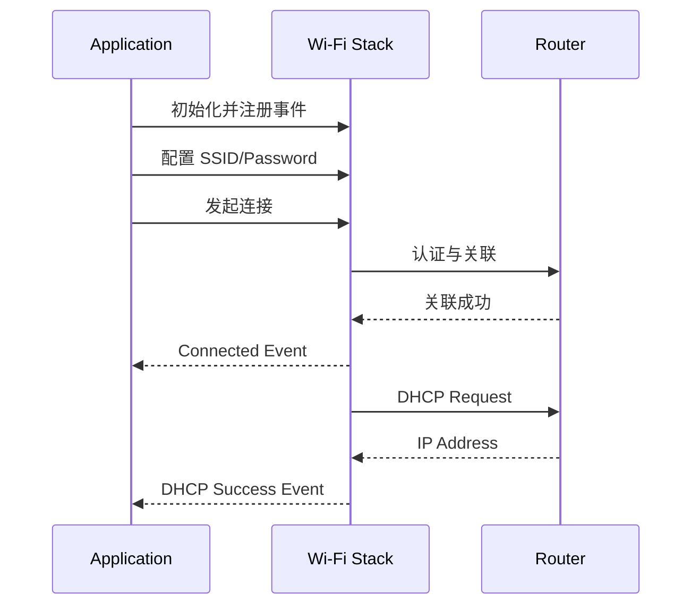

# STA 连接与重连

> WS63 作为 STA (Station) 连接路由器，并通过事件和重连策略维护网络可用状态。

## 学习目标

- 掌握 STA 初始化、扫描匹配、关联和 DHCP (Dynamic Host Configuration Protocol) 获取地址的流程。
- 理解 Wi-Fi 连接是异步状态机。
- 区分手动重连与协议栈自动重连策略。
- 避免在 Wi-Fi 事件回调中阻塞。

## 连接流程



调用连接接口成功只表示请求被接受，业务必须等待连接和 DHCP 事件后才能建立 TCP (Transmission Control Protocol) 、UDP (User Datagram Protocol) 、MQTT (Message Queuing Telemetry Transport) 等上层连接。

## 源码工程

```text
src/application/samples/wifi/sta_sample/
```

通过该工程的 Kconfig 配置 SSID (Service Set Identifier) 和密码。构建、烧录方式与其他 `ws63-liteos-app` 案例一致。

## 事件处理

应用至少维护以下状态：

| 事件 | 应用处理 |
| --- | --- |
| 连接成功 | 标记链路已关联，但暂不启动依赖 IP (Internet Protocol) 的业务 |
| DHCP 成功 | 保存地址信息，启动网络业务 |
| 断开连接 | 清除网络可用状态，关闭或挂起上层连接 |
| DHCP 失败 | 记录失败并进入受控重试或故障状态 |

事件回调只更新状态或投递消息，不能在回调中执行长时间延时、循环重试或阻塞式网络操作。

## 自动重连策略

SDK 提供自动重连策略接口：

```c
wifi_sta_set_reconnect_policy(enable, seconds, period, max_try_count);
```

四个参数分别控制是否使能、单次重连超时、重连间隔和最大尝试次数。具体范围以当前 [Wi-Fi Device API](../../../../api-reference/middleware/wifi/device/device.md#wifi_sta_set_reconnect_policy) 为准。

推荐做法：

1. 连接前配置重连策略。
2. 断开事件中只更新状态，不调用 `osal_msleep()`。
3. 重连成功并重新获得 IP 后，再恢复上层会话。
4. 达到最大次数后通知业务进入离线状态，由用户操作或更高层策略决定是否继续。

## 快速连接与凭据

产品可在 NV (Non-Volatile) 中保存经过校验的网络凭据或快速连接信息，但必须处理以下情况：

- 路由器信道、安全方式或密码发生变化。
- NV 数据版本不兼容或校验失败。
- 用户请求清除网络配置。
- 连续快速连接失败后回退到完整扫描连接。

不要在日志中打印明文密码。

## 验证清单

- 正确凭据能够连接并获得 IP。
- 错误密码不会进入无限重试。
- 路由器断电后应用进入离线状态，恢复后可以重连并重新获取 IP。
- 重连期间上层连接不会继续使用旧 IP 或旧 socket。
- 清除 NV 后不会继续使用旧凭据快速连接。

SoftAP 模式见 [SoftAP](../softap/softap.md)，STA 与 SoftAP 组合设计见 [中继](../repeater.md)。
