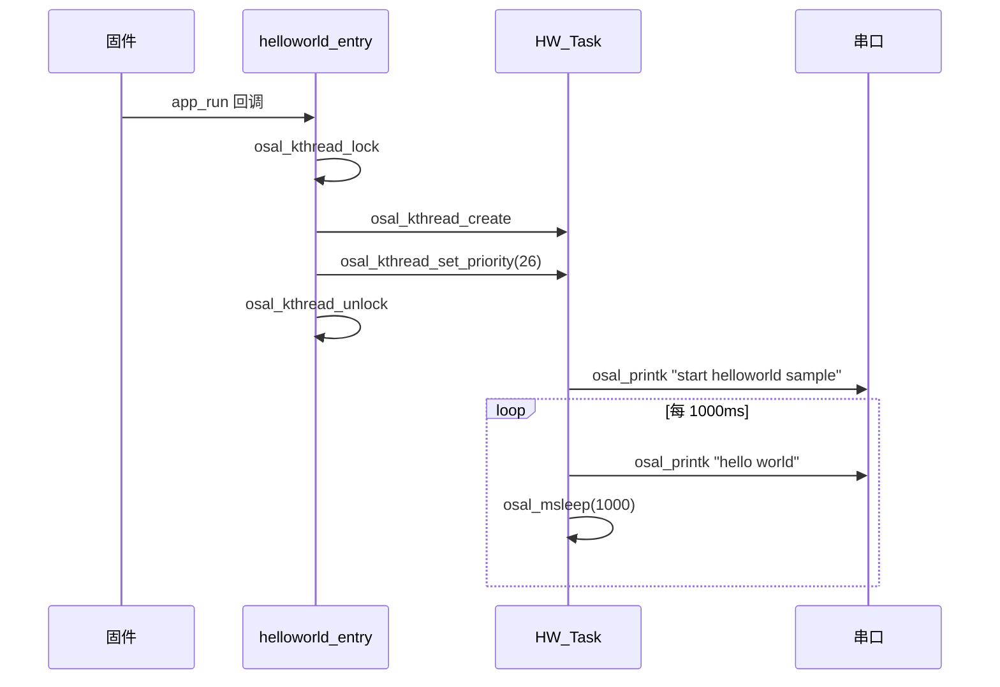

# Hello World

> 第一个 WS63 应用：Hello World

## 学习目标

- 了解 WS63 应用代码的基本骨架：`app_run()` 入口 → 创建任务 → 循环执行
- 掌握 `osal_kthread_create()` 创建任务的最小写法：入口函数、任务名、栈大小、优先级
- 掌握 `osal_printk()` 的用法——通过串口输出日志，验证程序运行
- 能够在 WS63 上跑通"编译 → 烧录 → 串口输出"全链路

## 基本概念

### 最小应用骨架

每个 WS63 应用都由 `app_run()` 启动——固件初始化完成后回调注册的入口函数。入口函数中创建任务，任务中写业务逻辑。


### 创建任务的 4 个要素

| 参数 | 含义 | 本例取值 |
|------|------|----------|
| 入口函数 | 任务的 main 函数，启动后从此处执行 | `hw_task` |
| 任务名 | 字符串，调试时在日志中区分不同任务 | `"HW_Task"` |
| 栈大小 | 任务专属堆栈（字节），存局部变量和调用链 | `0x1000`（4 KB） |
| 优先级 | 数字越小优先级越高，高优先级可抢占低优先级 | `26` |

### `osal_printk()` — 串口输出

`osal_printk()` 通过调试串口输出格式化文本，类似标准 C 的 `printf`。开发时用它打印日志、调试变量、验证程序逻辑。输出可通过串口工具（PuTTY、MobaXterm 等）查看，波特率通常为 `115200 8N1`。

### `app_run()` 是什么

`app_run(entry_func)` 是一个宏，将 `entry_func` 注册为应用入口。固件初始化（时钟、内存、外设等）完成后，SDK自动调用注册的入口函数。每个应用只有一个 `app_run()`。

### 调度锁

`osal_kthread_lock()` / `osal_kthread_unlock()` 是调度锁——禁止任务切换但不禁止中断。创建任务时用它对保护任务链表，防止创建到一半被其他任务打断。持锁时间应尽可能短（< 1ms）。

## 涉及 API

| API | 用途 | 头文件 |
|-----|------|--------|
| `osal_printk(fmt, ...)` | 格式化输出到调试串口 | `soc_osal.h` |
| `osal_kthread_create(handler, data, name, stack_size)` | 创建任务，返回 `osal_task*` 句柄 | `soc_osal.h` |
| `osal_kthread_set_priority(task, priority)` | 设置任务优先级 | `soc_osal.h` |
| `osal_kthread_lock()` / `osal_kthread_unlock()` | 禁止/恢复任务调度 | `soc_osal.h` |
| `osal_msleep(ms)` | 任务休眠指定毫秒，让出 CPU | `soc_osal.h` |
| `app_run(entry)` | 注册应用入口，固件初始化后回调 | `app_init.h` |

## 案例说明

### 案例简介

创建第一个 WS63 应用——启动后每 1 秒通过串口输出一行 "hello world"。这是验证开发环境、编译链、烧录工具、串口通信全部就绪的最简示例。

### 功能规格

| 规格项 | 说明 |
|--------|------|
| 任务名 | `HW_Task` |
| 栈大小 | `0x1000`（4096 字节） |
| 优先级 | 26 |
| 输出间隔 | 1000ms（`osal_msleep(1000)`） |
| 输出内容 | `"hello world\r\n"` |

程序运行流程：`app_run` 注册入口 → 创建 `HW_Task` → 打印启动提示 → 死循环每 1s 打印 "hello world"。

### 案例流程



## 案例操作指导

### 第一步：编译

```bash
fbb build ws63-liteos-app
```

> 更多编译选项请参考 [构建操作](../overall-architecture/build-output/index.md#构建操作)。

### 第二步：烧录

```bash
fbb flash ws63-liteos-app
```

> 更多烧录选项请参考 [构建操作](../overall-architecture/build-output/index.md#构建操作)。

### 第三步：验证

打开串口工具（波特率 `115200 8N1`），复位板子，串口应每秒输出一行：

```text
start helloworld sample
hello world
hello world
...
```

看到持续输出即表示**编译 → 烧录 → 串口通信**全链路验证通过。

## 关键配置

| 参数 | 值 | 说明 |
|------|-----|------|
| `DEFAULT_TASK_STACK_SIZE` | `0x1000` | 简单打印任务，4KB 足够 |
| `DEFAULT_TASK_PRIORITY` | 26 | 应用级中等优先级，不影响 BLE/SLE 等关键任务 |
| `DELAYS_MS` | 1000 | 打印间隔，减小可提高输出频率 |

## 代码详解

完整代码参考 `src/application/samples/peripheral/helloworld/helloworld.c`：

```c
#include "common_def.h"
#include "soc_osal.h"
#include "app_init.h"

#define DEFAULT_TASK_STACK_SIZE         0x1000
#define DEFAULT_TASK_PRIORITY           26
#define DELAYS_MS                       1000

static void *hw_task(const char *arg)
{
    unused(arg);
    osal_printk("start helloworld sample\r\n");
    for (;;) {
        osal_printk("hello world\r\n");
        osal_msleep(DELAYS_MS);
    }
    return NULL;
}

static void helloworld_entry(void)
{
    osal_task *task_handle = NULL;
    osal_kthread_lock();
    task_handle = osal_kthread_create((osal_kthread_handler)hw_task,
                                       0, "HW_Task",
                                       DEFAULT_TASK_STACK_SIZE);
    if (task_handle != NULL) {
        osal_kthread_set_priority(task_handle, DEFAULT_TASK_PRIORITY);
    }
    osal_kthread_unlock();
}

/* Run the helloworld_entry. */
app_run(helloworld_entry);
```

### 入口函数 `helloworld_entry()`

`app_run(helloworld_entry)` 将其注册为应用入口。固件初始化完成后自动调用。函数内做三件事：

1. **加调度锁** — `osal_kthread_lock()`，保护任务创建过程不被抢占
2. **创建任务** — `osal_kthread_create()`，传入入口函数、任务名、栈大小
3. **设优先级** — `osal_kthread_set_priority()`，然后解锁

### 任务函数 `hw_task()`

任务入口，启动后打印 `"start helloworld sample"` 标记启动，随后进入 `for(;;)` 死循环，每 1000ms 打印一次 `"hello world"` 并 `osal_msleep()` 让出 CPU。

---
