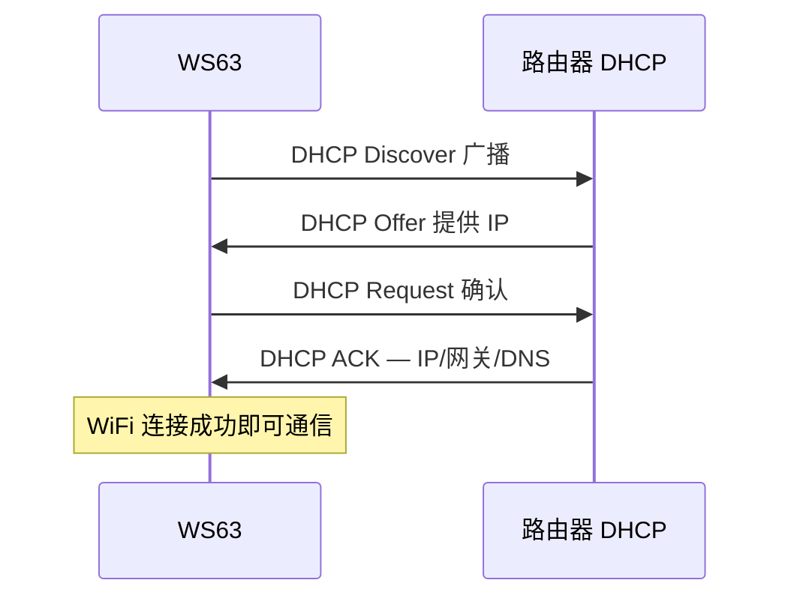

# DHCP/DNS

> lwIP (Lightweight IP (Internet Protocol)) DHCP (Dynamic Host Configuration Protocol) Client、DNS (Domain Name System) Client

> 前置阅读：[STA (Station) 连接](../../connectivity/wifi/sta/sta-connect.md)

## 学习目标

- 理解 DHCP Client 自动获取 IP 地址的流程
- 掌握 DNS 域名解析——将域名转换为 IP 地址
- 理解 DHCP 续约机制和 IP 地址变更的处理

## 基本概念

### DHCP 工作原理

WiFi STA 连接成功后自动启动 DHCP——WS63 内置 DHCP Client，无需手动配置。



### DHCP 续约

IP 租约到期前自动续约：租约 50% 时尝试续约 → 87.5% 时广播续约 → 续约失败则重新 DHCP。

### DNS 解析

`getaddrinfo()` 将域名解析为 IP 地址。DNS Server 地址由 DHCP 自动获取，无需手动配置。

## 涉及 API

| API | 用途 |
|-----|------|
| WiFi DHCP | 协议栈自动管理，`wifi_event_connection_changed(CONNECTED)` 后即可通信 |
| `wifi_sta_get_ap_info(&info)` | 获取当前 IP 地址 |
| `getaddrinfo(hostname, NULL, &hints, &res)` | DNS 域名解析 |
| `gethostbyname(hostname)` | DNS 解析（简化版） |

## 案例说明

### 案例简介

- DHCP 无代码——WiFi STA 连接成功后自动完成，`wifi_sta_get_ap_info()` 可获取当前 IP
- DNS：输入域名 → `getaddrinfo()` 解析 → 打印 IP → 用解析出的 IP 连接服务器

## 关键配置

| 参数 | 默认值 | 说明 |
|------|:---:|------|
| DHCP 超时 | 30s | 连接后 30s 未获 IP 视为失败 |
| DNS 超时 | 5s × 3 | 单次 5s，重试 3 次 |

## 代码详解

### 获取连接后的 IP 地址

```c
wifi_ap_info_t info;
wifi_sta_get_ap_info(&info);
printf("IP: %s\n", inet_ntoa(info.ip_addr));
printf("GW: %s\n", inet_ntoa(info.gateway));
```

### DNS 域名解析

```c
struct addrinfo hints = {
    .ai_family = AF_INET,
    .ai_socktype = SOCK_STREAM
};
struct addrinfo *res = NULL;

int ret = getaddrinfo("mqtt.example.com", NULL, &hints, &res);
if (ret == 0) {
    struct sockaddr_in *addr = (struct sockaddr_in *)res->ai_addr;
    printf("Resolved: %s\n", inet_ntoa(addr->sin_addr));
    freeaddrinfo(res);
}
```

---

