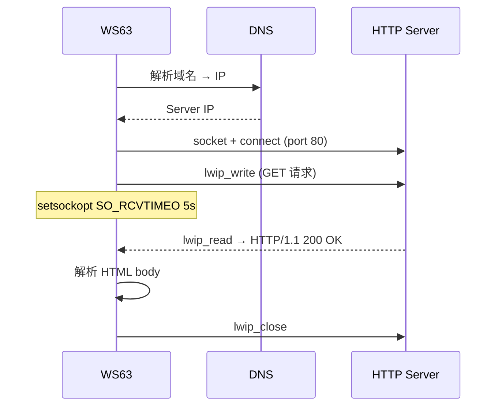

# HTTP

> HTTP (HyperText Transfer Protocol) Client — GET 请求 — lwIP (Lightweight IP (Internet Protocol))Socket API

> 前置阅读：[TCP/UDP](./tcp-udp/tcp-udp.md)

## 学习目标

- 理解 HTTP 在嵌入式设备上的实现方式——纯 lwIP报文
- 掌握 HTTP GET 请求的标准报文格式和发送流程
- 掌握 `setsockopt(SO_RCVTIMEO)` 接收超时的配置方法
- 理解 lwIP 特有函数：`lwip_write()` / `lwip_read()` / `lwip_close()`

## 基本概念

### HTTP 实现方式

WS63 不自带 HTTP Client 库——直接用 lwIP Socket API 构造 HTTP 请求。HTTP 请求就是一段符合 RFC 2616 的文本。

### HTTP GET 请求报文格式

```text
GET / HTTP/1.1\r\n
Host: www.example.com\r\n
Connection: close\r\n
\r\n
```

请求行 + Header + 空行结束。空行（`\r\n\r\n`）是请求结束的标志。

### lwIP 特有函数

| lwIP 函数 | 标准 POSIX (Portable Operating System Interface) | 说明 |
|-----------|:---:|------|
| `lwip_write()` | `write()` | **必须用 lwIP 版本** |
| `lwip_read()` | `read()` | **必须用 lwIP 版本** |
| `lwip_close()` | `close()` | 混用会导致资源泄漏 |
| `lwip_ioctl()` | `ioctl()` | 配置 socket 选项 |

### 通信流程



## 涉及 API

| API | 用途 |
|-----|------|
| `socket(AF_INET, SOCK_STREAM, 0)` | 创建 TCP (Transmission Control Protocol) socket |
| `connect(s, &addr, sizeof(addr))` | 连接 HTTP Server（端口 80） |
| `lwip_write(s, request, len)` | 发送 HTTP 请求（**必须用 lwIP 版本**） |
| `setsockopt(s, SOL_SOCKET, SO_RCVTIMEO, &tv, sizeof(tv))` | 设置接收超时 |
| `lwip_read(s, buf, len)` | 读取 HTTP 响应 |
| `lwip_close(s)` | 关闭 socket |

## 案例说明

### 案例简介

WS63 WiFi 连接路由器 → DNS (Domain Name System) 解析目标 IP → HTTP GET 获取首页 HTML → 串口打印响应。

零第三方库——纯 lwIP Socket + 手动构造 HTTP 报文。

## 案例操作指导

### 第一步：编译

```bash
fbb build ws63-liteos-app
```

> 更多编译选项请参考 [构建操作](../../overall-architecture/build-output/index.md#构建操作)。

### 第二步：烧录

```bash
fbb flash ws63-liteos-app
```

> 更多烧录选项请参考 [构建操作](../../overall-architecture/build-output/index.md#构建操作)。

### 第三步：验证

串口输出 `HTTP/1.1 200 OK` + HTML 内容。

## 关键配置

| 参数 | 值 | 说明 |
|------|:---:|------|
| HTTP 端口 | 80 | 标准端口 |
| 接收超时 | 5s | `SO_RCVTIMEO`，防止永久阻塞 |
| 接收缓冲区 | 64~2048B | lwIP 默认较小 |
| **陷阱** | 必须用 `lwip_close()` | 混用 `close()` 导致资源泄漏 |

## 代码详解

### Socket 创建与连接

```c
int s = socket(AF_INET, SOCK_STREAM, 0);

struct sockaddr_in addr;
addr.sin_family = AF_INET;
addr.sin_port = PP_HTONS(80);
addr.sin_addr.s_addr = server_ip;  // DNS 解析得到

if (connect(s, (struct sockaddr *)&addr, sizeof(addr)) != 0) {
    printf("connect failed\n");
    return;
}
```

### HTTP GET 请求构造

```c
const char *request =
    "GET / HTTP/1.1\r\n"
    "Host: www.example.com\r\n"
    "Connection: close\r\n"
    "\r\n";  // 空行标志请求结束

lwip_write(s, request, strlen(request));
```

### 接收响应（带超时）

```c
struct timeval tv = { .tv_sec = 5, .tv_usec = 0 };
setsockopt(s, SOL_SOCKET, SO_RCVTIMEO, &tv, sizeof(tv));

char buf[2048];
int len;
while ((len = lwip_read(s, buf, sizeof(buf) - 1)) > 0) {
    buf[len] = '\0';
    printf("%s", buf);
}
// len == 0: 对端关闭 | len < 0: 超时或错误
```

### 响应解析

```c
/* 检查 HTTP 状态码 */
if (strstr(buf, "HTTP/1.1 200 OK") || strstr(buf, "HTTP/1.0 200 OK")) {
    /* 找 Header 结束位置（\r\n\r\n），之后是 body */
    char *body = strstr(buf, "\r\n\r\n");
    if (body) {
        body += 4;
        printf("Body: %s\n", body);
    }
}
```

### 清理

```c
lwip_close(s);  // 必须用 lwip_close，不能用 close()
```

---

