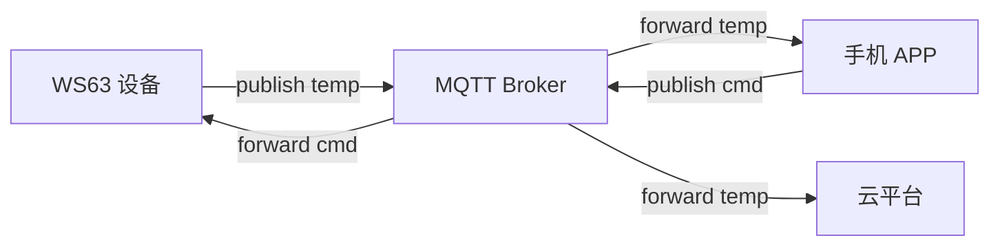

# MQTT

> Paho MQTT (Message Queuing Telemetry Transport) C Client、lwIP (Lightweight IP (Internet Protocol))Socket

> 前置阅读：[TCP/UDP](../tcp-udp/tcp-udp.md)、[DHCP/DNS](../dhcp-dns/dhcp-dns.md)

## 学习目标

- 理解 MQTT 发布/订阅模型——设备发布数据到 Topic，云端/APP 订阅 Topic 接收
- 掌握 Paho MQTT C Client 的初始化 → 连接 Broker → 订阅 → 发布的调用链
- 理解 QoS 0/1/2 的区别和选择
- 能够在 WS63 上通过 MQTT 对接主流云平台（阿里云/华为云/EMQX）

## 基本概念

### MQTT 发布/订阅模型

设备不直接与 APP 通信——设备发布到 Topic → Broker（服务器）转发给所有订阅者。



### QoS 等级

| QoS | 含义 | 适用场景 |
|:---:|------|------|
| 0 | 最多一次（可能丢包） | 传感器持续上报（丢一两条没关系） |
| 1 | 至少一次（可能重复） | 状态变更通知 |
| 2 | 恰好一次（最可靠） | 关键控制指令 |

### Topic 设计建议

| Topic | 方向 | 说明 |
|------|:---:|------|
| `device/{id}/sensor` | 上行 | 设备上报传感器数据 |
| `device/{id}/cmd` | 下行 | 云端下发控制指令 |
| `device/{id}/status` | 上行 | 设备在线/离线状态 |

### Will Message（遗嘱消息）

设备异常断线时 Broker 自动发送遗嘱消息通知订阅者"设备离线"。在 `connect` 时设置。

## 涉及 API

| API | 用途 |
|-----|------|
| `MQTTClient_create(&client, &conn_opts, ...)` | 创建 MQTT 客户端 |
| `MQTTClient_connect(client, &conn_opts)` | 连接 MQTT Broker |
| `MQTTClient_subscribe(client, topic, qos)` | 订阅 Topic |
| `MQTTClient_publish(client, topic, payload_len, payload, qos, retained)` | 发布消息 |
| `MQTTClient_setCallbacks(client, &callbacks)` | 注册消息接收回调 |
| `MQTTClient_disconnect(client)` / `MQTTClient_destroy(client)` | 断开/销毁 |

## 案例说明

### 案例简介

WS63 连接 MQTT Broker → 每 5 秒发布一次温度数据 → 订阅控制指令 Topic 并响应。

## 关键配置

| 参数 | 推荐值 | 说明 |
|------|:---:|------|
| Broker 地址 | IP 或域名 | 需先 DNS (Domain Name System) 解析 |
| Keep Alive | 60s | PINGREQ 心跳间隔 |
| 传感器上报 QoS | 0 | 数据持续上报，丢一两条无影响 |
| 控制指令 QoS | 1 | 确保至少收到一次 |
| Client ID | `WS63_<MAC>` | 全球唯一，避免 Broker 冲突 |

## 代码详解

### 初始化与连接

```c
MQTTClient client;
MQTTClient_connectOptions conn_opts = MQTTClient_connectOptions_initializer;

MQTTClient_create(&client, "tcp://broker.example.com:1883",
                  "WS63_001", MQTTCLIENT_PERSISTENCE_NONE, NULL);

conn_opts.keepAliveInterval = 60;
conn_opts.cleansession = 1;
/* 遗嘱消息——设备断线时 Broker 自动发布 */
conn_opts.will.topicName = "device/ws63/status";
conn_opts.will.message = "offline";
conn_opts.will.qos = 1;

MQTTClient_connect(client, &conn_opts);
```

### 发布传感器数据

```c
float temp = read_temperature();
MQTTClient_publish(client, "device/ws63/temp",
                   sizeof(temp), &temp, 0, 0);
/* QoS 0 —— 不需确认 */
```

### 订阅控制指令

```c
MQTTClient_subscribe(client, "device/ws63/cmd", 1);

/* 注册回调——收到指令时触发 */
static int message_arrived(void *context, char *topic, int len,
                           MQTTClient_message *msg) {
    printf("cmd: %.*s\n", msg->payloadlen, (char *)msg->payload);
    handle_command(msg->payload, msg->payloadlen);
    return 1;
}
```

### 心跳与重连

Keep Alive 60 秒——Broker 60 秒没收到消息即判定设备离线。`connectionLost` 回调中自动重连。

---

