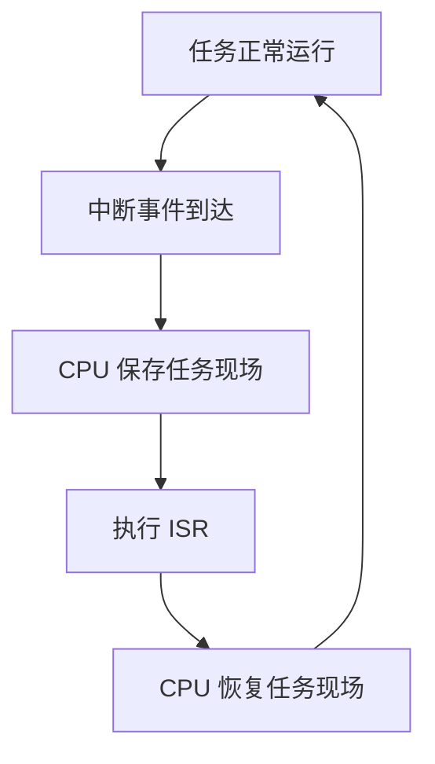

# OSAL 中断管理

> 使用 OSAL (Operating System Abstraction Layer) 接口注册、处理并释放 Timer2 硬件中断。

## 学习目标

- 掌握硬件中断的申请、配置、使能、禁用和释放流程
- 理解中断源状态与中断控制器状态都需要正确清除
- 使用 `osal_in_interrupt()` 确认中断服务程序的执行上下文
- 观察硬件中断异步打断运行中任务，并将日志处理延后到任务上下文

## 基本原理

中断是处理器响应异步事件的一种机制。当外设或系统产生中断请求时，CPU 暂停当前正在执行的任务，保存运行现场，转而执行对应的中断服务程序（ISR）；ISR 执行结束后，CPU 恢复现场并继续运行原任务。



中断适合处理按键、通信接收、定时器到期等无法预先确定发生时刻、又需要及时响应的事件。与任务持续轮询相比，中断可以减少无效查询，让 CPU 在事件未发生时执行其他工作。

ISR 会打断任务运行，应尽量短小，只完成清除中断状态、保存必要数据和通知任务等操作。日志输出、复杂计算以及可能阻塞的处理通常应放到任务上下文中执行。

## 涉及 API

| API | 用途 |
| --- | --- |
| `osal_irq_request()` | 申请中断号并注册 ISR |
| `osal_irq_set_priority()` | 设置中断优先级 |
| `osal_irq_enable()` | 使能指定中断 |
| `osal_irq_clear()` | 清除中断控制器中的挂起状态 |
| `osal_in_interrupt()` | 判断当前是否处于中断上下文 |
| `osal_irq_disable()` | 禁用指定中断 |
| `osal_irq_free()` | 释放已申请的中断 |

## 案例说明

### 案例功能

- 申请 Timer2 对应的硬件中断并设置优先级
- 低优先级任务不等待、不休眠，持续更新工作进度
- Timer2 独立产生 5 次硬件中断，异步打断运行中的工作任务
- ISR 清除中断、保存抢占点、重装 Timer2 并通知处理任务
- 处理任务输出每次中断的任务进度和两次抢占点之间的进度差
- 完成验证后禁用并释放中断资源

Timer2 只用于提供稳定、可重复的硬件中断源。案例没有使用定时器 UAPI (Unified API) 注册回调，因为中断号必须由案例通过 `osal_irq_request()` 直接管理。

### 源码目录

```text
src/application/samples/os/
├── CMakeLists.txt
├── Kconfig
└── interrupt/
    └── osal_interrupt/
        ├── CMakeLists.txt
        └── osal_interrupt.c
```

## 案例操作指导

### 第一步：启用并编译

```bash
fbb config set CONFIG_SAMPLE_ENABLE=y --target ws63-liteos-app
fbb config set CONFIG_ENABLE_OS_SAMPLE=y --target ws63-liteos-app
fbb config set CONFIG_SAMPLE_SUPPORT_OSAL_INTERRUPT=y --target ws63-liteos-app
fbb build --clean ws63-liteos-app
```

### 第二步：烧录

```bash
fbb flash ws63-liteos-app
```

### 第三步：验证

复位开发板，串口依次输出中断注册、5 次中断处理和资源释放结果：

```text
[osal interrupt] registered irq=28 priority=1
[osal interrupt] worker running: continuous loop, no wait or sleep
[osal interrupt] irq=1 context=ISR interrupted_progress=4798595 delta=4798595
[osal interrupt] irq=2 context=ISR interrupted_progress=10300949 delta=5502354
[osal interrupt] irq=3 context=ISR interrupted_progress=15804769 delta=5503820
[osal interrupt] irq=4 context=ISR interrupted_progress=21299965 delta=5495196
[osal interrupt] irq=5 context=ISR interrupted_progress=26804095 delta=5504130
[osal interrupt] cleanup disable=PASS free=PASS
[osal interrupt] summary irq=5 context_fail=0 progress_fail=0
[osal interrupt] ALL TESTS PASS
```

`interrupted_progress` 的实际数值随运行环境变化。五次进度持续增长且 `delta` 均大于 0，表示工作任务在两次中断之间持续运行，并被硬件中断异步打断；`context=ISR` 和 `context_fail=0` 表示处理函数均运行在中断上下文；`progress_fail=0` 表示五次抢占均观察到任务进度变化。

## 关键配置

| 配置项 | 当前值 | 说明 |
| --- | ---: | --- |
| `OSAL_INTERRUPT_SOURCE_INDEX` | Timer2 | 产生硬件中断的测试来源 |
| `OSAL_INTERRUPT_IRQ_NUMBER` | 28 | Timer2 对应的 WS63 中断号 |
| `OSAL_INTERRUPT_IRQ_PRIORITY` | 1 | 本案例使用的中断优先级 |
| `OSAL_INTERRUPT_INTERVAL_US` | 500000 μs | 两次验证事件之间的时间 |
| `OSAL_INTERRUPT_EXPECTED_COUNT` | 5 | 预期接收的中断次数 |
| `OSAL_INTERRUPT_WORKER_PRIORITY` | 25 | 连续工作任务的优先级 |

## 代码详解

### 注册并使能中断

```c
osal_irq_disable(OSAL_INTERRUPT_IRQ_NUMBER);
osal_irq_request(OSAL_INTERRUPT_IRQ_NUMBER, osal_interrupt_handler,
    NULL, "OsalInterrupt", NULL);
osal_irq_set_priority(OSAL_INTERRUPT_IRQ_NUMBER,
    OSAL_INTERRUPT_IRQ_PRIORITY);
osal_irq_enable(OSAL_INTERRUPT_IRQ_NUMBER);
```

先禁用中断可以避免初始化期间响应未准备好的中断源。申请和优先级设置成功后，才能使能中断。

### 连续运行的工作任务

```c
while (g_osal_interrupt_worker_running) {
    g_osal_interrupt_worker_progress++;
}
```

工作任务没有延时、等待或主动让出 CPU。即使任务始终处于运行态，硬件中断到达后仍能打断任务并执行 ISR。

### ISR 保存抢占点并通知任务

```c
hal_timer_v150_interrupt_clear(OSAL_INTERRUPT_SOURCE_INDEX);
osal_irq_clear(OSAL_INTERRUPT_IRQ_NUMBER);
g_osal_interrupt_progress_snapshot[index] =
    g_osal_interrupt_worker_progress;
osal_interrupt_start_source();
osal_sem_up(&g_osal_interrupt_sem);
```

Timer2 外设状态和中断控制器挂起状态分别清除，避免同一事件持续触发。ISR 保存被打断任务的当前进度，并在 ISR 内重装单次定时器，使后续中断不依赖任务调度。信号量用于把日志和验证处理交给任务。

### 禁用并释放中断

```c
osal_irq_disable(OSAL_INTERRUPT_IRQ_NUMBER);
osal_irq_clear(OSAL_INTERRUPT_IRQ_NUMBER);
osal_irq_free(OSAL_INTERRUPT_IRQ_NUMBER, NULL);
```

释放前先禁用中断并停止中断源，避免 ISR 在资源清理过程中再次执行。
