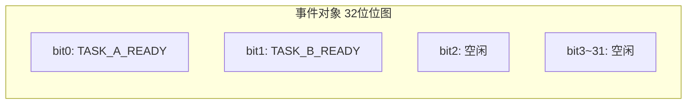
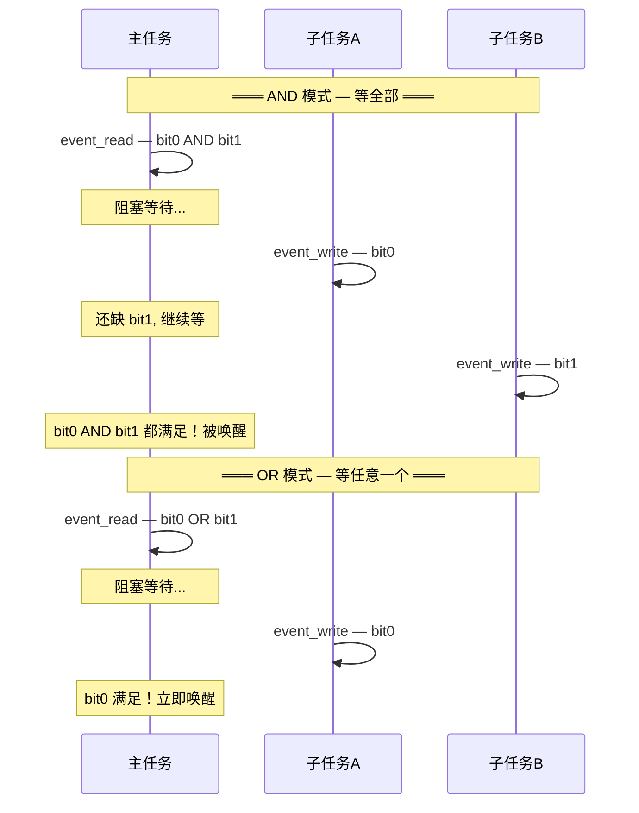
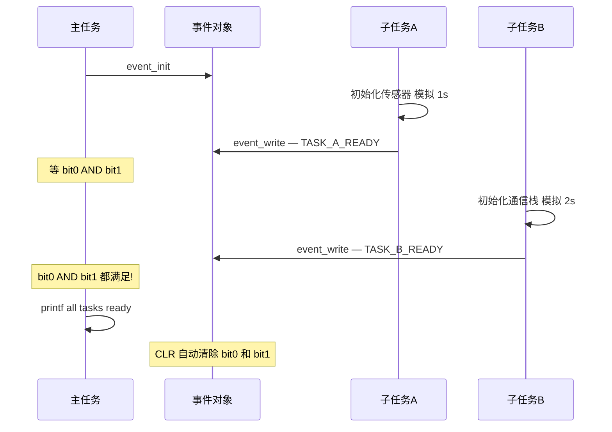

# OSAL 事件标志

> 多条件等待 — OSAL (Operating System Abstraction Layer) 事件标志

> 前置阅读：[OSAL 任务调度](../task/task-concurrency.md)、[OSAL 信号量同步](./semaphore-sync.md) — 事件标志是信号量的"多条件"升级版

## 学习目标

- 理解事件标志的核心用途——一个任务同时等待多个条件，全部满足或任一满足才继续
- 掌握 `osal_event_init(event)` → `osal_event_write(event, mask)` → `osal_event_read(event, mask, timeout, mode)` 的标准调用链
- 理解 AND 模式（`OSAL_WAITMODE_AND`）和 OR 模式（`OSAL_WAITMODE_OR`）的区别和适用场景
- 能够在多条件同步场景中正确选择事件标志而非多个信号量

## 基本概念

### 事件标志解决什么问题

信号量只能等一个条件。当需要等"WiFi 就绪 **且** SLE (SparkLink Low Energy) 就绪 **且** 传感器就绪"时，用 3 个信号量很笨重。事件标志用一个 32 位位图解决——每个 bit 代表一个条件，一次 `event_read` 可以等多个 bit。



### 典型使用场景

| 场景 | 等待模式 | 说明 |
|------|:---:|------|
| 设备启动：等 WiFi + SLE + 传感器 | AND | 三个都 OK 才开始业务 |
| 数据收集：等 ADC (Analog-to-Digital Converter) 或超时 | OR + timeout | 谁先到处理谁 |
| 多任务启动同步 | AND + CLR | 所有子任务就绪后主任务开始，自动复位 |
| 关机：等所有模块停用 | AND | 全部停用后进入低功耗 |

### AND vs OR 的区别



### 自动清除 vs 手动清除

| 模式 | 行为 | 适用场景 |
|------|------|---------|
| `OSAL_WAITMODE_CLR` | 条件满足后自动清除已等待的位 | 一次性同步——"启动完成"只触发一次 |
| 不设 `CLR` | 位保持置位，需手动 `event_clear` | 持续条件——"WiFi 连接中"持续指示 |

> 大多数同步场景推荐 `AND | CLR`——条件满足后自动复位，下次循环重新等待，不用手动清除。

### 事件标志 vs 信号量的选择指南

| 场景特征 | 推荐 |
|---------|------|
| 只等一个条件 | **信号量**（更轻量） |
| 等 N 个条件都满足 | **事件标志 AND** |
| 等 N 个条件任一满足 | **事件标志 OR** |
| 需要传数据（而不仅是通知） | **消息队列** |
| 保护共享资源 | **互斥锁** |

## 涉及 API

| API | 谁调用 | 用途 | 头文件 |
|-----|--------|------|--------|
| `osal_event_init(osal_event *event_obj)` | 入口任务 | 初始化事件对象（32 位位图初值 0） | `osal_event.h` |
| `osal_event_write(osal_event *event_obj, unsigned int mask)` | 子任务 | 置位指定标志位（"我准备好了"） | `osal_event.h` |
| `osal_event_read(osal_event *event_obj, unsigned int mask, unsigned int timeout_ms, unsigned int mode)` | 主任务 | 等待指定标志位，mode 控制 AND/OR 和 CLR | `osal_event.h` |
| `osal_event_clear(osal_event *event_obj, unsigned int mask)` | 主任务 | 手动清除指定标志位 | `osal_event.h` |

> `timeout_ms` 用 `OSAL_EVENT_FOREVER` 表示永久等待。mode 常用组合：`OSAL_WAITMODE_AND | OSAL_WAITMODE_CLR`（等全部 + 自动清除）。

## 案例说明

### 案例简介

模拟设备启动同步场景——两个子任务各自初始化（模拟传感器初始化和通信栈初始化），完成后通过事件标志通知主任务。主任务用 AND 模式等两个都就绪后才开始业务。

同时演示 OR 模式 + 超时的用法：主任务等"按键"或"3 秒超时"——用于事件驱动的超时保护。

### 功能规格

| 规格项 | 主任务 | 子任务A | 子任务B |
|--------|:---:|:---:|:---:|
| 优先级 | `LOW`（10） | `MIDDLE`（6） | `MIDDLE`（6） |
| 职责 | `event_read(AND)` 等两个就绪 | 初始化 → `event_write(bit0)` | 初始化 → `event_write(bit1)` |
| 事件位 | 等待 bit0 \| bit1 | 置 bit0 = `TASK_A_READY` | 置 bit1 = `TASK_B_READY` |
| 等待模式 | `OSAL_WAITMODE_AND \| OSAL_WAITMODE_CLR` | — | — |

程序运行流程：

1. 入口创建事件对象（初值 0）→ 创建两个子任务 → 创建主任务
2. 子任务A 初始化 → `event_write(bit0)` → 主任务继续等（还缺 bit1）
3. 子任务B 初始化 → `event_write(bit1)` → 主任务 AND 条件满足 → 被唤醒
4. 主任务打印 "all tasks ready" → 自动清除（`CLR`）→ 开始业务逻辑

### 启动同步流程



## 案例操作指导

### 第一步：编译

```bash
fbb config set CONFIG_SAMPLE_ENABLE=y --target ws63-liteos-app
fbb config set CONFIG_ENABLE_OS_SAMPLE=y --target ws63-liteos-app
fbb config set CONFIG_SAMPLE_SUPPORT_OSAL_EVENT_FLAG=y --target ws63-liteos-app
fbb build ws63-liteos-app
```

> 更多编译选项请参考 [构建操作](../../../overall-architecture/build-output/index.md#构建操作)。

### 第二步：烧录

```bash
fbb flash ws63-liteos-app
```

> 更多烧录选项请参考 [构建操作](../../../overall-architecture/build-output/index.md#构建操作)。

### 第三步：验证

AND 模式输出：

```
[event_flag] started, waiting mask=0x3
[event_flag] task A ready
[event_flag] task B ready
[event_flag] all tasks ready, mask=0x3
```

OR + 超时模式输出（3 秒内按按键 vs 不按）：

```
[Main] waiting for key OR timeout (3000ms)...
// 按了按键 → 立即输出
[Main] key pressed, doing action...
// 或 3 秒都没按键 →
[Main] timeout, doing fallback...
```

## 关键配置

| 参数 | 值 | 说明 |
|------|-----|------|
| bit0 | `(1 << 0)` = `TASK_A_READY` | 用 `#define` 或移位表达式定义 |
| bit1 | `(1 << 1)` = `TASK_B_READY` | 每个条件一个 bit |
| AND 等待模式 | `OSAL_WAITMODE_AND \| OSAL_WAITMODE_CLR` | 等全部 + 自动清除 |
| OR 等待模式 | `OSAL_WAITMODE_OR` | 等任意一个 |
| 超时 | `OSAL_EVENT_FOREVER` 或具体 ms 值 | AND 用 FOREVER；OR 用具体值实现超时保护 |
| 禁止位 | bit25 | LiteOS (Huawei LiteOS) 保留，用户代码不能使用 |

## 代码详解

### 事件对象与位定义

```c
#include "osal_event.h"

/* 事件位定义——每个条件占一个 bit */
#define TASK_A_READY  (1 << 0)   // bit0
#define TASK_B_READY  (1 << 1)   // bit1

static osal_event g_startup_event;  // 事件对象
```

### 入口初始化

```c
static void app_entry(void)
{
    osal_event_init(&g_startup_event);  // 32 位位图初值 0

    /* 创建子任务A（高优先级，先执行初始化） */
    osal_task *ta = osal_kthread_create(
        (osal_kthread_handler)task_a_handler, NULL, "TaskA", 2048);
    osal_kthread_set_priority(ta, OSAL_TASK_PRIORITY_MIDDLE);

    /* 创建子任务B */
    osal_task *tb = osal_kthread_create(
        (osal_kthread_handler)task_b_handler, NULL, "TaskB", 2048);
    osal_kthread_set_priority(tb, OSAL_TASK_PRIORITY_MIDDLE);

    /* 创建主任务——低优先级，等子任务就绪后才运行 */
    osal_task *tm = osal_kthread_create(
        (osal_kthread_handler)main_task_handler, NULL, "Main", 4096);
    osal_kthread_set_priority(tm, OSAL_TASK_PRIORITY_LOW);
}
app_run(app_entry);
```

### 子任务——置事件标志

```c
static int task_a_handler(void *data)
{
    (void)data;
    printf("[TaskA] initializing sensor...\n");
    osal_msleep(1000);  // 模拟初始化耗时

    /* 告知主任务：我准备好了 */
    osal_event_write(&g_startup_event, TASK_A_READY);
    /* 只置 bit0，不影响其他位（bit1 还是 0） */
    printf("[TaskA] ready (bit0 set)\n");

    while (1) {
        osal_msleep(1000);  // 正常业务
    }
    return 0;
}

static int task_b_handler(void *data)
{
    (void)data;
    printf("[TaskB] initializing comm stack...\n");
    osal_msleep(2000);  // 模拟初始化耗时（比 A 慢）

    osal_event_write(&g_startup_event, TASK_B_READY);
    printf("[TaskB] ready (bit1 set)\n");

    while (1) {
        osal_msleep(1000);  // 正常业务
    }
    return 0;
}
```

### 主任务的 AND 等待

```c
static int main_task_handler(void *data)
{
    (void)data;
    int ret;

    printf("[Main] waiting for all tasks ready...\n");

    /* AND 模式等 bit0 和 bit1 都置位
       OSAL_WAITMODE_AND:  等所有指定位都满足
       OSAL_WAITMODE_CLR:  满足后自动清除 bit0 和 bit1
       OSAL_EVENT_FOREVER: 永久等待（不超时） */
    ret = osal_event_read(&g_startup_event,
                          TASK_A_READY | TASK_B_READY,
                          OSAL_EVENT_FOREVER,
                          OSAL_WAITMODE_AND | OSAL_WAITMODE_CLR);
    if (ret == 0) {
        printf("[Main] all tasks ready, starting business...\n");
    }

    /* 开始业务逻辑 */
    while (1) {
        /* 业务代码... */
        osal_msleep(1000);
    }
    return 0;
}
```

### OR 模式 + 超时——等按键或超时

```c
static int main_with_timeout_handler(void *data)
{
    (void)data;
    int ret;

    while (1) {
        printf("[Main] waiting for key OR timeout (3000ms)...\n");

        /* OR 模式等 bit0（按键）或超时 3000ms
           注意：这里没用 CLR，所以条件满足后需手动清除 */
        ret = osal_event_read(&g_startup_event,
                              KEY_PRESSED,      // 只要 bit0
                              3000,             // 3 秒超时
                              OSAL_WAITMODE_OR);
        if (ret == 0) {
            /* 按键被按下 */
            printf("[Main] key pressed, doing action...\n");
            osal_event_clear(&g_startup_event, KEY_PRESSED);
        } else {
            /* 超时——3 秒内没有按键 */
            printf("[Main] timeout, doing fallback...\n");
        }
    }
    return 0;
}
```

### 事件标志 vs 信号量的选择

```c
/* 场景1: 只等一个条件 → 用信号量（更轻量） */
osal_sem_init(&sem, 0);
// 通知方: osal_sem_up(&sem);
// 等待方: osal_sem_down(&sem);

/* 场景2: 等 N 个条件都满足 → 用事件标志 */
osal_event_init(&event);
// 通知方: osal_event_write(&event, TASK_READY);
// 等待方: osal_event_read(&event, ALL_TASKS_MASK, FOREVER, AND|CLR);

/* 不要用 N 个信号量替代事件标志——等待方需要调 N 次 sem_down
   无法表达"全部满足"的原子语义（可能在两次 sem_down 之间新增条件） */
```

---

## 源码路径

```text
application/samples/os/ipc/osal_event_flag/
├── CMakeLists.txt
└── osal_event_flag.c
```

对应配置项为 `CONFIG_SAMPLE_SUPPORT_OSAL_EVENT_FLAG`。案例已在 WS63 开发板 COM16 上完成 7 分区烧录，并匹配串口日志 `[event_flag] all tasks ready, mask=0x3`。

