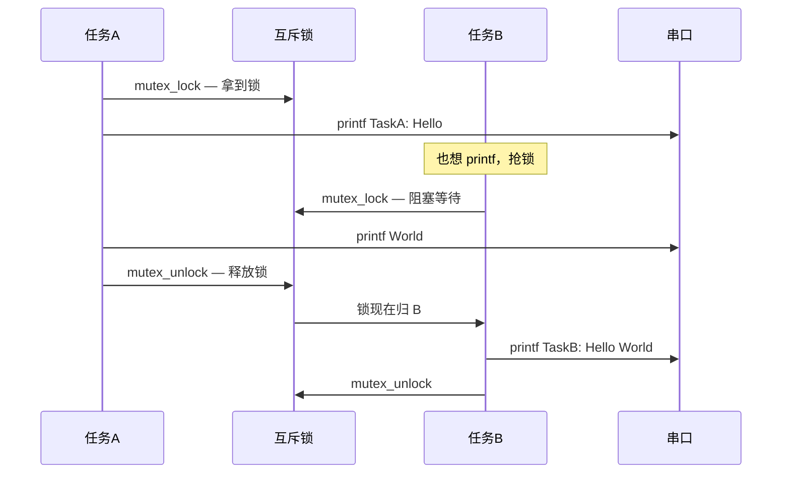
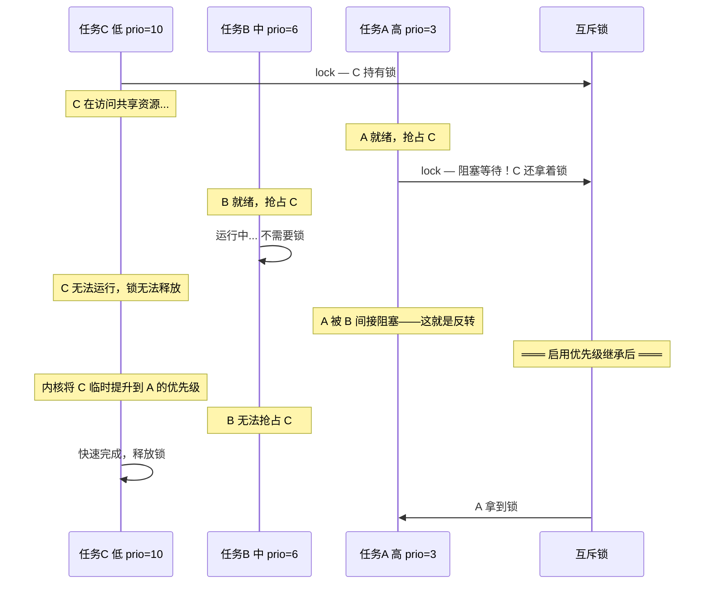
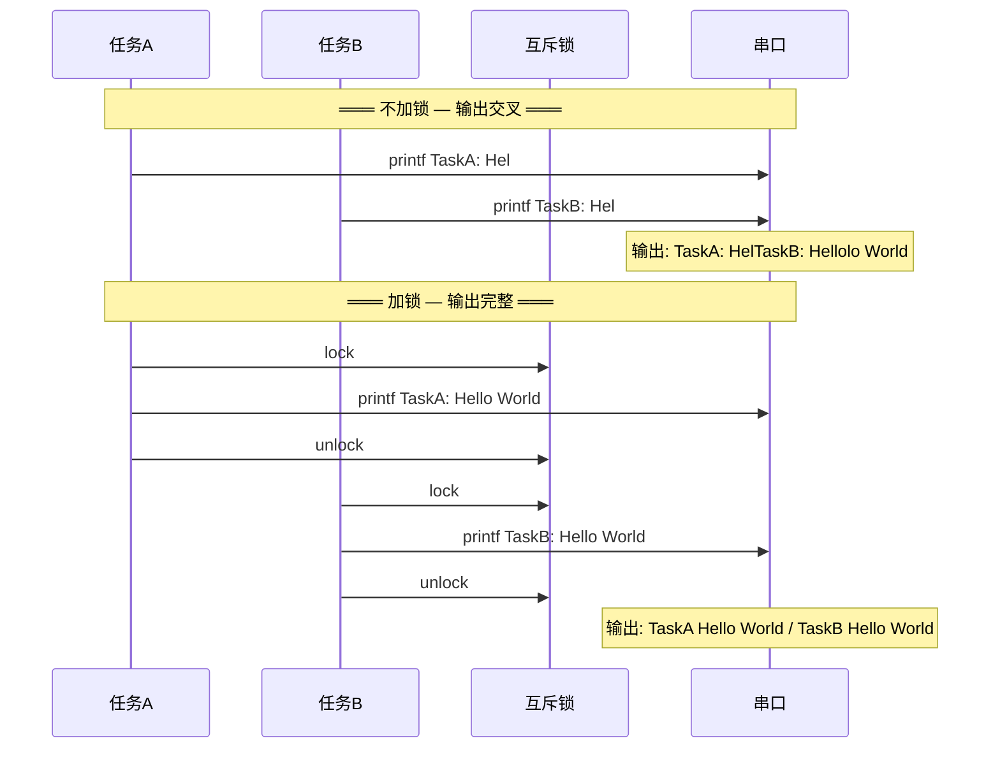

# OSAL 互斥锁

> 共享资源保护 — OSAL (Operating System Abstraction Layer) 互斥锁

> 前置阅读：[OSAL 任务调度](../task/task-concurrency.md) — 需要先理解任务抢占和调度锁的概念

## 学习目标

- 理解互斥锁的核心用途——保护多任务共享的临界资源
- 掌握 `osal_mutex_init(mutex)` → `osal_mutex_lock(mutex)` → `osal_mutex_unlock(mutex)` 的标准调用链
- 理解优先级继承机制——互斥锁如何防止经典的优先级反转问题
- 能够识别死锁风险并使用 `osal_mutex_lock_timeout` 超时退出

## 基本概念

### 互斥锁解决什么问题

当多个任务访问同一个共享资源时，需要保证"原子性"——一个任务访问期间，其他任务不能插进来。



### 优先级反转与优先级继承

互斥锁最经典的陷阱是优先级反转。看下面这个场景：



> 优先级反转导致高优先级任务被中优先级任务间接阻塞，可能让系统实时性崩溃。互斥锁的优先级继承机制自动解决这个问题——信号量没有这个机制，这是选择互斥锁的关键理由。

### 三种保护的对比

| 对比项 | 互斥锁 | 调度锁 | 关中断 |
|--------|:---:|:---:|:---:|
| 禁止什么 | 其他任务访问**同一个锁**保护的资源 | 所有任务调度 | 所有中断 + 调度 |
| 其他任务能运行 | 能（访问不同锁/无锁区域） | 不能 | 不能 |
| 允许 ISR (Interrupt Service Routine) | 允许 | 允许 | 不允许 |
| 持锁上限 | 不限（但越短越好） | < 1ms | < 10μs |
| 优先级继承 | 有 | 无 | 无 |
| 典型场景 | 保护 printf / SPI (Serial Peripheral Interface) / 配置结构体 | 保护一个标志位 | 保护 ISR 与任务共享的变量 |

> 大多数场景用互斥锁。只在保护极短临界区（< 1μs）且不需要优先级继承时才用调度锁。

### 死锁的避免

当两个任务互相等对方释放锁时发生死锁：

```
任务A: lock(A) → lock(B)    任务B: lock(B) → lock(A)
         ↓                        ↓
      等 B 释放...              等 A 释放...
```

三条规则避免死锁：

1. **统一加锁顺序**——所有任务按相同顺序加锁（如永远先锁 A 再锁 B）
2. **使用超时加锁**——`osal_mutex_lock_timeout(&mutex, 100)` 超时后退出并报错
3. **减少锁持有时间**——不在锁内调 `osal_msleep`，不在锁内调可能阻塞的 API

## 涉及 API

| API | 谁调用 | 用途 | 头文件 |
|-----|--------|------|--------|
| `osal_mutex_init(osal_mutex *mutex)` | 入口任务 | 初始化互斥锁 | `osal_mutex.h` |
| `osal_mutex_lock(osal_mutex *mutex)` | 任务A/B | 加锁——阻塞等待直到拿到锁 | `osal_mutex.h` |
| `osal_mutex_lock_timeout(osal_mutex *mutex, unsigned int timeout)` | 任务A/B | 加锁——超时返回，timeout 单位 ms | `osal_mutex.h` |
| `osal_mutex_unlock(osal_mutex *mutex)` | 任务A/B | 解锁——释放锁，唤醒等待者 | `osal_mutex.h` |

> 互斥锁有优先级继承，信号量没有——这是选择互斥锁的关键理由。保护共享资源时优先用互斥锁。

## 案例说明

### 案例简介

两个任务同时向串口打印字符串。先看不加锁时的输出交叉混乱，再看加锁后输出整齐。用肉眼可见的效果直观理解互斥锁的作用。

> 这个案例演示的是嵌入式开发中最常见的问题之一——"为什么我的串口日志是乱的？"

### 功能规格

| 规格项 | 任务A | 任务B |
|--------|:---:|:---:|
| 优先级 | `OSAL_TASK_PRIORITY_MIDDLE`（6） | 同（6） |
| 栈大小 | 4096 字节 | 4096 字节 |
| 职责 | 循环打印 "TaskA: Hello World" | 循环打印 "TaskB: Hello World" |
| 共享资源 | 串口（隐含在 `printf` 中） | |
| 保护方式 | 全局互斥锁 `g_print_mutex` | |

程序运行流程：

1. 创建互斥锁 → 创建任务A → 创建任务B
2. 两个任务同优先级，时间片轮转执行
3. 不加锁时：A 打印到一半被 B 抢占 → 输出交叉混乱
4. 加锁后：A 拿到锁 → 完整打印 → 释放 → B 拿到锁 → 完整打印

### 案例流程



## 案例操作指导

### 第一步：编译

```bash
fbb config set CONFIG_SAMPLE_ENABLE=y --target ws63-liteos-app
fbb config set CONFIG_ENABLE_OS_SAMPLE=y --target ws63-liteos-app
fbb config set CONFIG_SAMPLE_SUPPORT_OSAL_MUTEX=y --target ws63-liteos-app
fbb build ws63-liteos-app
```

> 更多编译选项请参考 [构建操作](../../../overall-architecture/build-output/index.md#构建操作)。

### 第二步：烧录

```bash
fbb flash ws63-liteos-app
```

> 更多烧录选项请参考 [构建操作](../../../overall-architecture/build-output/index.md#构建操作)。

### 第三步：验证

复位后观察带互斥锁版本的输出：

```
[mutex] started
[mutex] TaskA: Hello World
[mutex] TaskB: Hello World
[mutex] TaskA: Hello World
[mutex] TaskB: Hello World
```

每行完整，清晰可读。

## 关键配置

| 参数 | 值 | 说明 |
|------|-----|------|
| 互斥锁超时 | 100ms | 用 `lock_timeout` 替代 `lock`，防止死锁永久挂起 |
| 锁持有时间 | 越短越好 | 只在实际访问共享资源时持有，不在锁内调 `osal_msleep` |
| 加锁顺序 | 全局统一 | 所有任务按相同顺序加多个锁（如永远先 A 后 B） |
| 任务栈 | 4096 | `printf` 内部有较大的栈消耗，给足余量 |

## 代码详解

### 互斥锁初始化

```c
#include "osal_mutex.h"

static osal_mutex g_print_mutex;  // 互斥锁对象

/* 入口中初始化 */
osal_mutex_init(&g_print_mutex);
```

### 不加锁的版本——输出交叉混乱

```c
/* 任务A 和 任务B 都直接 printf，不加任何保护 */
static int task_a_handler(void *data)
{
    (void)data;
    while (1) {
        printf("TaskA: Hello World\n");  // 可能被 B 打断
        osal_msleep(100);
    }
    return 0;
}

static int task_b_handler(void *data)
{
    (void)data;
    while (1) {
        printf("TaskB: Hello World\n");  // 可能被 A 打断
        osal_msleep(100);
    }
    return 0;
}
/* 结果：两个 printf 随机交叉，输出混乱 */
```

### 加锁的版本——输出完整

```c
static int task_a_handler(void *data)
{
    (void)data;
    while (1) {
        osal_mutex_lock(&g_print_mutex);              // 拿锁
        printf("TaskA: Hello World\n");               // 安全打印
        osal_mutex_unlock(&g_print_mutex);            // 放锁
        osal_msleep(100);
    }
    return 0;
}

static int task_b_handler(void *data)
{
    (void)data;
    while (1) {
        osal_mutex_lock(&g_print_mutex);              // 拿锁——等 A 释放
        printf("TaskB: Hello World\n");               // 安全打印
        osal_mutex_unlock(&g_print_mutex);            // 放锁
        osal_msleep(100);
    }
    return 0;
}
/* 结果：每次打印都完整，不会交叉 */
```

### 超时加锁——防止死锁

```c
/* 用超时版本避免永久阻塞 */
if (osal_mutex_lock_timeout(&g_print_mutex, 100) != 0) {
    printf("lock timeout!\n");  // 100ms 还没拿到锁，报错退出
    return -1;
}
/* 拿到锁，安全操作 */
printf("TaskA: Hello World\n");
osal_mutex_unlock(&g_print_mutex);
```

### 死锁场景演示——为什么统一加锁顺序重要

```c
/* 危险写法——任务A 和 任务B 用相反的加锁顺序 */
/* 任务A: 先锁 A 再锁 B */
osal_mutex_lock(&mutex_a);
osal_msleep(10);               // 给 B 时间拿到 mutex_b
osal_mutex_lock(&mutex_b);     // 等 B 释放 mutex_b...

/* 任务B: 先锁 B 再锁 A */
osal_mutex_lock(&mutex_b);
osal_mutex_lock(&mutex_a);     // 等 A 释放 mutex_a...

/* 结果：A 等 B 放 mutex_b，B 等 A 放 mutex_a → 死锁！ */
/* 正确：两个任务都用相同顺序（如永远先锁 A 再锁 B） */
```

> 死锁的典型特征是系统"无声无息地卡死"——没有 crash，没有 panic，任务就是不再执行了。用 `lock_timeout` 可以检测并恢复。

---

## 源码路径

```text
application/samples/os/ipc/osal_mutex/
├── CMakeLists.txt
└── osal_mutex_sample.c
```

对应配置项为 `CONFIG_SAMPLE_SUPPORT_OSAL_MUTEX`。案例已在 WS63 开发板 COM4 上完成 7 分区烧录，并匹配串口日志 `[mutex] TaskA: Hello World`。

