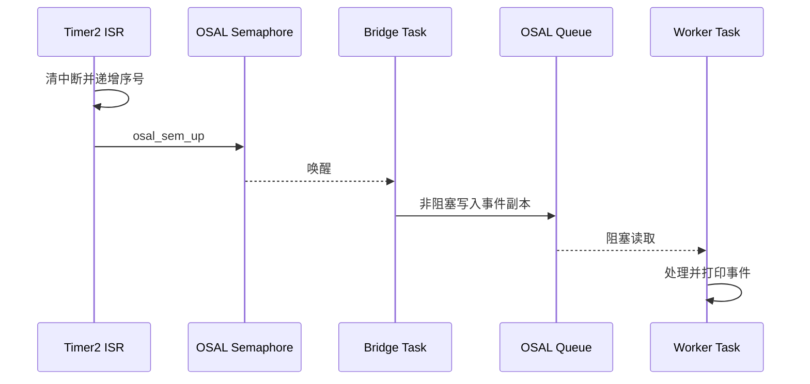

# OSAL 消息队列：ISR 到任务

> 使用 OSAL (Operating System Abstraction Layer) 信号量和消息队列，把中断事件安全地交给任务处理。前置阅读：[OSAL 中断管理](../interrupt/osal-interrupt.md)。

## 学习目标

- 理解 ISR (Interrupt Service Routine) 中只执行清中断、记录最小状态和通知任务
- 掌握 `osal_msg_queue_create` → `osal_msg_queue_write_copy` → `osal_msg_queue_read_copy` 的调用链
- 理解固定大小消息的副本传递语义和队列满处理
- 掌握不支持 ISR 直接写队列时的“信号量桥接任务”设计

## 设计约束

当前 SDK 的 `osal_msg_queue_write_copy` 和 `osal_msg_queue_read_copy` 不能在中断等不可阻塞上下文调用。因此 ISR **不能直接写消息队列**。案例采用以下受支持的链路：



这样既保持 ISR 足够短，又确保消息队列 API 只在任务上下文调用。

## 消息设计

```c
typedef struct {
    uint32_t type;
    uint32_t sequence;
} msg_queue_event_t;
```

桥接任务使用非阻塞写入，工作任务可以阻塞等待。消息队列传递的是结构体副本，工作任务不会引用 ISR 或其他任务的栈内存；不要从 ISR 投递指向栈变量的指针。

## 案例说明

案例使用 Timer2 每秒产生一次真实硬件中断。ISR 清除中断、更新序号并释放二值信号量；桥接任务被唤醒后把事件写入深度为 4 的队列；工作任务阻塞读取并打印事件类型和序号。

| 参数 | 值 | 说明 |
| --- | --- | --- |
| 中断源 | Timer2 | 无需外接硬件 |
| 中断周期 | 1 秒 | 便于串口观察 |
| 队列深度 | 4 | 可缓存短时突发 |
| 消息大小 | `sizeof(msg_queue_event_t)` | 创建、写入和读取保持一致 |
| 桥接任务优先级 | `OSAL_TASK_PRIORITY_MIDDLE` | 尽快把中断通知转换为消息 |
| 工作任务优先级 | `OSAL_TASK_PRIORITY_LOW` | 在任务上下文处理业务 |

桥接任务使用 `OSAL_MSGQ_NO_WAIT` 非阻塞写入。队列满时丢弃当前事件并打印：

```text
[msg_queue] queue full, dropped sequence=<n>
```

队列持续满通常表示工作任务处理过慢或消息模型不合理，不应只靠无限增大队列掩盖问题。

## 源码路径

```text
application/samples/os/ipc/osal_msg_queue/
├── CMakeLists.txt
└── osal_msg_queue_sample.c
```

对应配置项为 `CONFIG_SAMPLE_SUPPORT_OSAL_MSG_QUEUE`。

## 案例操作指导

### 第一步：编译

```bash
fbb config set CONFIG_SAMPLE_ENABLE=y --target ws63-liteos-app
fbb config set CONFIG_ENABLE_OS_SAMPLE=y --target ws63-liteos-app
fbb config set CONFIG_SAMPLE_SUPPORT_OSAL_MSG_QUEUE=y --target ws63-liteos-app
fbb build ws63-liteos-app
```

> 更多编译选项请参考 [构建操作](../../../overall-architecture/build-output/index.md#构建操作)。

### 第二步：烧录

```bash
fbb flash ws63-liteos-app
```

### 第三步：验证

```text
[msg_queue] started: ISR -> semaphore -> queue -> worker
[msg_queue] worker received type=1 sequence=1
[msg_queue] worker received type=1 sequence=2
[msg_queue] worker received type=1 sequence=3
```

序号持续递增，说明 Timer2 ISR、信号量、桥接任务、消息队列和工作任务链路均正常。

## 上板验证结果

案例已在 WS63 开发板 COM16 上完成验证。固件成功烧录 7 个分区，串口在复位后匹配：

```text
[msg_queue] worker received type=1 sequence=1
```

---
