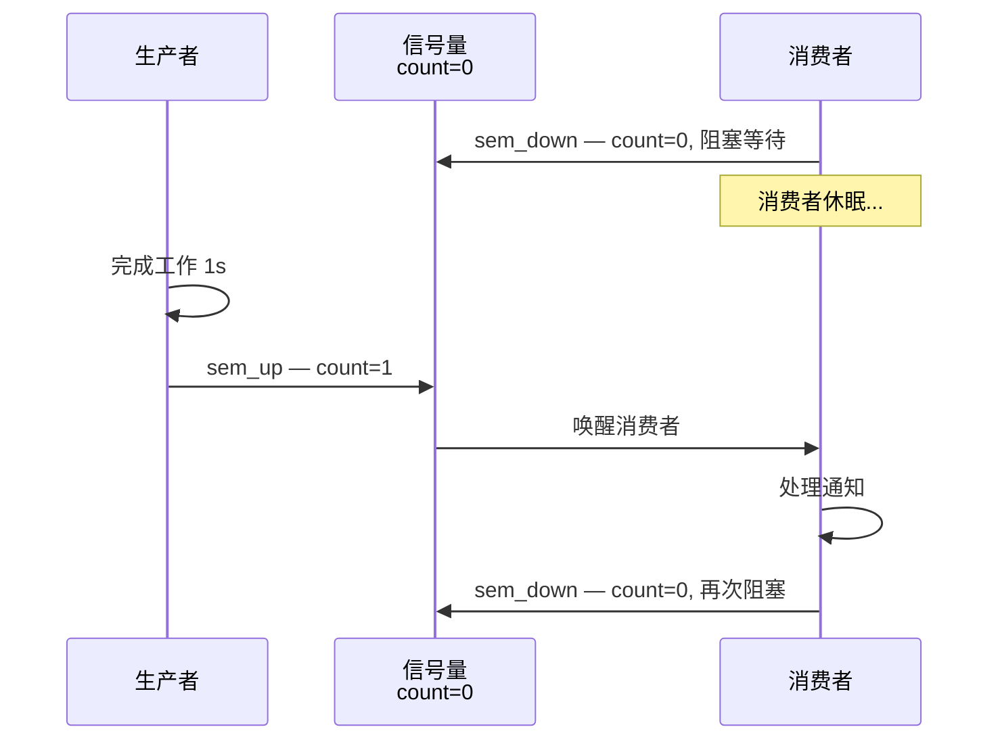
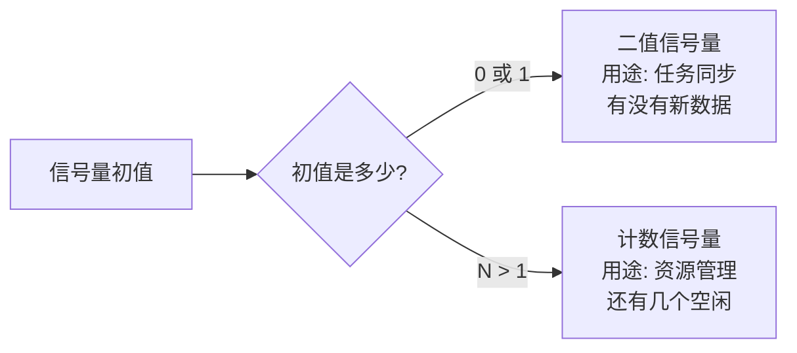
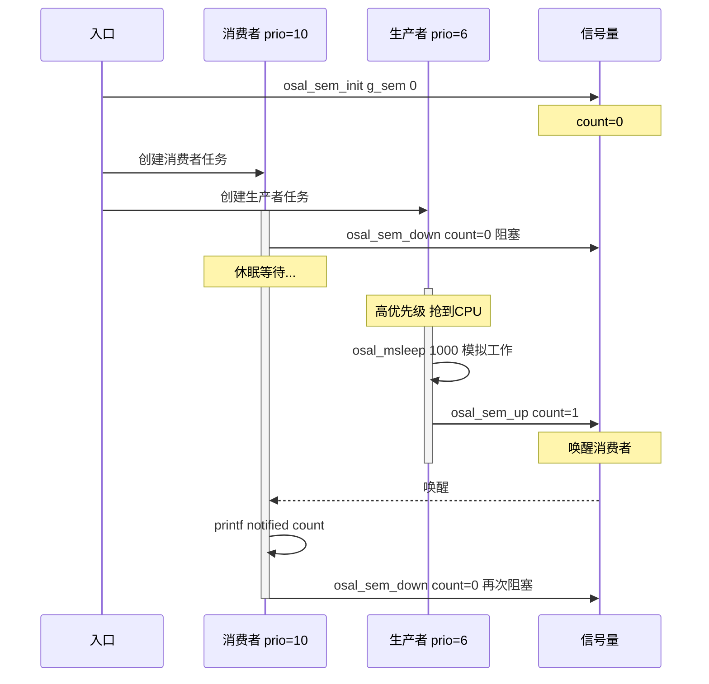

# OSAL 信号量同步

> 信号量 — 任务同步 — OSAL (Operating System Abstraction Layer) 计数信号量

> 前置阅读：[OSAL 任务调度](../task/task-concurrency.md) — 需要先理解任务创建和优先级模型

## 学习目标

- 理解信号量的核心用途——任务间同步（"数据准备好了"的信号）
- 掌握 `osal_sem_init(sem, val)` → `osal_sem_down(sem)` → `osal_sem_up(sem)` 的标准调用链
- 理解二值信号量（任务同步）和计数信号量（资源管理）的区别和使用场景
- 能够在任务间用信号量实现生产者→消费者的数据就绪通知

## 基本概念

### 信号量解决什么问题

信号量是任务间最轻量的同步方式——一个任务说"好了"，另一个任务收到后继续。形象地说：信号量像是一面旗子——生产者举旗（`sem_up`），消费者看到旗子后行动（`sem_down`）。



### 典型使用场景

| 场景 | 谁 up | 谁 down |
|------|-------|--------|
| 传感器采样完成 → 通知处理任务 | 采样任务（或 DMA (Direct Memory Access) 中断 ISR (Interrupt Service Routine)） | 数据处理任务 |
| 按键中断 → 唤醒处理任务 | ISR（`sem_up` 可在 ISR 中调用） | 按键处理任务 |
| 多个空闲缓冲区可用 | 缓冲区释放者（每次释放 up） | 缓冲区申请者（每次申请 down） |

> `osal_sem_up` 可以在 ISR 中用于通知任务；当前 SDK 的消息队列读写接口不能在中断上下文调用。如果中断事件还需要携带数据，可先用信号量唤醒桥接任务，再由任务写入消息队列。

### 信号量 vs 互斥锁

初学者容易混淆这两个概念，但它们解决的问题完全不同：

| 对比项 | 信号量 | 互斥锁 |
|--------|:---:|:---:|
| 解决什么问题 | 同步——"数据好了" | 互斥——"这个归我用" |
| 初值 | 0（等通知）或 N（N 个资源） | 1（未锁定） |
| 计数范围 | 0 ~ N | 0 ~ 1 |
| 优先级继承 | 无 | 有 |
| ISR 中释放 | `sem_up` **可以** | `mutex_unlock` **不行** |
| 谁释放 | 任何任务/ISR | 只能由加锁的任务解锁 |

> 信号量 = "有 3 个空闲缓冲区可用"（计数型）。互斥锁 = "串口当前只有我能用"（排他型）。两者不是替代关系。

### 二值信号量 vs 计数信号量



- **二值信号量**：初值 0 或 1，用于任务同步——生产者 `up` → 消费者 `down`，一对一通知
- **计数信号量**：初值 N（如 3），用于资源管理——每分配一个资源 `down`（N-1），每释放一个资源 `up`（N+1），N 降到 0 时申请者阻塞

## 涉及 API

| API | 谁调用 | 用途 | 头文件 |
|-----|--------|------|--------|
| `osal_sem_init(osal_semaphore *sem, int val)` | 入口任务 | 初始化信号量，val=初始计数 | `osal_semaphore.h` |
| `osal_sem_down(osal_semaphore *sem)` | 消费者任务 | P 操作——等待信号量，count=0 则阻塞 | `osal_semaphore.h` |
| `osal_sem_down_timeout(osal_semaphore *sem, unsigned int timeout)` | 消费者任务 | P 操作——带超时，timeout 单位 ms | `osal_semaphore.h` |
| `osal_sem_up(osal_semaphore *sem)` | 生产者/ISR | V 操作——释放信号量，count+1（可在 ISR 中调） | `osal_semaphore.h` |

## 案例说明

### 案例简介

生产者任务每 1 秒完成一次模拟工作，通过 `sem_up` 通知消费者。消费者阻塞在 `sem_down` 上等待，被唤醒后打印通知序号。最简同步模式——不涉及数据传递，专注演示信号量的"通知"语义。

> 需要传递数据（而不仅是通知）的场景，请阅读下一篇：[OSAL 消息队列](./queue-isr-task.md)。

### 功能规格

| 规格项 | 生产者任务 | 消费者任务 |
|--------|:---:|:---:|
| 优先级 | `OSAL_TASK_PRIORITY_MIDDLE`（6） | `OSAL_TASK_PRIORITY_LOW`（10） |
| 栈大小 | 4096 字节 | 4096 字节 |
| 职责 | 模拟工作 1s → `sem_up` 通知 | `sem_down` 阻塞等待 → 打印计数 |
| 信号量初值 | 0（消费者初始阻塞） |
| 同步方式 | 纯信号量，不涉及数据传递 |

程序运行流程：

1. 入口创建信号量（初值 0）→ 创建消费者任务 → 创建生产者任务
2. 消费者先运行 → `sem_down` 阻塞（count=0，进入等待）
3. 生产者运行 → `osal_msleep(1000)` → `sem_up` → 消费者被唤醒
4. 消费者打印 → 再次 `sem_down` → 继续等待下一个通知

### 案例流程



## 案例操作指导

### 第一步：编译

```bash
fbb config set CONFIG_SAMPLE_ENABLE=y --target ws63-liteos-app
fbb config set CONFIG_ENABLE_OS_SAMPLE=y --target ws63-liteos-app
fbb config set CONFIG_SAMPLE_SUPPORT_OSAL_SEMAPHORE=y --target ws63-liteos-app
fbb build ws63-liteos-app
```

> 更多编译选项请参考 [构建操作](../../../overall-architecture/build-output/index.md#构建操作)。

### 第二步：烧录

```bash
fbb flash ws63-liteos-app
```

> 更多烧录选项请参考 [构建操作](../../../overall-architecture/build-output/index.md#构建操作)。

### 第三步：验证

上电后串口每秒输出一行：

```
[semaphore] consumer notified: 1
[semaphore] consumer notified: 2
[semaphore] consumer notified: 3
...
```

数字从 1 开始持续递增，说明每次 `sem_up` 都成功唤醒了消费者。

## 关键配置

| 参数 | 值 | 说明 |
|------|-----|------|
| 信号量初值 | 0 | 消费者初始阻塞，等生产者第一次 `up` |
| 生产者优先级 | `MIDDLE`（6） | 比消费者高，确保工作完成后优先通知 |
| 消费者优先级 | `LOW`（10） | 后台任务，被通知后才运行 |
| `sem_down` 调用上下文 | **仅任务** | ISR 中不能调 `sem_down`（没非阻塞版本） |
| `sem_up` 调用上下文 | 任务或 ISR | ISR 中通知任务的标准方式 |

## 代码详解

### 信号量初始化

```c
#include "osal_semaphore.h"

static osal_semaphore g_sem;  // 信号量对象

/* 入口中初始化 */
osal_sem_init(&g_sem, 0);
/* 初值 0: 消费者一开始调用 sem_down 就会阻塞
   初值 1: 消费者第一次 sem_down 立即通过（相当于"已经有一次通知"）
   初值 3: 用于资源管理——3 个空闲缓冲区 */
```

### 生产者任务

```c
static int producer_task_handler(void *data)
{
    (void)data;
    while (1) {
        osal_msleep(1000);        // 模拟"完成工作"（实际可能是等传感器/等DMA）
        osal_sem_up(&g_sem);      // 通知——"数据好了!"
        /* sem_up 可在 ISR 中调用，所以这个模式同样适用于中断→任务的场景 */
    }
    return 0;
}
```

### 消费者任务

```c
static int consumer_task_handler(void *data)
{
    (void)data;
    int count = 0;
    while (1) {
        osal_sem_down(&g_sem);    // 阻塞等待——没通知时休眠
        /* sem_down 不能在 ISR 中调用——ISR 不能阻塞 */
        count++;
        osal_printk("[semaphore] consumer notified: %u\r\n", count);
    }
    return 0;
}
```

### 二值信号量 vs 计数信号量的代码对比

```c
/* ===== 二值信号量：任务同步 ===== */
osal_sem_init(&binary_sem, 0);
// 生产者: osal_sem_up(&binary_sem);
// 消费者: osal_sem_down(&binary_sem);
// 用途: "有新数据了", "操作完成了"

/* ===== 计数信号量：资源管理 ===== */
osal_sem_init(&count_sem, 3);   // 3 个空闲缓冲区
// 申请缓冲区: osal_sem_down(&count_sem);  // 计数-1，到 0 则阻塞
// 释放缓冲区: osal_sem_up(&count_sem);    // 计数+1
// 用途: 跟踪可用资源数量
```

> 为什么信号量叫"计数"信号量？因为 `count` 可以 >1——每次 `up` 加 1，每次 `down` 减 1，count 降到 0 时 `down` 阻塞。互斥锁的"计数"只能是 0 或 1。

---

## 源码路径

```text
application/samples/os/ipc/osal_semaphore/
├── CMakeLists.txt
└── osal_semaphore_sample.c
```

对应配置项为 `CONFIG_SAMPLE_SUPPORT_OSAL_SEMAPHORE`。案例已在 WS63 开发板 COM4 上完成 7 分区烧录，并匹配串口日志 `[semaphore] consumer notified: 1`。

