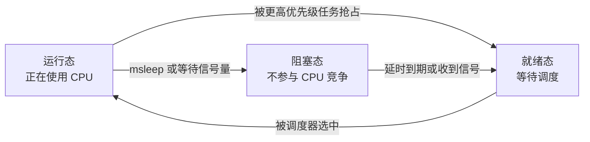
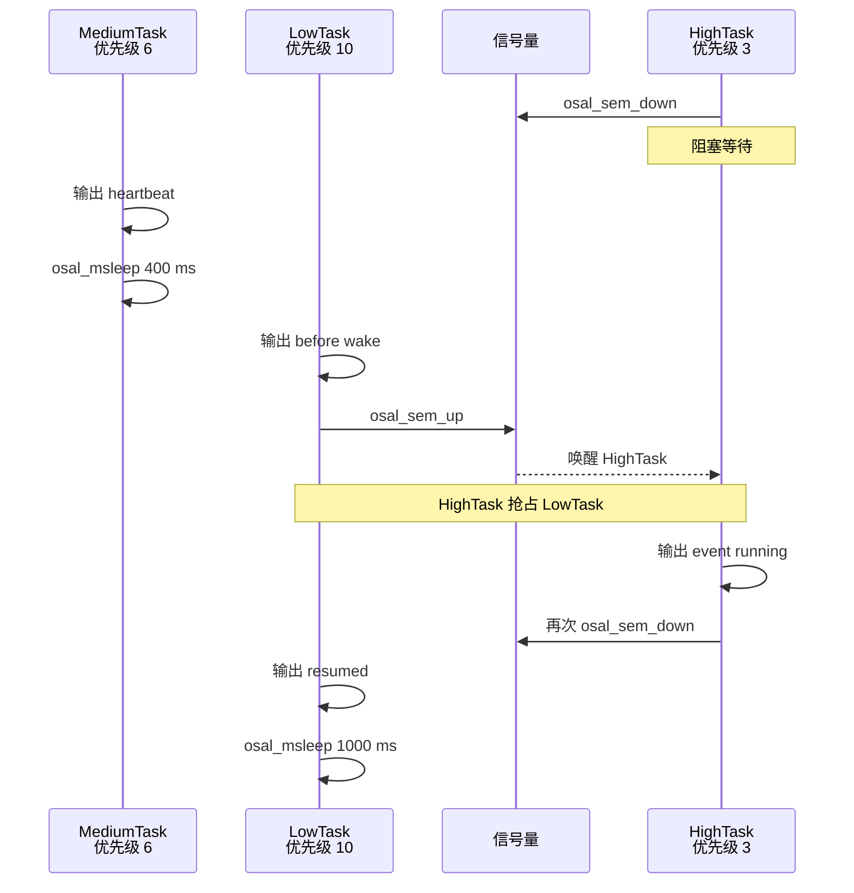

# OSAL 任务调度

> 使用三个不同优先级的 OSAL (Operating System Abstraction Layer) 任务，观察任务阻塞、唤醒、交错运行和高优先级抢占。

## 学习目标

- 理解单核处理器中并发与并行的区别
- 掌握 `osal_kthread_create()` 和 `osal_kthread_set_priority()` 的基本用法
- 理解运行态、就绪态和阻塞态之间的转换
- 理解 OSAL 任务优先级数值越小、优先级越高
- 通过固定串口日志顺序观察高优先级任务的抢占过程
- 使用 `osal_msleep()` 或等待同步对象让出 CPU，避免任务忙循环

## 基本原理

### 单核任务调度

WS63 的应用任务运行在单个 CPU 上，**任意时刻只能有一个任务使用 CPU**。操作系统调度器把 CPU
使用时间分给不同任务，所以从一段时间来看，多个任务都在向前运行，这种方式称为并发。


图中的每个方框代表一个不同的时间段。CPU 先执行 MediumTask，再切换到 LowTask；LowTask 唤醒
HighTask 后被抢占，CPU 转去执行 HighTask；HighTask 再次阻塞后，CPU 回到 LowTask 继续执行。

```text
时间向前：MediumTask → LowTask → HighTask → LowTask → MediumTask
同一时刻：                  只有一个任务在运行
```

并行表示两个任务在同一时刻分别运行在不同 CPU 核上。本案例演示的是单核 CPU 分时执行多个任务，
不是多核并行。

### 任务的三种基本状态



| 状态 | 含义 | 本案例中的表现 |
| --- | --- | --- |
| 运行态 | 当前正在使用 CPU | 任务输出日志或执行 `sem_up` |
| 就绪态 | 已具备运行条件，等待调度器选择 | HighTask 被唤醒后进入就绪态 |
| 阻塞态 | 正在等待时间或事件，不竞争 CPU | `osal_msleep()`、`osal_sem_down()` |

阻塞不是停止任务。阻塞条件满足后，任务会重新进入就绪态。

### 优先级与抢占

WS63 LiteOS (Huawei LiteOS) 的 OSAL 任务优先级数值越小，优先级越高：

| 优先级宏 | 数值 | 本案例任务 |
| --- | ---: | --- |
| `OSAL_TASK_PRIORITY_HIGH` | 3 | HighTask |
| `OSAL_TASK_PRIORITY_MIDDLE` | 6 | MediumTask |
| `OSAL_TASK_PRIORITY_LOW` | 10 | LowTask |

优先级只在多个任务同时处于就绪态时发挥作用。HighTask 等待信号量期间处于阻塞态，不会因为优先级高而持续占用 CPU。

LowTask 调用 `osal_sem_up()` 后，HighTask 从阻塞态变为就绪态。HighTask 的优先级高于当前运行的 LowTask，
因此调度器先运行 HighTask；HighTask 再次阻塞后，LowTask 才从原位置继续执行。

## 案例说明

### 案例功能

案例创建三个常驻任务：

| 任务 | 周期或等待条件 | 职责 |
| --- | --- | --- |
| HighTask | 等待信号量 | 收到事件后打印处理序号，随后重新阻塞 |
| MediumTask | 400 ms | 打印独立心跳，展示不同任务交错运行 |
| LowTask | 1000 ms | 打印唤醒前日志、唤醒 HighTask、打印恢复日志 |

HighTask 与 LowTask 的日志形成下面的固定顺序：

```text
[low] round=N before wake
[high] event=N running
[low] round=N resumed
```

HighTask 的日志出现在 LowTask 的两条日志之间，说明 LowTask 在唤醒更高优先级任务后被抢占；`resumed` 表示 HighTask 处理完成并重新阻塞后，LowTask 才恢复运行。

信号量在本案例中只用于制造确定、可重复的唤醒条件。信号量的计数语义和生产者/消费者模式请阅读 [OSAL 信号量同步](../ipc/semaphore-sync.md)。

### 代码目录

案例路径：

```text
src/application/samples/os/task/osal_task_concurrency/
```

```text
src/application/samples/os/
├── CMakeLists.txt
├── Kconfig
└── task/
    └── osal_task_concurrency/
        ├── CMakeLists.txt
        └── osal_task_concurrency.c
```

该案例属于操作系统任务调度，不依赖 GPIO (General Purpose Input/Output)、LED (Light Emitting Diode)、按键等外设，因此放在 `application/samples/os/task/`，不再使用原来的 `application/samples/peripheral/tasks/`。

### 运行流程



## 涉及 API

| API | 用途 | 头文件 |
| --- | --- | --- |
| `osal_kthread_create()` | 创建任务 | `osal_task.h`，由 `soc_osal.h` 汇总包含 |
| `osal_kthread_set_priority()` | 设置任务优先级 | `osal_task.h` |
| `osal_kthread_lock()` / `osal_kthread_unlock()` | 初始化期间暂停和恢复任务调度 | `osal_task.h` |
| `osal_msleep()` | 使当前任务延时并让出 CPU | `osal_task.h` |
| `osal_sem_init()` | 创建初值为 0 的信号量 | `osal_semaphore.h` |
| `osal_sem_down()` | 等待信号量，无事件时阻塞 | `osal_semaphore.h` |
| `osal_sem_up()` | 释放信号量并唤醒等待任务 | `osal_semaphore.h` |

## 案例操作指导

### 第一步：启用案例

```bash
fbb config set CONFIG_SAMPLE_ENABLE=y --target ws63-liteos-app
fbb config set CONFIG_ENABLE_OS_SAMPLE=y --target ws63-liteos-app
fbb config set CONFIG_SAMPLE_SUPPORT_OSAL_TASK_CONCURRENCY=y --target ws63-liteos-app
```

验证本案例时，应关闭其他会持续输出日志的 sample，避免串口日志相互干扰。

### 第二步：编译

配置变化后执行 clean 构建：

```bash
fbb build --clean ws63-liteos-app
```

编译成功后生成：

```text
output/ws63/fwpkg/ws63-liteos-app/ws63-liteos-app_all.fwpkg
```

### 第三步：烧录

```bash
fbb flash ws63-liteos-app
```

### 第四步：验证

开发板复位后，串口首先输出优先级配置：

```text
[task_concurrency] started: high=3 medium=6 low=10
```

随后应持续出现类似日志：

```text
[medium] heartbeat=1
[medium] heartbeat=2
[low] round=1 before wake
[high] event=1 running
[low] round=1 resumed
[medium] heartbeat=3
[medium] heartbeat=4
[low] round=2 before wake
[high] event=2 running
[low] round=2 resumed
```

验收时至少连续观察 10 轮，并确认：

- `heartbeat` 持续递增，MediumTask 没有饿死
- `round` 和 `event` 从 1 开始持续递增
- 每一轮都是 `before wake` → `high running` → `resumed`
- 没有 `create failed`、`priority failed`、`wait failed` 或系统复位

MediumTask 与 LowTask 周期不是整数倍，心跳日志在不同轮次中的相对位置可能变化，这是正常的并发调度现象。抢占验证只检查同一轮的三条关键日志顺序。

## 代码详解

### 创建任务并设置优先级

```c
osal_task *task = osal_kthread_create(handler, NULL, name, stack_size);
if (task == NULL) {
    return NULL;
}

if (osal_kthread_set_priority(task, priority) != OSAL_SUCCESS) {
    osal_kthread_destroy(task, 1);
    return NULL;
}
```

案例在调度锁定期间创建三个任务并设置优先级，避免先创建的任务在其他任务配置完成前提前运行。调度锁只覆盖初始化过程，不能在任务业务循环中长时间持有。

### HighTask：事件到来前保持阻塞

```c
while (1) {
    if (osal_sem_down(&g_high_task_sem) != OSAL_SUCCESS) {
        osal_msleep(1000);
        continue;
    }
    event_count++;
    osal_printk("[high] event=%u running\r\n", event_count);
}
```

`osal_sem_down()` 在信号量计数为 0 时阻塞任务。此时 HighTask 虽然优先级最高，但不会参与 CPU 竞争。

### MediumTask：独立周期心跳

```c
while (1) {
    heartbeat_count++;
    osal_printk("[medium] heartbeat=%u\r\n", heartbeat_count);
    osal_msleep(400);
}
```

每轮任务只执行一次短日志，然后主动阻塞。不要删除 `osal_msleep()` 改成紧密循环，否则会产生大量日志并持续占用 CPU。

### LowTask：制造可观察的抢占

```c
osal_printk("[low] round=%u before wake\r\n", round_count);
osal_sem_up(&g_high_task_sem);
osal_printk("[low] round=%u resumed\r\n", round_count);
```

WS63 LiteOS 的 `LOS_SemPost()` 在唤醒等待任务后执行调度。如果被唤醒任务的优先级更高，
`osal_sem_up()` 返回前就会切换到 HighTask。HighTask 再次阻塞后，LowTask 才继续输出 `resumed`。

## 常见问题

### 为什么 HighTask 优先级最高，却不是一直运行

HighTask 大部分时间阻塞在 `osal_sem_down()`。只有 LowTask 释放信号量后，它才进入就绪态并参与调度。高优先级不等于持续占用 CPU。

### 为什么不能只创建两个周期打印任务

两个不同周期的日志只能说明两个任务都在运行，无法明确证明何时发生了抢占。本案例通过 LowTask 的前后两条日志夹住 HighTask 日志，使抢占行为可以直接验证。

### 为什么不用 LED 和按键展示

任务调度属于 OS (Operating System) 能力，不需要依赖外设。纯串口案例不需要接线，也不会把 GPIO 中断、按键消抖等其他知识混入任务管理主题。

### 日志顺序偶尔受串口影响怎么办

串口输出本身会消耗时间，因此案例每次只输出一条短日志。验证时关注同一轮 LowTask 和 HighTask 的三条日志，不要求 MediumTask 心跳出现在固定位置。
