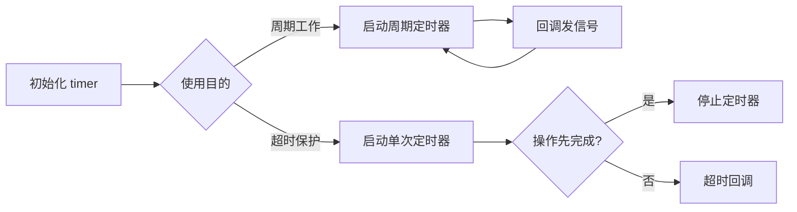
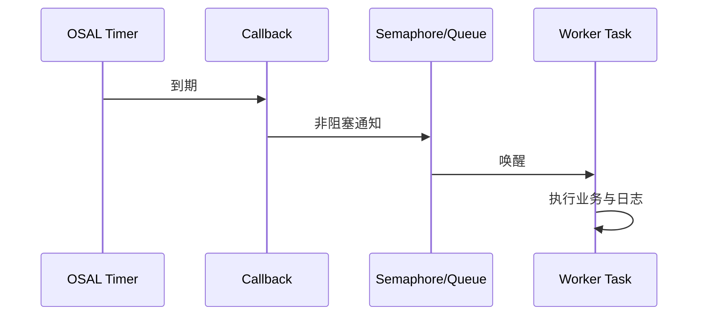

# OSAL 软件定时器

> 使用 OSAL (Operating System Abstraction Layer) 定时器实现周期任务和单次超时保护。硬件计数与精确测量请参考 [硬件 Timer](../../peripherals/timer-hw/timer-hw.md)。

## 学习目标

- 掌握 `osal_timer` 的初始化、启动、停止和重复使用。
- 理解周期模式与单次模式的差异。
- 理解定时器回调的上下文限制。
- 使用“回调通知任务”模式处理耗时业务。

## 周期模式与单次模式

| 模式 | 行为 | 典型场景 |
| --- | --- | --- |
| 周期定时器 | 每个周期触发一次，直到显式停止 | 周期采样、状态刷新、心跳 |
| 单次定时器 | 到期触发一次后停止 | 操作超时、延迟执行、无操作恢复 |

两种模式使用相同的 OSAL 定时器对象。应用应明确每次启动的预期行为，并在重新配置或释放资源前停止定时器。



## 回调规则

定时器回调应按类似 ISR (Interrupt Service Routine) 的约束设计：短小、非阻塞、不执行复杂业务。

| 回调中的操作 | 建议 |
| --- | --- |
| 更新简单状态、释放信号量 | 可以 |
| 非阻塞写消息队列 | 可以 |
| `osal_msleep()`、等待信号量 | 禁止 |
| 大量日志、文件或 NV (Non-Volatile) 操作 | 移交任务 |
| Wi-Fi、BLE (Bluetooth Low Energy) 、SLE (SparkLink Low Energy) 等可能阻塞的业务调用 | 移交任务 |

推荐流程：



## 周期任务模式

周期模式适合固定间隔触发。回调只负责通知工作任务，任务完成采样、协议交互或打印。

需要停止时先阻止新的业务调度，再停止定时器，最后等待已经唤醒的任务完成，避免资源释放后回调仍访问旧对象。

## 单次超时模式

单次定时器通常与一个异步操作成对使用：

1. 启动异步操作。
2. 启动单次超时定时器。
3. 操作先完成时停止定时器。
4. 定时器先到期时设置超时状态并通知任务执行兜底。

同一个定时器对象可以重复启动，但重新启动前应明确上一轮操作已经结束，避免旧回调影响新状态。

## 源码参考

当前 SDK 中可以参考以下 vendor 示例的 OSAL 定时器用法：

```text
vendor/HiHope_NearLink_DK_WS63E_V03/demo/timer/timer_example.c
vendor/DyCloud_WF6301_DK V1.0/demo/timer_sample/timer_sample.c
```

这些示例用于理解 API 调用；产品代码仍应根据业务状态机补充停止、销毁和并发保护。

## 选择建议

- 普通周期业务和超时保护使用 OSAL 软件定时器。
- 需要高精度计数、捕获或硬件中断时使用硬件 Timer。
- 只需要任务延时且不要求并行处理时，可在任务上下文使用 OSAL 延时接口，不必额外创建定时器。
