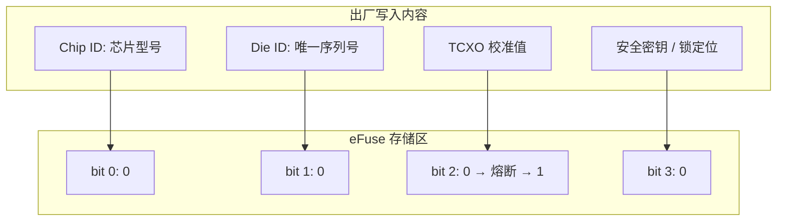
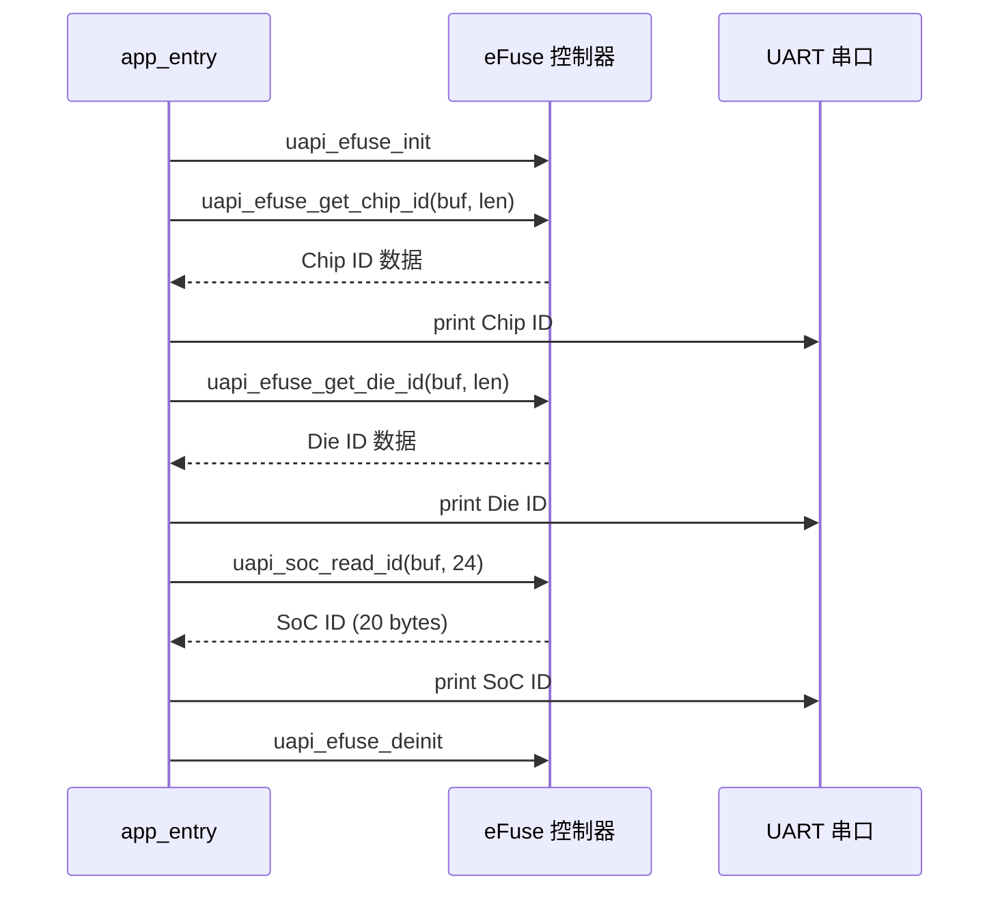

# eFuse

> eFuse (Electronic Fuse) 驱动 | 头文件: `src/include/driver/efuse.h` | 关联：[TCXO (Temperature Compensated Crystal Oscillator)](../tcxo/tcxo.md)

## 学习目标

- 理解 eFuse 作为一次性可编程（OTP (One-Time Programmable)）存储的物理特性——bit 编程后不可逆
- 掌握 eFuse 初始化、Die ID/Chip ID/SoC ID 的读取方法
- 理解 eFuse 在设备身份标识（Device Identity）和出厂配置中的作用

## 基本概念

### eFuse 是什么

eFuse（电子熔丝）是芯片内部的一种一次性可编程存储器。每个 bit 初始状态为 0，通过施加特定编程电压可将选中的 bit 熔断为 1——这个过程**不可逆**。eFuse 常用于存储芯片出厂时写入的永久性信息：



### eFuse 中存储的典型信息

| 信息 | API | 长度 | 用途 |
|------|-----|:---:|------|
| Chip ID | `uapi_efuse_get_chip_id(buf, len)` | 变长 | 芯片型号标识——固件启动时做兼容性检查 |
| Die ID | `uapi_efuse_get_die_id(buf, len)` | 变长 | 每颗芯片的唯一序列号——设备注册、云端认证、密钥派生 |
| SoC ID | `uapi_soc_read_id(id, id_length)` | 20 字节 | 系统级芯片标识（包含更多生产信息） |
| TCXO 校准值 | `uapi_efuse_get_tcxo_calibrate_val(&val)` | 1 字节 | 晶振温补参数（见 [TCXO](../tcxo/tcxo.md)） |
| 安全密钥 | 通过安全引擎读取 | 128~256-bit | 加密/签名密钥（通常不可直接通过 eFuse API 读取） |

### eFuse 编程保护

为防止误写入，SDK的写入 API 分两类：
- `uapi_efuse_write_bit()` / `uapi_efuse_write_buffer()` —— 直接写入（**已在出厂后锁定，用户不可用**）
- `uapi_efuse_write_bit_with_flag()` / `uapi_efuse_write_buffer_with_flag()` —— 需提供保护标志 `EFUSE_WRITE_PROTECT_FLAG`（`0x5A5A5A5A`），并且硬件锁定后拒绝写入

> **警告**：量产芯片的 eFuse 关键区域出厂后已硬件锁定——即使用正确的 flag 也无法写入。用户代码中只应调用**读取** API。

## 涉及 API

| API | 用途 | 头文件 |
|-----|------|--------|
| `uapi_efuse_init()` | 初始化 eFuse 模块（使能时钟） | `efuse.h` |
| `uapi_efuse_deinit()` | 反初始化 eFuse 模块 | `efuse.h` |
| `uapi_efuse_get_chip_id(buf, len)` | 读取 Chip ID（芯片型号） | `efuse.h` |
| `uapi_efuse_get_die_id(buf, len)` | 读取 Die ID（唯一序列号） | `efuse.h` |
| `uapi_soc_read_id(id, id_length)` | 读取 SoC ID（20 字节综合标识） | `efuse.h` |
| `uapi_efuse_read_buffer(buf, addr, len)` | 从指定 eFuse 字节地址读取数据 | `efuse.h` |
| `uapi_efuse_calc_crc(buf, len, &crc)` | 计算 eFuse 数据块的零计数 CRC (Cyclic Redundancy Check) | `efuse.h` |

## 案例说明

### 案例简介

本案例代码基于 SDK 头文件 `efuse.h` 中的 API 签名构建（无独立 sample），演示 eFuse 的标准读取流程：
1. `uapi_efuse_init()` 初始化 eFuse 时钟
2. `uapi_efuse_get_chip_id()` 读取芯片型号
3. `uapi_efuse_get_die_id()` 读取芯片唯一序列号
4. `uapi_soc_read_id()` 读取 20 字节 SoC ID
5. 将读取到的 ID 信息通过串口打印，实现设备身份识别

### 功能规格

| 规格项 | 说明 |
|--------|------|
| 操作类型 | 只读——不执行任何写入操作 |
| Chip ID | 芯片型号标识符 |
| Die ID | 全球唯一序列号 |
| SoC ID | 20 字节综合标识 |
| 输出 | 串口打印十六进制 ID 值 |

### 案例流程



## 案例操作指导

1. 将以下代码集成到任意可编译的 sample 工程中（如 `hello` sample 的 `app_entry` 中）
2. 编译：
   ```bash
   fbb build <your_sample>
   ```
3. 烧录固件，串口观察输出：
   - Chip ID: 十六进制芯片型号
   - Die ID: 十六进制唯一序列号（每颗芯片不同）
   - SoC ID: 20 字节十六进制数组
4. 记录 Die ID 和 SoC ID 可用于云端设备注册

## 关键配置

| 配置项 | 推荐值 | 说明 |
|--------|:---:|------|
| 缓冲区长度的缓冲区 | >= 实际 ID 长度 | `get_chip_id` 和 `get_die_id` 需要调用者提供足够大的缓冲区。建议用 16 字节数组 |
| `uapi_soc_read_id` 的 id_length | >= 20 | 必须 >= 20 字节，否则返回参数错误。建议传入 24 字节留余量 |
| CRC 校验 | 可选 | `uapi_efuse_calc_crc` 可验证 eFuse 数据完整性——建议在读取关键配置（如 TCXO 校准值）后执行 CRC 校验 |
| eFuse 初始化时机 | 系统启动早期 | eFuse 时钟可能被其他模块关闭——在使用任何 eFuse API 前务必调用 `uapi_efuse_init()` |

> **Trade-off**：eFuse 不可逆——意味着安全但不可更新。对于需要动态更新的设备信息（如固件版本号），应保存在外部 Flash 而非 eFuse。Die ID 永久不变，是最可靠的设备硬件身份标识。

## 代码详解

### 1. 初始化 eFuse 模块

```c
#include "efuse.h"

errcode_t ret = uapi_efuse_init();
if (ret != ERRCODE_SUCC) {
    osal_printk("efuse init failed: %d\r\n", ret);
    return;
}
```

### 2. 读取并打印 Chip ID

`uapi_efuse_get_chip_id()` 将芯片型号写入提供的缓冲区。注意 API 签名中 `buffer` 是 `uint8_t*`，`length` 是 `uint16_t`：

```c
uint8_t chip_id[16] = {0};

errcode_t ret = uapi_efuse_get_chip_id(chip_id, sizeof(chip_id));
if (ret == ERRCODE_SUCC) {
    osal_printk("Chip ID: ");
    for (uint16_t i = 0; i < sizeof(chip_id); i++) {
        osal_printk("%02X", chip_id[i]);
    }
    osal_printk("\r\n");
} else {
    osal_printk("get chip id failed: %d\r\n", ret);
}
```

### 3. 读取并打印 Die ID

Die ID 是每颗芯片的唯一硬件序列号——即使同型号的两颗芯片，Die ID 也完全不同：

```c
uint8_t die_id[16] = {0};

errcode_t ret = uapi_efuse_get_die_id(die_id, sizeof(die_id));
if (ret == ERRCODE_SUCC) {
    osal_printk("Die ID: ");
    for (uint16_t i = 0; i < 8; i++) {   /* 通常只打印前 8 字节即可区分 */
        osal_printk("%02X", die_id[i]);
    }
    osal_printk("\r\n");
} else {
    osal_printk("get die id failed: %d\r\n", ret);
}
```

### 4. 读取 SoC ID

`uapi_soc_read_id()` 返回 20 字节的 SoC 综合标识，包含 Chip ID + Die ID 及生产工艺信息。缓冲区长度必须 >= 20：

```c
uint8_t soc_id[24] = {0};   /* 24 字节——留 4 字节余量 */

errcode_t ret = uapi_soc_read_id(soc_id, sizeof(soc_id));
if (ret == ERRCODE_SUCC) {
    osal_printk("SoC ID: ");
    for (uint16_t i = 0; i < 20; i++) {
        osal_printk("%02X", soc_id[i]);
    }
    osal_printk("\r\n");
} else {
    osal_printk("get soc id failed: %d\r\n", ret);
}
```

### 5. 按字节地址读取 eFuse 原始数据

除了预定义的 Chip ID / Die ID 区域，也可以通过 `uapi_efuse_read_buffer()` 按字节地址读取 eFuse 任意区域：

```c
uint8_t raw_data[32] = {0};

/* 从 eFuse 地址 0x00 开始读取 32 字节原始数据 */
errcode_t ret = uapi_efuse_read_buffer(raw_data, 0x00, sizeof(raw_data));
if (ret == ERRCODE_SUCC) {
    osal_printk("eFuse raw[0..31]: ");
    for (uint16_t i = 0; i < sizeof(raw_data); i++) {
        osal_printk("%02X ", raw_data[i]);
    }
    osal_printk("\r\n");
}
```

### 6. 反初始化

使用完毕后释放 eFuse 模块时钟（如果后续不再访问 eFuse，建议 deinit 以省电）：

```c
uapi_efuse_deinit();
```

> Die ID 是设备硬件身份的最可靠来源——不可篡改、不可复制。云端设备注册时建议用 Die ID 或 SoC ID 作为设备的硬件根身份（Hardware Root of Trust）。

---

