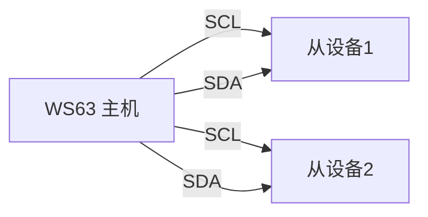
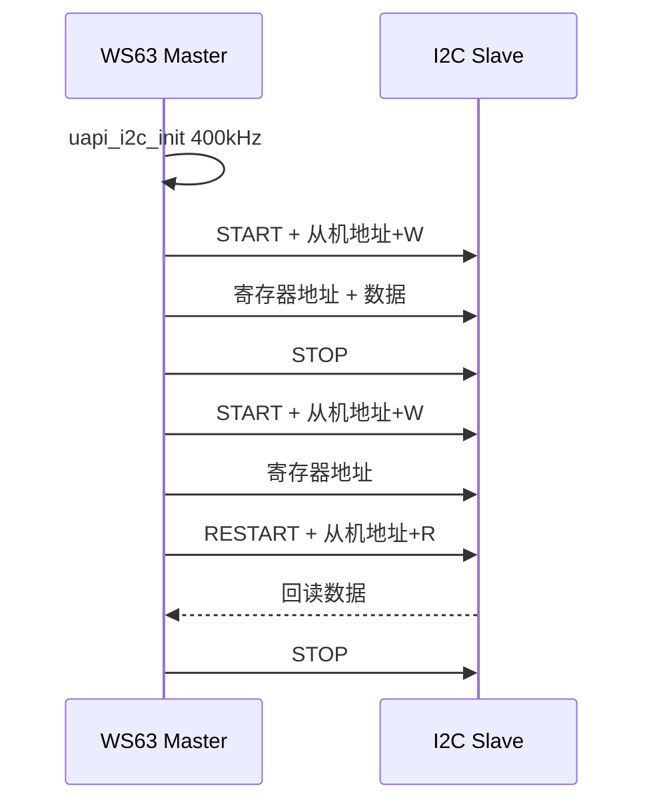

# I2C

> I2C (Inter-Integrated Circuit) 驱动 | sample: i2c

## 学习目标

- 理解 I2C 两线制总线（SCL (Serial Clock Line)+ SDA (Serial Data Line)）和主从模型
- 掌握 I2C 主机的初始化：引脚复用 → 配置地址和速率 → `uapi_i2c_master_write/read`
- 能够在 WS63 上作为 I2C 主机读写从设备（EEPROM (Electrically Erasable Programmable Read-Only Memory)、传感器等）

## 基本概念

### I2C 总线简介

I2C是飞利浦发明的两线制串行总线——SCL（时钟）+ SDA（数据），支持一主多从。



### 从机地址

每个 I2C 设备有唯一的 7-bit 地址——主机通过地址选中目标从机，然后发起读写。常见地址：EEPROM 0x50~0x57、温度传感器 0x48。

### 传输速率

| 模式 | 速率 | 适用场景 |
|------|:---:|------|
| 标准模式 | 100kHz | 低速传感器、EEPROM |
| 快速模式 | 400kHz | 多数传感器和存储器 |
| 高速模式 | 3.4MHz | 摄像头等高速设备 |

### I2C 读写时序

主机写：START → 从机地址+W → 寄存器地址 → 数据 → STOP
主机读：START → 从机地址+W → 寄存器地址 → RESTART → 从机地址+R → 读数据 → STOP

## 涉及 API

| API | 用途 | 头文件 |
|-----|------|--------|
| `uapi_pin_set_mode(pin, mode)` | 设置 SCL/SDA 引脚为 I2C 功能 | `pinctrl.h` |
| `uapi_i2c_init(port, baudrate, hscode)` | 初始化 I2C 端口和速率 | `i2c.h` |
| `uapi_i2c_master_write(port, addr, buf, len)` | 主机写数据到从机 | `i2c.h` |
| `uapi_i2c_master_read(port, addr, buf, len)` | 主机从从机读数据 | `i2c.h` |
| `uapi_i2c_deinit(port)` | 去初始化 I2C | `i2c.h` |

## 案例说明

### 案例简介

初始化 I2C 主机（400kHz），向从设备写入数据并回读验证。演示标准的 I2C 主机读写流程。

### 功能规格

| 规格项 | 说明 |
|--------|------|
| I2C 端口 | I2C0 (Master) |
| 速率 | 400kHz (Fast Mode) |
| 主机地址 | 0x0 |
| 从机地址 | 根据实际设备配置 |
| 操作 | 写数据 → 读回验证 |

程序运行流程：引脚复用 → `i2c_init` → `master_write` 写数据 → `master_read` 回读 → 比较验证。

### 案例流程



## 案例操作指导

### 第一步：编译

```bash
fbb build ws63-liteos-app
```

> 更多编译选项请参考 [构建操作](../../../overall-architecture/build-output/index.md#构建操作)。

### 第二步：烧录

```bash
fbb flash ws63-liteos-app
```

> 更多烧录选项请参考 [构建操作](../../../overall-architecture/build-output/index.md#构建操作)。

### 第三步：验证

串口打印写入和回读的数据一致。

## 关键配置

| 参数 | 值 | 说明 |
|------|-----|------|
| `baudrate` | 400000 | 400kHz——大多数 I2C 设备支持 |
| `hscode` | 0x0 | 主机地址 |
| 从机地址 | 设备数据手册 | 7-bit 地址，左移 1 位 |
| 上拉电阻 | ~4.7kΩ | I2C 总线必须有上拉——OD 输出 |

## 代码详解

完整代码参考 `src/application/samples/peripheral/i2c/i2c_master_demo.c`：

```c
#include "pinctrl.h"
#include "i2c.h"
#include "soc_osal.h"
#include "app_init.h"

#define I2C_MASTER_ADDR       0x0
#define I2C_SET_BAUDRATE      400000
#define I2C_TASK_PRIO         24

static void app_i2c_init_pin(void)
{
    /* SCL 和 SDA 都要设为 I2C 功能 */
    uapi_pin_set_mode(CONFIG_I2C_SCL_MASTER_PIN, CONFIG_I2C_MASTER_PIN_MODE);
    uapi_pin_set_mode(CONFIG_I2C_SDA_MASTER_PIN, CONFIG_I2C_MASTER_PIN_MODE);
}

static void i2c_master_task(const char *arg)
{
    (void)arg;
    i2c_data_t data = { 0 };
    uint8_t slave_addr = CONFIG_I2C_SLAVE_ADDR;

    app_i2c_init_pin();

    /* 初始化 I2C——400kHz，主机地址 0 */
    uapi_i2c_init(CONFIG_I2C_PORT, I2C_SET_BAUDRATE, I2C_MASTER_ADDR);

    /* 准备要写的数据 */
    data.send_buf[0] = 0x00;   // 寄存器地址
    data.send_buf[1] = 0x5A;   // 数据
    data.send_len = 2;

    /* 主机写 */
    uapi_i2c_master_write(CONFIG_I2C_PORT, slave_addr,
                          data.send_buf, data.send_len);

    osal_msleep(10);  // 等从设备处理

    /* 主机读——先写寄存器地址再读 */
    data.send_buf[0] = 0x00;   // 要读的寄存器地址
    data.send_len = 1;
    data.recv_len = 1;

    uapi_i2c_master_read(CONFIG_I2C_PORT, slave_addr,
                         data.send_buf, data.send_len,
                         data.recv_buf, data.recv_len);

    osal_printk("read back: 0x%02X\r\n", data.recv_buf[0]);
}
app_run(i2c_entry);
```

> I2C 是开漏（OD）输出——SCL 和 SDA 必须接上拉电阻到 VCC（通常 4.7kΩ），否则总线无法输出高电平。部分开发板内置上拉，没有的话需要外接。

---

