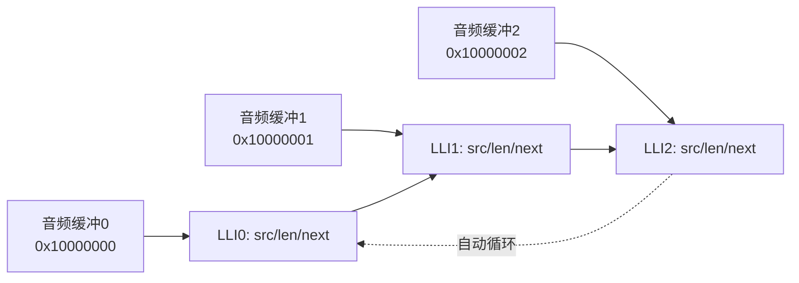
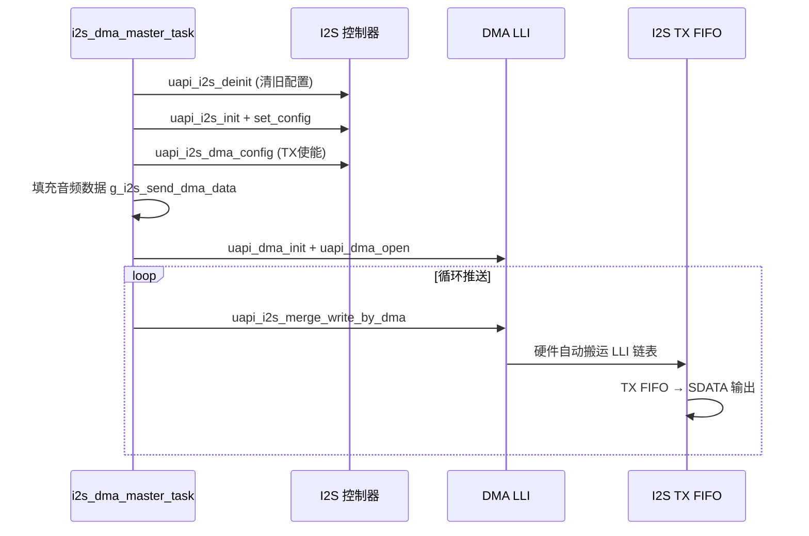

# I2S

> I2S (Inter-IC Sound) 驱动 + DMA (Direct Memory Access) LLI (Linked List Item) | sample: `src/application/samples/peripheral/i2s_dma_lli/` | 前置：[DMA](../dma/dma.md)

## 学习目标

- 理解 I2S数字音频接口的三线时序：BCLK (Bit Clock) 位时钟、LRCK (Left/Right Clock) 声道选择、SDATA (Serial Data) 音频数据
- 掌握 I2S Master 模式初始化、DMA 属性配置、以及 DMA LLI 链式传输实现无间断音频播放
- 理解 `uapi_i2s_merge_write_by_dma()` 如何在任务循环中持续推送音频数据

## 基本概念

### I2S 总线信号

I2S 是专门为数字音频传输设计的三线制同步串行总线。Master 端提供时钟，Slave 端跟随：

| 信号 | 方向 | 说明 |
|------|:---:|------|
| BCLK | Master → Slave | 每个数据位一个时钟脉冲，频率 = 采样率 × 位宽 × 声道数 |
| LRCK | Master → Slave | 左右声道帧时钟，L=低电平表示左声道数据，R=高电平表示右声道 |
| SDATA | Master → Slave | 串行音频数据，在 BCLK 边沿采样 |

### DMA LLI 为什么是音频播放的关键

音频数据需要**无间断连续流式传输**——一旦 DMA 断流，输出波形会出现毛刺（pop/click 噪声）。普通 DMA 一次只能配置一块缓冲区，传完需要 CPU 重新初始化下一块——这个间隙就是断流。

DMA LLI允许提前构建多条传输描述符的链表：DMA 完成一块后**硬件自动**加载下一块的配置参数——零间隙。I2S TX (Transmit)FIFO (First-In First-Out) 永远不会空：



### I2S 配置要素

sample 中 I2S Master 模式的关键配置项：

| 配置项 | sample 值 | 说明 |
|--------|:---:|------|
| `drive_mode` | `MASTER` | Master 提供 BCLK 和 LRCK |
| `transfer_mode` | `STD_MODE` | 标准 I2S 模式（非左对齐/右对齐） |
| `data_width` | `THIRTY_TWO_BIT` | 每声道 32-bit 数据位宽 |
| `channels_num` | `TWO_CH` | 双声道（左右） |
| `clk_edge` | `RISING_EDGE` | BCLK 上升沿采样数据 |
| `div_number` | 32 | 时钟分频系数 |
| `number_of_channels` | 2 | 声道数 |

## 涉及 API

| API | 用途 | 头文件 |
|-----|------|--------|
| `uapi_i2s_init(bus, NULL)` | 初始化 I2S 总线 | `i2s.h` |
| `uapi_i2s_deinit(bus)` | 反初始化 I2S（切换配置前调用） | `i2s.h` |
| `uapi_i2s_set_config(bus, &cfg)` | 设置 I2S 工作参数 | `i2s.h` |
| `uapi_i2s_dma_config(bus, &attr)` | 配置 DMA 属性（TX/RX 使能、中断阈值） | `i2s.h` |
| `uapi_i2s_merge_write_by_dma(bus, data, len, &dma_cfg, arg, wait)` | DMA 方式合并写入 I2S TX | `i2s.h` |
| `sio_porting_i2s_pinmux()` | 引脚复用配置（I2S 引脚映射） | `hal_sio.h` |
| `uapi_dma_init() / uapi_dma_open()` | DMA 控制器初始化 | `hal_dma.h` |

## 案例说明

### 案例简介

配置 I2S Master 模式 + DMA LLI，实现音频数据从内存到 I2S TX 的无间断发送。任务循环中持续调用 `uapi_i2s_merge_write_by_dma()` 推送数据，DMA 自动将数据搬运到 I2S 发送 FIFO。

### 功能规格

| 规格项 | 说明 |
|--------|------|
| I2S 角色 | Master（输出 BCLK/LRCK） |
| 音频格式 | 32-bit / 双声道 / 标准 I2S 时序 |
| 数据位宽 | 32-bit |
| DMA 通道 | TX DMA 使能，RX (Receive) DMA 关闭 |
| TX FIFO 中断阈值 | 7（FIFO 深度为 8，阈值 7 表示剩 1 个空位时触发 DMA 请求） |
| DMA 传输宽度 | src_width=2（32b），dest_width=2（32b） |
| DMA 突发长度 | 0（单次传输） |
| 数据递增 | 每个 word 递增 1，从 0x10000000 开始 |

### 案例流程



## 案例操作指导

1. 确保工程使能了 `CONFIG_SIO_USING_V151`（新版 SIO 驱动）或相应 I2S Kconfig 配置
2. 编译：
   ```bash
   fbb build i2s_dma_lli
   ```
3. 烧录固件，将 I2S 引脚连接到外部 DAC (Digital-to-Analog Converter)（如 ES8311 / PCM5102）：
 - BCLK、LRCK、SDATA 对应板级配置中的 I2S 引脚
4. 串口输出：`DMA master transfer start.`
5. 在 DAC 输出端（耳机/扬声器）可听到递增数据产生的测试音

## 关键配置

| 配置项 | 推荐值 | 说明 |
|--------|:---:|------|
| `tx_int_threshold` | 7（FIFO深度-1） | 值越大，DMA 越早开始搬运，越不容易断流；值越小，DMA 请求越频繁，总线开销越大。WS63 I2S TX FIFO 深度为 8，设为 7 最稳妥 |
| `burst_length` | 0（单次） | 突发长度越大单次搬运越多，但需对齐 FIFO 宽度。I2S 场景设 0（单次传输）即可满足流式需求 |
| `src_width / dest_width` | 2（32-bit） | 必须与 `data_width` 匹配——32-bit 位宽对应 width=2 |
| DLL 链表长度 | `CONFIG_I2S_TRANSFER_LEN_OF_DMA_LLI` | 链表需要足够长以覆盖 DMA 缓冲区切换的时间窗口。建议至少 4~8 个 LLI 节点 |

> **Trade-off**：中断阈值过高 → DMA 搬运频次高，CPU 被中断打断频繁；中断阈值过低 → FIFO 容易耗尽 → 音频断流。7/8 是 WS63 I2S FIFO 的最佳平衡点。

## 代码详解

### 1. I2S Master 初始化

初始化前先执行 `uapi_i2s_deinit()` 清除旧配置，然后配置 I2S 工作参数和 DMA 属性：

```c
static void i2s_dma_master_init(void)
{
    uapi_i2s_deinit(SIO_BUS_0);          /* 先清除旧配置 */
    uapi_i2s_init(SIO_BUS_0, NULL);      /* 初始化总线 */
    sio_porting_i2s_pinmux();            /* I2S 引脚复用映射 */

    i2s_config_t config = {
        .drive_mode = MASTER,            /* Master 模式：输出 BCLK/LRCK */
        .transfer_mode = STD_MODE,       /* 标准 I2S 时序 */
        .data_width = THIRTY_TWO_BIT,    /* 32-bit 数据 */
        .channels_num = TWO_CH,          /* 双声道 */
        .timing = NONE_TIMING_MODE,
        .clk_edge = RISING_EDGE,         /* 上升沿采样 */
        .div_number = I2S_DIV_NUMBER,    /* 时钟分频 = 32 */
        .number_of_channels = I2S_CHANNEL_NUMBER, /* 声道数 = 2 */
    };
    i2s_dma_attr_t attr = {
        .tx_dma_enable = 1,              /* 使能 TX DMA */
        .tx_int_threshold = I2S_TX_INT_THRESHOLD,  /* FIFO 中断阈值 = 7 */
        .rx_dma_enable = 0,              /* 关闭 RX DMA */
        .rx_int_threshold = I2S_RX_INT_THRESHOLD,
    };
    uapi_i2s_set_config(SIO_BUS_0, &config);
    uapi_i2s_dma_config(SIO_BUS_0, &attr);
}
```

### 2. 音频数据填充

用递增序列填充发送缓冲区（每个立体声对使用相同值，模拟左右声道等幅信号）：

```c
static uint32_t g_i2s_first_data = 0x10000000;
static uint32_t g_i2s_send_dma_data[CONFIG_I2S_TRANSFER_LEN_OF_DMA_LLI] = { 0 };

for (uint32_t i = 0; i < CONFIG_I2S_TRANSFER_LEN_OF_DMA_LLI; i += I2S_DMA_TRANS_STEP) {
    g_i2s_send_dma_data[i] = g_i2s_first_data;       /* 左声道 */
    g_i2s_send_dma_data[i + 1] = g_i2s_first_data;   /* 右声道 */
    g_i2s_first_data++;                               /* 递增 */
}
```

### 3. DMA 配置与数据推送

I2S 有自己的 DMA 传输配置结构体 `i2s_dma_config_t`，定义 src/dest 宽度、突发长度和优先级：

```c
uapi_dma_init();
uapi_dma_open();

i2s_dma_config_t dma_cfg = {
    .src_width = I2S_DMA_SRC_WIDTH,      /* 2: 32-bit */
    .dest_width = I2S_DMA_DEST_WIDTH,    /* 2: 32-bit */
    .burst_length = I2S_DMA_BURST_LENGTH,/* 0: 单次传输 */
    .priority = 0,                       /* 最高优先级 */
};
```

任务循环中持续推送数据。`uapi_i2s_merge_write_by_dma()` 将整个音频缓冲区一次性提交给 DMA LLI——I2S 驱动内部自动管理 LLI 链表：

```c
while (1) {
    uapi_watchdog_kick();  /* 喂狗——长时循环中必须 */
    if (uapi_i2s_merge_write_by_dma(SIO_BUS_0, &g_i2s_send_dma_data,
            CONFIG_I2S_TRANSFER_LEN_OF_DMA_LLI, &dma_cfg,
            (uintptr_t)NULL, true) != ret) {
        osal_printk("master uapi_i2s_merge_write_by_dma error.\r\n");
    }
}
```

> `i2s_dma_lli_master_demo.c` 只演示了 Master TX 模式。sample 目录下另有 `i2s_dma_lli_slave_demo.c` 演示 Slave RX 模式——DMA 从 I2S RX FIFO 搬运数据到内存，代码结构与 Master 对称。

---

