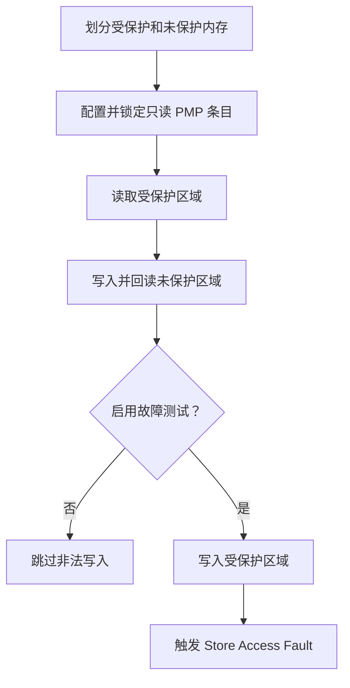

# PMP 内存保护

> 使用技术：RISC-V PMP（Physical Memory Protection，物理内存保护）、TOR 地址匹配、访问权限、故障验证

本案例在 WS63 上划分一段 64 字节对齐缓冲区，将前 32 字节配置为只读区域，后 32 字节保持可写，并验证 PMP 对内存访问权限的控制。

## 学习目标

- 使用 `uapi_pmp_config()` 配置 PMP 条目
- 理解 TOR 模式的地址边界
- 验证受保护区域可读、相邻未保护区域可写
- 通过可选的非法写入验证 Store Access Fault

## 基本概念

PMP 是 RISC-V 处理器提供的物理内存保护机制，可以为物理地址范围配置读、写和执行权限。CPU 访问不符合权限的地址时，硬件会触发访问异常。

本案例使用 TOR（Top of Range）模式。当前 PMP 条目的地址是不包含在保护范围内的上边界，前一个条目的地址构成下边界。WS63 平台配置会在启用本案例时为样例缓冲区拆分 SRAM 条目，避免低编号条目提前覆盖样例区域。

## 涉及 API

| API | 用途 |
|-----|------|
| `uapi_pmp_config()` | 配置一个或多个 PMP 条目的边界、权限、匹配模式及 Lock 位 |

## 案例流程



默认模式只执行不会触发异常的安全验证。故障模式会有意写入受保护区域，板端可能停止运行或复位，仅用于验证 PMP 写保护。

## 配置案例

在 SDK 根目录执行：

```powershell
fbb menuconfig ws63-liteos-app
```

进入以下菜单启用 PMP Sample：

```text
Application
  → Enable Sample.
    → Enable the Sample of peripheral.
      → Support PMP Sample.
```

首次运行保持 `PMP Sample Configuration → Trigger a protected write for exception verification.` 关闭。需要验证异常时再启用该选项，并在验证完成后关闭。

PMP 驱动和 WS63 平台 PMP 配置已包含在 `ws63-liteos-app` 中，不需要额外修改组件列表。

## 编译和运行

修改 PMP Sample 配置后执行 clean 构建，确保平台 PMP 条目和 Sample 使用同一份配置：

```powershell
fbb build --clean ws63-liteos-app
fbb flash ws63-liteos-app --port <device_port> --baud 2000000 --json-summary
fbb monitor --port <device_port>
```

## 正常输出

```text
[pmp] protected region: <start_address> - <end_address>
[pmp] unprotected region: <start_address> - <end_address>
[pmp] initial values: protected=0x11, unprotected=0x33
[pmp] first 32 bytes configured as read-only
[pmp] protected read succeeded: 0x11
[pmp] unprotected write succeeded: 0x22
[pmp] fault test disabled; protected write skipped
```

## 故障验证输出

启用故障测试后，出现 Store Access Fault 表示 PMP 成功拦截非法写入：

```text
[pmp] triggering protected write; a store access fault is expected
<Store Access Fault 日志>
```

如果继续输出以下日志，说明写保护未生效，应检查 PMP 条目边界和权限：

```text
[pmp] ERROR: protected write was not blocked
```
