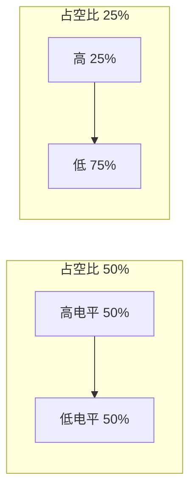
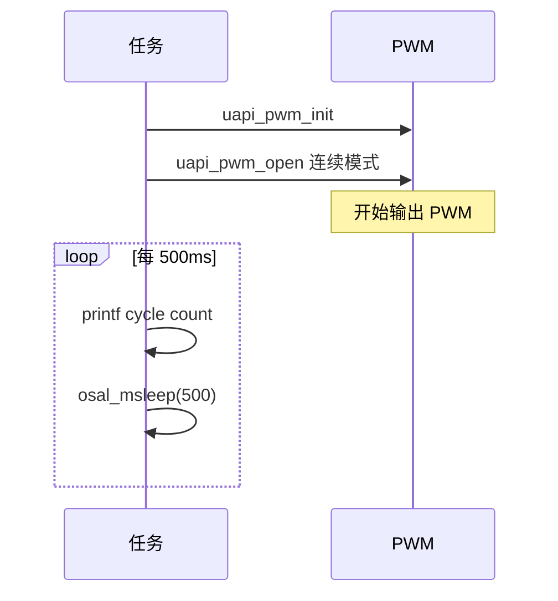

# PWM

> PWM (Pulse Width Modulation) 驱动 | sample: pwm

## 学习目标

- 掌握 PWM 的配置：高低电平时间 → 周期和占空比
- 理解 `pwm_config_t` 结构体各字段的含义
- 能够在 WS63 上输出 PWM 控制 LED (Light Emitting Diode) 亮度或舵机角度

## 基本概念

### PWM 做什么

PWM通过调整高低电平的时间比例来控制平均电压——不改变频率，只改变占空比。



| 占空比 | 平均电压（VCC=3.3V） | LED 效果 |
|:---:|:---:|------|
| 100% | 3.3V | 最亮 |
| 50% | 1.65V | 半亮 |
| 25% | 0.825V | 暗 |
| 0% | 0V | 灭 |

### 频率选择

频率 = `1 / (高电平时间 + 低电平时间)`。LED 调光推荐 > 1kHz（避免人眼感知闪烁），舵机控制在 50Hz（20ms 周期）。

### 两种模式

| 模式 | 行为 | 适用场景 |
|------|------|---------|
| 连续（Repeat） | 无限循环输出 | LED 调光、电机调速 |
| 单次（One-Shot） | 输出指定脉冲数后停止 | 步进电机、精确脉冲控制 |

## 涉及 API

| API | 用途 | 头文件 |
|-----|------|--------|
| `uapi_pin_set_mode(pin, mode)` | 设置引脚为 PWM 功能 | `pinctrl.h` |
| `uapi_pwm_init()` | 初始化 PWM 模块 | `pwm.h` |
| `uapi_pwm_open(channel, &cfg)` | 打开 PWM 通道并配置 | `pwm.h` |
| `uapi_pwm_close(channel)` | 关闭 PWM 通道 | `pwm.h` |
| `uapi_pwm_set_period(channel, period)` | 动态修改周期 | `pwm.h` |

## 案例说明

### 案例简介

配置 PWM 通道输出连续方波——低电平 0、高电平 20 个时钟周期，无限循环。演示连续模式和回调计数。

### 功能规格

| 规格项 | 说明 |
|--------|------|
| PWM 通道 | Kconfig 可配 |
| 低电平时间 | 0 周期 |
| 高电平时间 | 20 周期 |
| 偏移 | 0 |
| 重复次数 | 0xFF（无限） |
| 模式 | 连续（Repeat） |
| 回调 | 每周期完成 +1 计数 |

程序运行流程：引脚复用 → `pwm_init` → `pwm_open` 连续模式 → 每 500ms 打印周期计数。

### 案例流程



## 案例操作指导

### 第一步：编译

```bash
fbb build ws63-liteos-app
```

> 更多编译选项请参考 [构建操作](../../../overall-architecture/build-output/index.md#构建操作)。

### 第二步：烧录

```bash
fbb flash ws63-liteos-app
```

> 更多烧录选项请参考 [构建操作](../../../overall-architecture/build-output/index.md#构建操作)。

### 第三步：验证

逻辑分析仪看到连续 PWM 波形。串口每 500ms 打印完成的周期数不断增长。

## 关键配置

| 参数 | 值 | 说明 |
|------|-----|------|
| `low_time` | 0 | 低电平持续时钟周期数 |
| `high_time` | 20 | 高电平持续时钟周期数 |
| `offset` | 0 | 周期偏移，多路 PWM 对齐用 |
| `repeat` | 0xFF | 无限循环——连续模式 |
| PWM 频率 | 时钟 / 周期 | 调整 `low_time + high_time` 改变频率 |

## 代码详解

完整代码参考 `src/application/samples/peripheral/pwm/pwm_demo.c`：

```c
#include "pinctrl.h"
#include "pwm.h"
#include "soc_osal.h"
#include "app_init.h"

#define TEST_TCXO_DELAY_500MS    500
#define PWM_LOW_TIME_CYC         0
#define PWM_HIGH_TIME_CYC        20
#define PWM_TASK_PRIO            24

static uint32_t g_pwm_cyc_done_cnt = 0;

/* PWM 周期完成回调 */
static errcode_t pwm_sample_callback(uint8_t channel)
{
    (void)channel;
    g_pwm_cyc_done_cnt++;         // 每周期完成计数
    return ERRCODE_SUCC;
}

void pwm_repeat_mode(void)
{
    pwm_config_t cfg_repeat = {
        PWM_LOW_TIME_CYC,         // 低电平时间：0
        PWM_HIGH_TIME_CYC,        // 高电平时间：20
        0,                        // 偏移：0
        0xFF,                     // 重复次数：无限
        true                      // 连续输出
    };

    uapi_pwm_init();
    uapi_pwm_open(CONFIG_PWM_CHANNEL, &cfg_repeat);
    /* PWM 开始连续输出 */
}

static void pwm_task(const char *arg)
{
    (void)arg;
    uapi_pin_set_mode(CONFIG_PWM_PIN, CONFIG_PWM_PIN_MODE);
    pwm_repeat_mode();

    while (1) {
        osal_msleep(TEST_TCXO_DELAY_500MS);
        osal_printk("pwm cycles: %u\r\n", g_pwm_cyc_done_cnt);
    }
}
app_run(pwm_entry);
```

> `pwm_config_t` 的 `repeat` 字段：0xFF = 无限循环，0~254 = 输出指定次数后自动停止（单次模式）。0 表示不输出。

---

