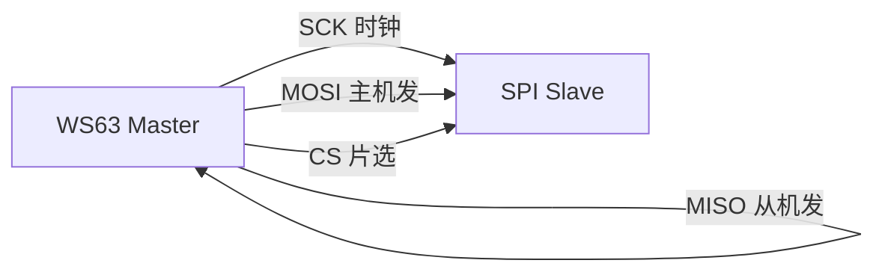
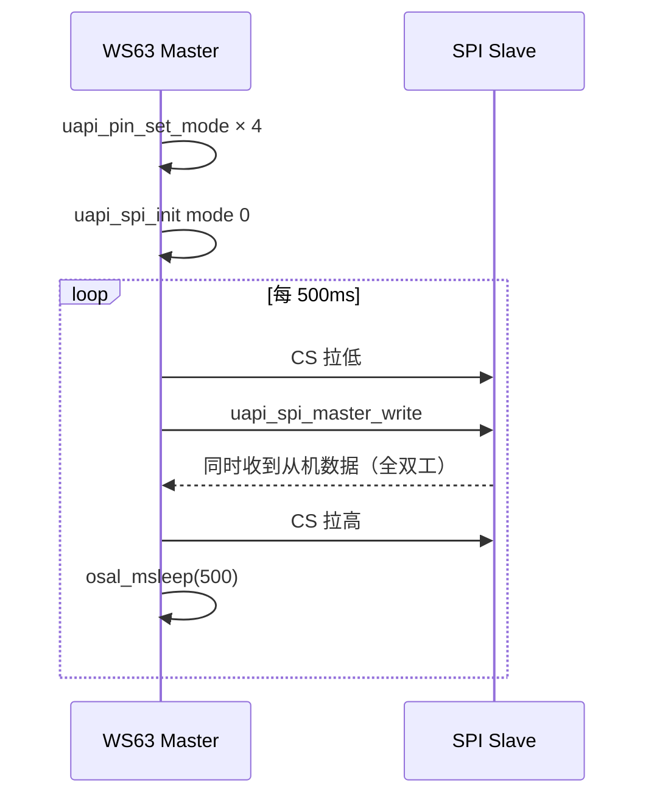

# SPI

> SPI (Serial Peripheral Interface) 驱动 | sample: spi

## 学习目标

- 理解 SPI 四线制总线（SCK/MOSI/MISO/CS）和全双工特性
- 掌握 SPI 主机的初始化：引脚复用 → 时钟极性和相位 → 帧格式 → `uapi_spi_master_write/read`
- 理解 CPOL/CPHA 四种模式的区别和选择依据

## 基本概念

### SPI 总线简介

SPI是 Motorola 发明的四线制同步串行总线——有时钟线，无需约定波特率，速度远超 UART (Universal Asynchronous Receiver/Transmitter)。



| 信号 | 方向 | 说明 |
|------|:---:|------|
| SCK (Serial Clock) | Master→Slave | 时钟信号 |
| MOSI (Master Out Slave In) | Master→Slave | 主机发从机收 |
| MISO (Master In Slave Out) | Slave→Master | 从机发主机收 |
| CS/SS | Master→Slave | 片选——低电平选中从机 |

### CPOL 和 CPHA —— 四种模式

| 模式 | CPOL | CPHA | SCK 空闲电平 | 采样边沿 |
|:---:|:---:|:---:|:---:|:---:|
| 0 | 0 | 0 | 低 | 上升沿 |
| 1 | 0 | 1 | 低 | 下降沿 |
| 2 | 1 | 0 | 高 | 下降沿 |
| 3 | 1 | 1 | 高 | 上升沿 |

> 大多数 SPI 设备工作在模式 0 或模式 3。具体用哪个看设备数据手册的时序图。

### SPI vs I2C vs UART

| 对比项 | SPI | I2C (Inter-Integrated Circuit) | UART |
|--------|:---:|:---:|:---:|
| 线数 | 4（+每从机 1 CS (Carrier Synchronization)） | 2 | 3（TX/RX/GND） |
| 速度 | 10MHz+ | 最高 3.4MHz | 典型 115200 |
| 全双工 | 是 | 否 | 是 |
| 一主多从 | CS 片选 | 地址寻址 | 不支持 |

## 涉及 API

| API | 用途 | 头文件 |
|-----|------|--------|
| `uapi_pin_set_mode(pin, mode)` | 设置 SCK/MOSI/MISO/CS 引脚为 SPI 功能 | `pinctrl.h` |
| `uapi_spi_init(port, &cfg)` | 初始化 SPI 端口 | `spi.h` |
| `uapi_spi_master_write(port, &data)` | 主机写数据 | `spi.h` |
| `uapi_spi_master_read(port, &data)` | 主机读数据 | `spi.h` |
| `uapi_spi_deinit(port)` | 去初始化 SPI | `spi.h` |

## 案例说明

### 案例简介

初始化 SPI 主机（模式 0），向从设备发送数据并读回。演示 SPI 主机的标准收发流程。

### 功能规格

| 规格项 | 说明 |
|--------|------|
| SPI 端口 | SPI0 (Master) |
| 模式 | 0（CPOL=0, CPHA=0） |
| 帧格式 | 8-bit 数据帧 |
| 速率 | `SPI_FREQUENCY`（Kconfig 可配） |
| CS | 硬件 CS 或 GPIO (General Purpose Input/Output) 手动控制 |

程序运行流程：4 引脚复用 → `spi_init` 配置模式和速率 → `master_write` 发数据 → 延时 → `master_read` 读响应 → 循环。

### 案例流程



## 案例操作指导

### 第一步：编译

```bash
fbb build ws63-liteos-app
```

> 更多编译选项请参考 [构建操作](../../../overall-architecture/build-output/index.md#构建操作)。

### 第二步：烧录

```bash
fbb flash ws63-liteos-app
```

> 更多烧录选项请参考 [构建操作](../../../overall-architecture/build-output/index.md#构建操作)。

### 第三步：验证

SPI 逻辑分析仪看到每 500ms 一组 SPI 帧。串口打印收发数据。

## 关键配置

| 参数 | 值 | 说明 |
|------|-----|------|
| CPOL / CPHA | 0 / 0（模式 0） | 根据从设备时序图选择 |
| 帧大小 | 8-bit | 常用 8-bit 或 16-bit |
| 速率 | MHz 级 | 根据从设备最大速率调整 |
| CS | 硬件或 GPIO | 多从机时各接独立 CS |

## 代码详解

完整代码参考 `src/application/samples/peripheral/spi/spi_master_demo.c`：

```c
#include "pinctrl.h"
#include "spi.h"
#include "soc_osal.h"
#include "app_init.h"

#define SPI_SLAVE_NUM         1
#define SPI_FREQUENCY         2
#define SPI_CLK_POLARITY      0
#define SPI_CLK_PHASE         0
#define SPI_FRAME_FORMAT      0
#define SPI_FRAME_SIZE_8      0x07
#define SPI_TASK_PRIO         24

static void app_spi_init_pin(void)
{
    /* 四根线全部设为 SPI 功能 */
    uapi_pin_set_mode(CONFIG_SPI_DI_MASTER_PIN, CONFIG_SPI_MASTER_PIN_MODE);
    uapi_pin_set_mode(CONFIG_SPI_DO_MASTER_PIN, CONFIG_SPI_MASTER_PIN_MODE);
    uapi_pin_set_mode(CONFIG_SPI_CLK_MASTER_PIN, CONFIG_SPI_MASTER_PIN_MODE);
    uapi_pin_set_mode(CONFIG_SPI_CS_MASTER_PIN, CONFIG_SPI_MASTER_PIN_MODE);
}

static void spi_master_task(const char *arg)
{
    (void)arg;
    spi_config_t cfg = {
        .slave_num = SPI_SLAVE_NUM,
        .freq = SPI_FREQUENCY,
        .clk_polarity = SPI_CLK_POLARITY,
        .clk_phase = SPI_CLK_PHASE,
        .frame_format = SPI_FRAME_FORMAT,
        .frame_size = SPI_FRAME_SIZE_8
    };
    spi_data_t data = { 0 };

    app_spi_init_pin();
    uapi_spi_init(CONFIG_SPI_PORT, &cfg);

    while (1) {
        /* 准备发送数据 */
        data.send_buf[0] = 0xA5;
        data.send_len = 1;
        data.recv_len = 1;

        uapi_spi_master_write(CONFIG_SPI_PORT, &data);
        /* SPI 全双工——写的同时也在收，recv_buf 中有从机发来的数据 */
        osal_printk("recv: 0x%02X\r\n", data.recv_buf[0]);

        osal_msleep(500);
    }
}
app_run(spi_entry);
```

> SPI 是全双工的——调用 `uapi_spi_master_write` 的同时主机也在收数据。`recv_buf` 中是从机在同一时钟周期发出的数据。如果从机没有数据要发，`recv_buf` 内容为 0xFF 或 0x00（取决于从机行为）。

---

