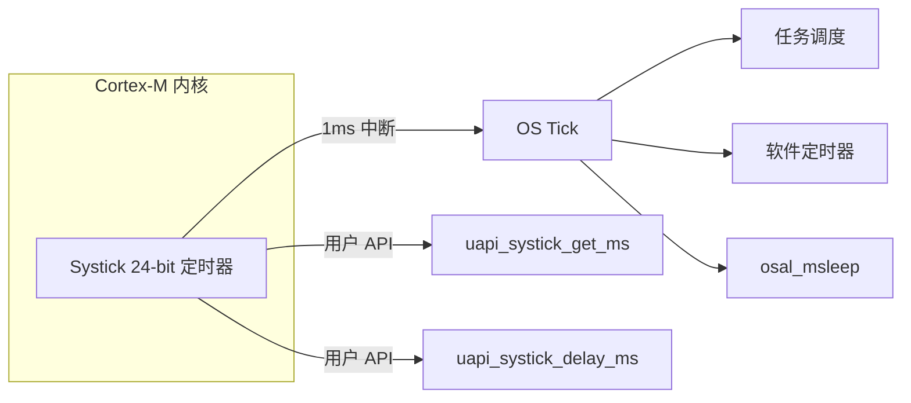
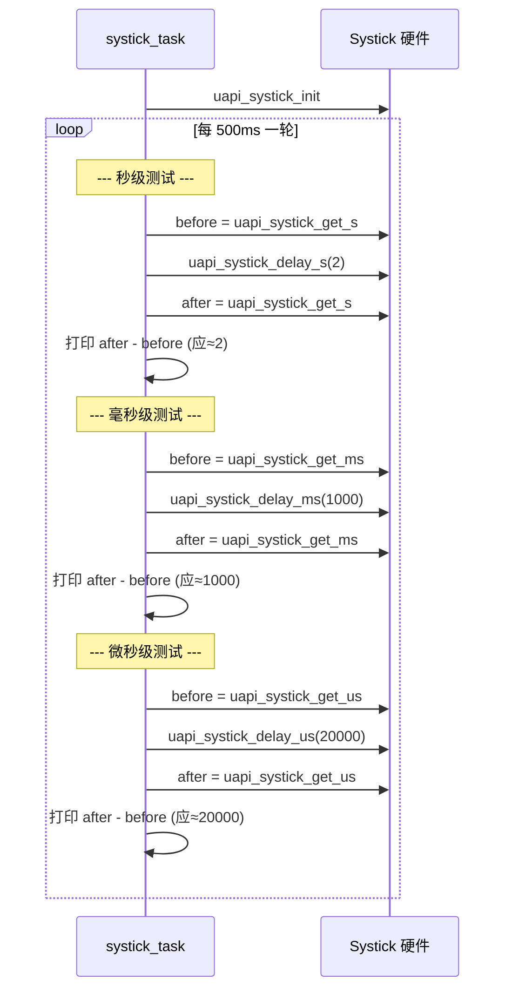

# SysTick

> Systick 驱动 | sample: `src/application/samples/peripheral/systick/systick_demo.c`

## 学习目标

- 理解 Systick 作为 Cortex-M 内核内置 24 位定时器的定位——系统心跳节拍，RTOS (Real-Time Operating System) 默认 1ms 中断
- 掌握 `uapi_systick_get_s()` / `uapi_systick_get_ms()` / `uapi_systick_get_us()` 的精确计时功能
- 掌握 `uapi_systick_delay_s()` / `uapi_systick_delay_ms()` / `uapi_systick_delay_us()` 的阻塞延时用法

## 基本概念

### Systick 是什么

Systick 是 ARM (Advanced RISC (RISC-V) Machines) Cortex-M 内核内置的 24 位递减定时器——与芯片外设定时器不同，它是**内核的一部分**，全局只有一个。在 LiteOS (Huawei LiteOS) / FreeRTOS (Free Real-Time Operating System) 中，Systick 通常配置为 1ms 周期中断，作为整个操作系统的**时钟节拍（tick）**——所有 OS (Operating System) 延时、任务调度、软件定时器都依赖这个心跳。



### Systick 与硬件定时器的区别

| 对比项 | Systick | 硬件定时器 |
|--------|:---:|:---:|
| 归属 | Cortex-M 内核内置 | 芯片外设 IP (Internet Protocol) |
| 全局数量 | 1 个 | 多个通道 |
| 位宽 | 24-bit | 32-bit（通常） |
| 默认用途 | RTOS 系统 tick | 用户自定义精确定时 |
| 用户可改周期 | 不建议（影响 OS） | 可以 |
| 典型 API | `get_s/get_ms/get_us/delay_*` | `start/stop` + ISR (Interrupt Service Routine) 回调 |
| 测量精度 | ms 级（受 tick 分辨率限制的 API）/ μs 级（硬件寄存器直读的 API） | μs 级 ISR |

## 涉及 API

| API | 用途 | 头文件 |
|-----|------|--------|
| `uapi_systick_init()` | 初始化 Systick（使能时钟和中断） | `systick.h` |
| `uapi_systick_get_s()` | 获取系统运行秒数（uint64） | `systick.h` |
| `uapi_systick_get_ms()` | 获取系统运行毫秒数（uint64） | `systick.h` |
| `uapi_systick_get_us()` | 获取系统运行微秒数（uint64） | `systick.h` |
| `uapi_systick_delay_s(n)` | 阻塞延时 n 秒 | `systick.h` |
| `uapi_systick_delay_ms(n)` | 阻塞延时 n 毫秒 | `systick.h` |
| `uapi_systick_delay_us(n)` | 阻塞延时 n 微秒 | `systick.h` |

> `uapi_systick_get_us()` 直接读取 Systick 硬件计数器，精度为微秒级。`uapi_systick_get_ms()` 基于 OS tick 计数器，精度为 1ms。

## 案例说明

### 案例简介

本 sample 演示 Systick 时间获取与阻塞延时的三种精度（秒/毫秒/微秒），每种精度执行以下步骤：
1. 记录延时前的时间戳（`get_s/ms/us`）
2. 调用对应的 `delay_*()` 阻塞延时
3. 记录延时后的时间戳
4. 计算差值并打印，验证延时精度

### 功能规格

| 规格项 | 说明 |
|--------|------|
| 秒级延时 | 2 秒（`SYSTICK_DELAY_S=2`） |
| 毫秒级延时 | 1000 毫秒（`SYSTICK_DELAY_MS=1000`） |
| 微秒级延时 | 20000 微秒（`SYSTICK_DELAY_US=20000`） |
| 每轮间隔 | 500ms（`SYSTICK_TASK_DURATION_MS=500`） |
| 精度验证 | `after > before` 即判定正常 |

### 案例流程



## 案例操作指导

1. 编译：
   ```bash
   fbb build systick
   ```
2. 烧录固件，串口观察输出：
   - `systick delay 2s!` → `count_s = 2` → `systick get s work normall.`
   - `systick delay 1000ms!` → `count_ms = 1000` → `systick get ms work normall.`
   - `systick delay 20000us!` → `count_us ≈ 20000` → `systick get us work normall.`
3. 每 500ms 打印一轮，循环持续输出

## 关键配置

| 配置项 | 推荐值 | 说明 |
|--------|:---:|------|
| Systick 周期 | 1ms（RTOS 默认） | 用户一般不改——修改会影响 OS 调度精度和所有 `osal_msleep` 行为 |
| `uapi_systick_delay_us` 最小值 | >= 2us | 极短延时（1us）可能因函数调用开销而不准确。sample 用 20000us 验证 |
| 时间戳变量类型 | `uint64_t` | `get_s/get_ms` 返回值是 `uint64_t`，系统长期运行（>49 天）不会溢出 |

> **Trade-off**：`uapi_systick_get_us()` 直接读硬件寄存器，精度最高但可能受 Systick 重载瞬间的竞态影响（概率极低）；`uapi_systick_get_ms()` 基于软件 tick 计数器，绝对可靠但精度仅 1ms。对us级测量用 `get_us`，对长时间计时用 `get_ms`。

## 代码详解

### 1. Systick 初始化

```c
uapi_systick_init();
```

`uapi_systick_init()` 在 sample 中由用户任务显式调用，但通常情况下 RTOS 启动时已自动初始化 Systick——用户任务调用是幂等的，不会产生副作用。

### 2. 秒级延时与验证

记录延时前后的秒时间戳，差值应等于延时值（误差 ±1 秒内）：

```c
uint64_t count_before_get_s;
uint64_t count_after_get_s;

count_before_get_s = uapi_systick_get_s();
uapi_systick_delay_s(SYSTICK_DELAY_S);   /* 阻塞 2 秒 */
count_after_get_s = uapi_systick_get_s();

osal_printk("count_s = %llu\r\n", count_after_get_s - count_before_get_s);
if (count_after_get_s > count_before_get_s) {
    osal_printk("systick get s work normall.\r\n");
}
```

### 3. 毫秒级延时与验证

```c
uint64_t count_before_get_ms;
uint64_t count_after_get_ms;

count_before_get_ms = uapi_systick_get_ms();
uapi_systick_delay_ms(SYSTICK_DELAY_MS); /* 阻塞 1000ms */
count_after_get_ms = uapi_systick_get_ms();

osal_printk("count_ms = %llu\r\n", count_after_get_ms - count_before_get_ms);
if (count_after_get_ms > count_before_get_ms) {
    osal_printk("systick get ms work normall.\r\n");
}
```

### 4. 微秒级延时与验证

```c
uint64_t count_before_get_us;
uint64_t count_after_get_us;

count_before_get_us = uapi_systick_get_us();
uapi_systick_delay_us(SYSTICK_DELAY_US); /* 阻塞 20000us = 20ms */
count_after_get_us = uapi_systick_get_us();

osal_printk("count_us = %llu\r\n", count_after_get_us - count_before_get_us);
if (count_after_get_us > count_before_get_us) {
    osal_printk("systick get us work normall.\r\n");
}
```

> `uapi_systick_delay_us()` 是**阻塞延时**——调用期间 CPU 不释放。微秒级短延时（<100us）用阻塞方式无问题，但毫秒级以上延时建议用 `osal_msleep()` 释放 CPU 给其他任务。

---

