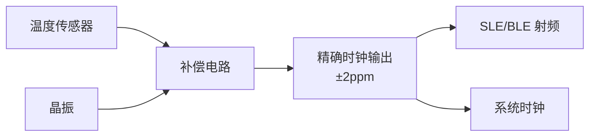
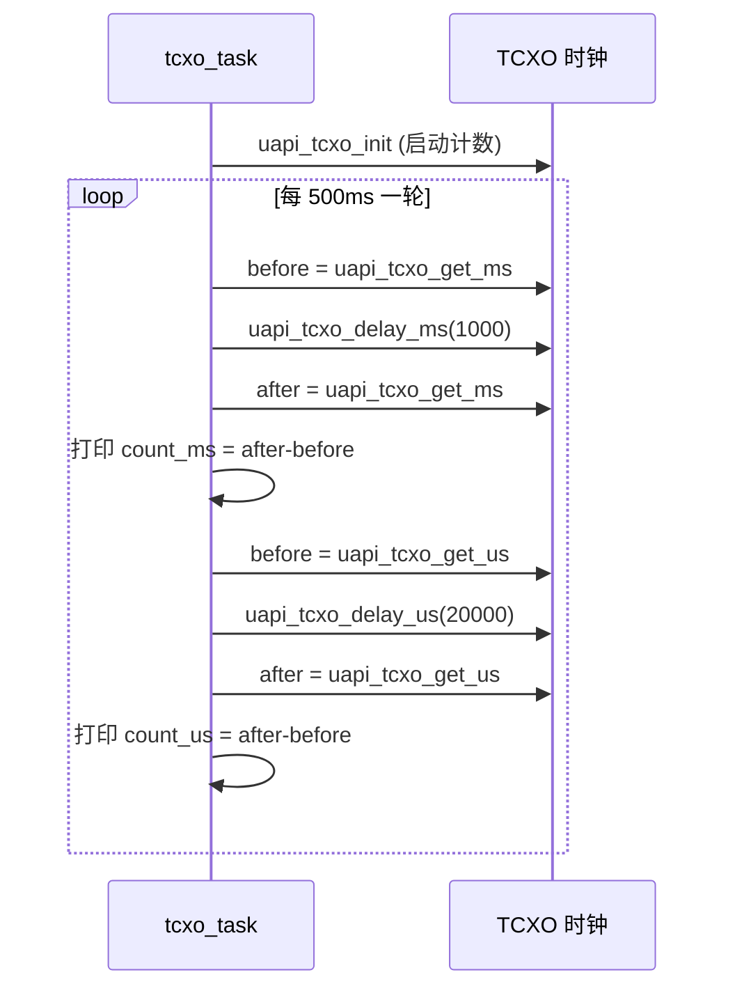

# TCXO

> TCXO (Temperature Compensated Crystal Oscillator) 驱动 | sample: `src/application/samples/peripheral/tcxo/tcxo_demo.c` | 关联：[eFuse (Electronic Fuse)](../efuse/efuse.md)

## 学习目标

- 理解 TCXO的作用——补偿温度对晶振频率的影响，保证射频通信的时钟精度
- 掌握 TCXO 初始化（`uapi_tcxo_init`）、高精度延时（`uapi_tcxo_delay_ms/us`）和时间戳获取（`uapi_tcxo_get_ms/us`）的用法
- 理解 TCXO 校准的原理和时机——从 eFuse 读出厂校准值，在射频协议栈启动前写入 TCXO

## 基本概念

### 为什么需要 TCXO

晶振的谐振频率受温度影响——常温 ±20ppm 的普通晶振在 -40 到 +85 摄氏度范围内频率漂移可达 ±50ppm。对于 BLE/SLE 射频通信，2.4GHz 载波下 50ppm 误差 = 120kHz 频偏，远超接收机容忍范围，直接导致解调失败、连接中断。

TCXO 内部包含温度传感器和补偿电路——实时检测芯片温度，根据补偿曲线自动调整晶振负载电容，将全温度范围的频率误差控制在 ±2ppm 以内。



### TCXO 时钟 vs Systick 时钟

| 对比项 | TCXO 时钟 | Systick 时钟 |
|--------|:---:|:---:|
| 时钟源 | 外部温补晶振（高精度） | 系统总线时钟 ÷ 分频 |
| 精度 | ±2ppm（校准后） | 取决于晶振（可能 ±50ppm） |
| 典型用途 | 精确延时、时间戳、射频定时 | RTOS (Real-Time Operating System) 系统 tick |
| API 风格 | `uapi_tcxo_get_ms/us`、`uapi_tcxo_delay_ms/us` | `uapi_systick_get_ms`、`uapi_systick_delay_ms` |
| 计时起点 | `uapi_tcxo_init()` 调用后开始 | 系统上电即开始 |

> 如果需要精确测量代码段耗时（如中断响应延迟），应使用 TCXO 的 `get_us` API 而非 Systick 的版本。

### 校准值来源

WS63 芯片在出厂测试时已将校准值写入 eFuse。上电初始化流程中，固件从 eFuse 读取校准值并写入 TCXO 补偿寄存器即可完成校准——用户代码无需手动计算校准参数。这一流程必须在 **SLE/BLE 协议栈初始化之前**完成，否则射频时钟误差不可修正。

## 涉及 API

| API | 用途 | 头文件 |
|-----|------|--------|
| `uapi_tcxo_init()` | 初始化 TCXO 模块（启动计数） | `tcxo.h` |
| `uapi_tcxo_get_ms()` | 获取 TCXO 毫秒时间戳（uint64） | `tcxo.h` |
| `uapi_tcxo_get_us()` | 获取 TCXO 微秒时间戳（uint64） | `tcxo.h` |
| `uapi_tcxo_delay_ms(n)` | TCXO 精确定时阻塞延时 n 毫秒 | `tcxo.h` |
| `uapi_tcxo_delay_us(n)` | TCXO 精确定时阻塞延时 n 微秒 | `tcxo.h` |
| `uapi_tcxo_calibrate(val)` | 写校准值到 TCXO 补偿寄存器 | `tcxo.h` |
| `uapi_efuse_get_tcxo_calibrate_val(&val)` | 从 eFuse 读出厂校准值 | `efuse.h` |

## 案例说明

### 案例简介

本 sample 演示 TCXO 时钟的毫秒/微秒级延时与时间戳功能：
1. `uapi_tcxo_init()` 初始化 TCXO
2. 每 500ms 执行一轮测试：毫秒级延时 1000ms + 微秒级延时 20000us
3. 每种延时前后分别调用 `get_ms/get_us` 获取时间戳，计算差值验证精度

### 功能规格

| 规格项 | 说明 |
|--------|------|
| 毫秒级测试 | 延时 1000ms（`TCXO_DELAY_MS=1000`） |
| 微秒级测试 | 延时 20000us（`TCXO_DELAY_US=20000`） |
| 每轮间隔 | 500ms（`TCXO_TASK_DURATION_MS=500`） |
| 时间戳类型 | `uint64_t`——长期运行不溢出 |
| 精度验证 | `after > before` 即判定正常 |

### 案例流程



## 案例操作指导

1. 编译：
   ```bash
   fbb build tcxo
   ```
2. 烧录固件，串口观察输出：
   - `tcxo delay 1000ms!` → `count_ms = 1000` → `tcxo get ms work normall.`
   - `tcxo delay 20000us!` → `count_us ≈ 20000` → `tcxo get us work normall.`
3. 每 500ms 循环输出一轮

## 关键配置

| 配置项 | 推荐值 | 说明 |
|--------|:---:|------|
| TCXO 初始化时机 | `app_entry` 最早阶段 | 必须在任何依赖高精度时钟的模块（SLE/BLE、音频）之前初始化 |
| 校准时机 | `tcxo_init` 之后、射频 `init` 之前 | 射频协议栈启动时采样当前时钟配置——在此之后修改校准值无效 |
| `tcxo_delay_us` 最小值 | >= 2us | 极短延时（1us）受函数调用开销影响可能不准确。product code 中短延时用 NOP 循环 |

> **Trade-off**：TCXO 精度高但功耗也高（温补电路持续工作）。在不需要高精度时钟的低功耗休眠模式下，可关闭 TCXO 切换到内部 RC 振荡器以省电。唤醒后需重新初始化 TCXO 并恢复校准。

## 代码详解

### 1. TCXO 初始化

`uapi_tcxo_init()` 使能 TCXO 时钟源并启动内部计数器。初始化后 `get_ms/get_us` 才返回有效值：

```c
uapi_tcxo_init();
```

> 如果系统还需要 TCXO 校准，应在 `uapi_tcxo_init()` 之后调用 `uapi_tcxo_calibrate(val)`。sample 专注于演示延时功能，未包含校准步骤——完整的校准流程见下文"TCXO 校准详解"。

### 2. 毫秒级延时与时间戳验证

记录延时前后的毫秒时间戳，期望差值接近 1000：

```c
uint64_t count_before_get_ms;
uint64_t count_after_get_ms;

count_before_get_ms = uapi_tcxo_get_ms();
uapi_tcxo_delay_ms(TCXO_DELAY_MS);   /* 阻塞 1000ms */
count_after_get_ms = uapi_tcxo_get_ms();

osal_printk("count_after_get_ms = %llu, count_before_get_ms = %llu\r\n",
            count_after_get_ms, count_before_get_ms);
osal_printk("count_ms = %llu\r\n", count_after_get_ms - count_before_get_ms);
if (count_after_get_ms > count_before_get_ms) {
    osal_printk("tcxo get ms work normall.\r\n");
}
```

### 3. 微秒级延时与时间戳验证

记录延时前后的微秒时间戳，期望差值接近 20000：

```c
uint64_t count_before_get_us;
uint64_t count_after_get_us;

count_before_get_us = uapi_tcxo_get_us();
uapi_tcxo_delay_us(TCXO_DELAY_US);   /* 阻塞 20000us = 20ms */
count_after_get_us = uapi_tcxo_get_us();

osal_printk("count_after_get_us = %llu, count_before_get_us = %llu\r\n",
            count_after_get_us, count_before_get_us);
osal_printk("count_us = %llu\r\n", count_after_get_us - count_before_get_us);
if (count_after_get_us > count_before_get_us) {
    osal_printk("tcxo get us work normall.\r\n");
}
```

### 4. TCXO 校准详解（结合 eFuse）

sample 本身演示延时功能，不包含校准代码。但在实际应用中，TCXO 校准是必须步骤。完整的校准流程如下：

```c
#include "tcxo.h"
#include "efuse.h"

static void tcxo_full_calibrate(void)
{
    uint8_t cal_val = 0;

    uapi_tcxo_init();                              /* 1. 先初始化 TCXO */
    uapi_efuse_get_tcxo_calibrate_val(&cal_val);   /* 2. 从 eFuse 读出校准值 */
    uapi_tcxo_calibrate(cal_val);                  /* 3. 写入 TCXO 补偿寄存器 */
    osal_printk("tcxo calibrated: %d\r\n", cal_val);
}

/* 在系统初始化早期调用——SLE/BLE init 之前 */
static void app_entry(void)
{
    tcxo_full_calibrate();
    // ... 后续初始化 SLE/BLE ...
}
```

> 校准值 `cal_val` 是 0~255 之间的整数，代表 TCXO 补偿 DAC (Digital-to-Analog Converter) 的输入码字。不同芯片的校准值不同，出厂时已针对每颗芯片单独测定并写入 eFuse。

---

