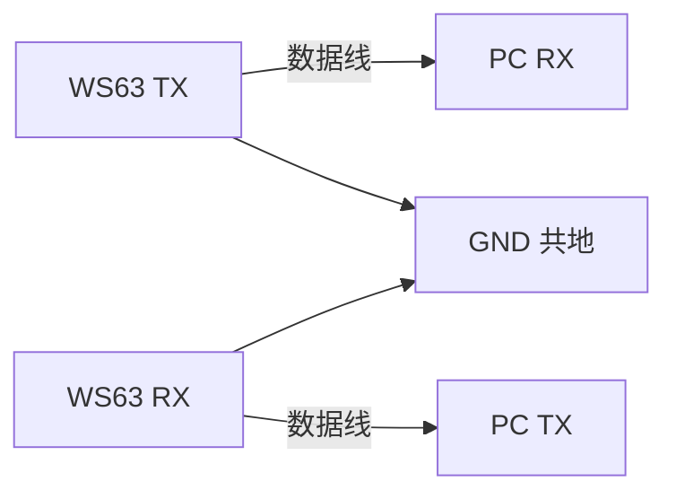
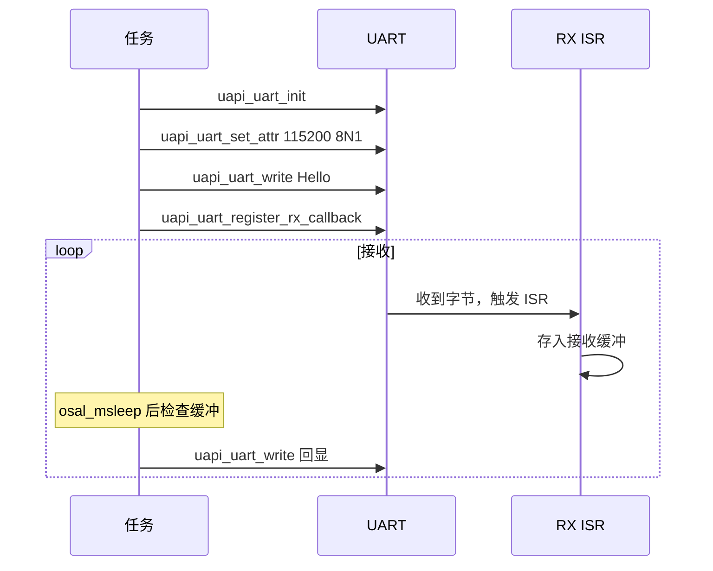

# UART

> UART (Universal Asynchronous Receiver/Transmitter) 驱动 | sample: uart

## 学习目标

- 掌握 UART 初始化的完整流程：引脚复用 → 波特率/数据位/停止位配置 → 中断/DMA 模式选择
- 掌握 `uapi_uart_write()` 发送数据和中断回调接收数据的用法
- 理解 UART 三种传输模式——中断、DMA (Direct Memory Access)、轮询——的差异和选择策略

## 基本概念

### UART 通信简介

UART是嵌入式最常用的异步串行通信接口——仅需 TX/RX/GND 三根线，无需时钟线（异步意味着收发双方约定相同波特率）。



### 波特率和帧格式

| 参数 | 常见值 | 说明 |
|------|--------|------|
| 波特率 | 9600 / 115200 / 921600 | 每秒传输的 bit 数，收发双方必须一致 |
| 数据位 | 8 | 每帧有效数据位数 |
| 停止位 | 1 | 帧结束标志 |
| 校验位 | None | 可选奇/偶校验 |

### 三种传输模式

| 模式 | 原理 | CPU 占用 | 适用场景 |
|------|------|:---:|------|
| 中断（INT） | 每收到一个字节触发 ISR (Interrupt Service Routine) | 中（每字节中断一次） | 低波特率、小数据量 |
| DMA | 硬件自动搬数据，完成后一次中断 | 低 | 高波特率、大数据量 |
| 轮询（Poll） | CPU 循环检查 FIFO (First-In First-Out) | 高 | 调试、简单回环测试 |

## 涉及 API

| API | 用途 | 头文件 |
|-----|------|--------|
| `uapi_pin_set_mode(pin, mode)` | 设置 TX/RX 引脚为 UART 功能 | `pinctrl.h` |
| `uapi_uart_init(bus, &pins, &cfg)` | 初始化 UART，参数含引脚和配置 | `uart.h` |
| `uapi_uart_set_attr(bus, &attr)` | 配置波特率、数据位、停止位、校验 | `uart.h` |
| `uapi_uart_write(bus, buf, len, timeout)` | 发送数据，timeout 控制阻塞时间 | `uart.h` |
| `uapi_uart_register_rx_callback(bus, condition, callback)` | 注册接收回调（中断/DMA 模式） | `uart.h` |
| `uapi_uart_read(port, buf, len)` | 轮询读（Poll 模式） | `uart.h` |

## 案例说明

### 案例简介

配置 UART0 为 115200 8N1，支持中断、DMA、轮询三种模式，实现回显（收到什么发回什么）。

### 功能规格

| 规格项 | 说明 |
|--------|------|
| UART 端口 | UART0 |
| 波特率 | 115200 |
| 帧格式 | 8 数据位 + 1 停止位 + 无校验（8N1） |
| TX/RX 引脚 | Kconfig 可配，通过 `uapi_pin_set_mode` 复用 |
| 模式 | 中断（INT）/ DMA / 轮询（Poll），Kconfig 切换 |

程序运行流程：引脚复用 → `uart_init` → `set_attr` → 写一条欢迎消息 → 进入接收循环（不同模式不同实现）。

### 案例流程（中断模式）



## 案例操作指导

### 第一步：编译

```bash
fbb build ws63-liteos-app
```

> 更多编译选项请参考 [构建操作](../../../overall-architecture/build-output/index.md#构建操作)。

### 第二步：烧录

```bash
fbb flash ws63-liteos-app
```

> 更多烧录选项请参考 [构建操作](../../../overall-architecture/build-output/index.md#构建操作)。

### 第三步：验证

串口工具打开对应 COM 口（115200 8N1），看到 "UART demo start." 后，输入任意字符，收到相同字符回显。

## 关键配置

| 参数 | 值 | 说明 |
|------|-----|------|
| 波特率 | 115200 | 最常用的嵌入式调试波特率 |
| 帧格式 | 8N1 | 8 数据位、无校验、1 停止位——最通用 |
| DMA 模式 | 大数据量时用 | 波特率 921600+ 推荐 DMA |
| 中断模式 | 小数据量 | 波特率 ≤ 115200 中断模式足够 |
| 任务栈 | 0x1000 | UART 缓冲较大，建议 4096 |

## 代码详解

完整代码参考 `src/application/samples/peripheral/uart/uart_demo.c`：

```c
#include "pinctrl.h"
#include "uart.h"
#include "soc_osal.h"
#include "app_init.h"

#define UART_BAUDRATE                115200
#define UART_TASK_STACK_SIZE         0x1000

static void app_uart_init_pin(void)
{
    /* 设置引脚为 UART 功能——TX 和 RX 都要设置 */
    uapi_pin_set_mode(CONFIG_UART_TXD_PIN, CONFIG_UART_TXD_PIN_MODE);
    uapi_pin_set_mode(CONFIG_UART_RXD_PIN, CONFIG_UART_RXD_PIN_MODE);
}

static void app_uart_init_config(void)
{
    uart_attr_t attr = {
        .baud_rate = UART_BAUDRATE,        // 115200
        .data_bits = UART_DATA_BIT_8,      // 8 位数据
        .stop_bits = UART_STOP_BIT_1,      // 1 位停止
        .parity = UART_PARITY_NONE         // 无校验
    };
    uapi_uart_init(CONFIG_UART_PORT);
    uapi_uart_set_attr(CONFIG_UART_PORT, &attr);
}

#if defined(CONFIG_UART_SUPPORT_INT_MODE)
/* 中断模式——RX 回调中收数据 */
static void uart_rx_callback(uint8_t port, uint8_t *buf, uint16_t len)
{
    /* 回调上下文——不能阻塞，不能 printf
       将数据拷走或通过队列/信号量通知任务 */
    memcpy(g_rx_buf, buf, len);
    g_rx_flag = 1;
}
#endif

static void uart_task(const char *arg)
{
    (void)arg;
    app_uart_init_pin();
    app_uart_init_config();
#if defined(CONFIG_UART_SUPPORT_INT_MODE)
    uapi_uart_register_rx_callback(CONFIG_UART_PORT, uart_rx_callback);
#endif

    uapi_uart_write(CONFIG_UART_PORT, "UART demo start.\r\n", 19);

    while (1) {
#if defined(CONFIG_UART_SUPPORT_INT_MODE)
        if (g_rx_flag) {
            uapi_uart_write(CONFIG_UART_PORT, g_rx_buf, CONFIG_UART_TRANSFER_SIZE);
            g_rx_flag = 0;
        }
        osal_msleep(5);  // 5ms 检查一次
#elif defined(CONFIG_UART_SUPPORT_POLL_MODE)
        uint8_t buf[128];
        int len = uapi_uart_read(CONFIG_UART_PORT, buf, sizeof(buf));
        if (len > 0) {
            uapi_uart_write(CONFIG_UART_PORT, buf, len);  // 回显
        }
#endif
    }
}
app_run(uart_entry);
```

> 中断模式的 UART RX (Receive) 回调运行在中断上下文中——和 GPIO (General Purpose Input/Output)ISR 的约束相同：不能阻塞、不能 `printf`。数据必须通过缓冲/队列传给任务处理。

---

