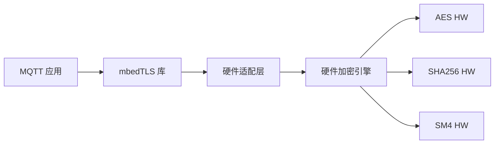

# mbedTLS TLS/DTLS

> mbedTLS (mbed Transport Layer Security)、硬件加密适配

> 前置阅读：[硬件加密引擎](../crypto/crypto.md)、[MQTT (Message Queuing Telemetry Transport)](../../network/mqtt/mqtt.md)

## 学习目标

- 理解 TLS/DTLS 的作用——在 TCP/UDP 层之上提供加密和身份认证
- 掌握 mbedTLS 的初始化、证书加载、TLS (Transport Layer Security) 握手配置
- 理解 mbedTLS 硬件加速——将 AES/SHA 运算卸载到硬件加密引擎
- 能够在 MQTT  over TLS 场景中启用加密通信

## 基本概念

### TLS vs DTLS

| 对比项 | TLS | DTLS (Datagram Transport Layer Security) |
|--------|:---:|:---:|
| 传输层 | TCP (Transmission Control Protocol) | UDP (User Datagram Protocol) |
| 典型场景 | MQTT、HTTPS | CoAP (Constrained Application Protocol) 、UDP 加密 |
| 握手 | 标准 TCP 握手后 TLS 握手 | 自带重传和排序机制 |

### mbedTLS 硬件加速

mbedTLS 软件库 + 硬件适配层。将 AES/SHA256/SM4 等运算从软件卸载到 WS63 硬件加密引擎——性能提升 100 倍。



### 认证模式

| 模式 | 说明 | 适用场景 |
|------|------|------|
| PSK (Pre-Shared Key) | 预共享密钥，最简单 | 内部网络、原型验证 |
| 单向认证 | CA 证书验证服务器身份 | 连接公有云平台 |
| 双向认证 | 客户端也需证书 | 高安全场景（金融、军工） |

## 涉及 API

| API | 用途 |
|-----|------|
| `mbedtls_ssl_init()` / `mbedtls_ssl_config_init()` | 初始化 SSL 上下文和配置 |
| `mbedtls_ssl_conf_authmode()` | 配置认证模式（单向/双向/无验证） |
| `mbedtls_ssl_conf_ca_chain()` | 加载 CA 证书 |
| `mbedtls_ssl_setup()` / `mbedtls_ssl_handshake()` | 建立 SSL 连接 |
| `mbedtls_ssl_write()` / `mbedtls_ssl_read()` | 加密数据收发 |
| `mbedtls_ssl_close_notify()` | 安全关闭连接 |

## 案例说明

### 案例简介

WS63 使用 MQTT over TLS 连接阿里云 IoT——mbedTLS 握手 → 加密发布和订阅。与普通 MQTT 代码一致，仅在连接参数中指定 TLS。

## 关键配置

| 参数 | 推荐值 | 说明 |
|------|:---:|------|
| 认证模式 | PSK / 单向 / 双向 | 从简到繁 |
| 加密套件 | `TLS_ECDHE_RSA_WITH_AES_128_GCM_SHA256` | 推荐 |
| 硬件加速 | `CONFIG_MBEDTLS_HARDWARE_ACCEL=y` | 性能提升 100× |

## 代码详解

```c
#include <mbedtls/ssl.h>

mbedtls_ssl_context ssl;
mbedtls_ssl_config conf;

mbedtls_ssl_init(&ssl);
mbedtls_ssl_config_init(&conf);

/* 单向认证——加载 CA 证书验证服务器 */
mbedtls_ssl_conf_authmode(&conf, MBEDTLS_SSL_VERIFY_REQUIRED);
mbedtls_ssl_conf_ca_chain(&conf, &ca_cert, NULL);

/* 硬件加速——Kconfig 启用后自动生效 */

mbedtls_ssl_setup(&ssl, &conf);
mbedtls_ssl_set_bio(&ssl, &net_ctx, mbedtls_net_send, mbedtls_net_recv, NULL);

/* TLS 握手 */
int ret;
while ((ret = mbedtls_ssl_handshake(&ssl)) != 0) {
    if (ret != MBEDTLS_ERR_SSL_WANT_READ &&
        ret != MBEDTLS_ERR_SSL_WANT_WRITE) {
        printf("TLS handshake failed: %d\n", ret);
        return;
    }
}

/* 加密通信——与普通 Socket 一样用 write/read */
mbedtls_ssl_write(&ssl, "hello", 5);
char buf[256];
mbedtls_ssl_read(&ssl, buf, sizeof(buf));

mbedtls_ssl_close_notify(&ssl);
```

> MQTT over TLS 集成：在 MQTT `connect` 配置中指定 `ssl://` 前缀的 Broker 地址并加载 TLS 上下文即可——其余代码与普通 MQTT 完全一样。

---

