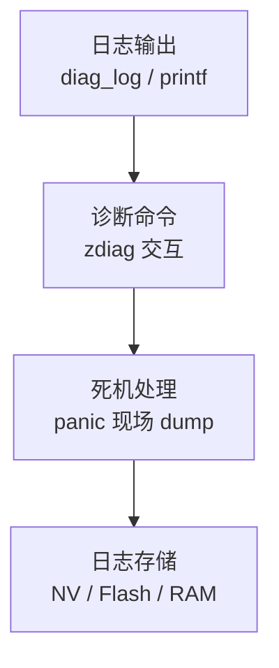

# 诊断与日志

> 使用技术：DFX (Diagnostic & Feedback)、diag_log、panic

## 学习目标

- 理解 WS63 DFX 体系——日志分级、诊断命令、死机现场保存
- 掌握 `diag_log` 的使用和日志级别控制
- 理解死机（Panic）后的现场信息含义——PC/SP/调用栈/寄存器
- 掌握通过串口/zdiag 工具获取诊断信息的方法

## 基本概念

### DFX 体系架构



四层递进保障——从日常调试到死机排查。

### 日志级别

| 级别 | 说明 | 输出条件 |
|------|------|:---:|
| FATAL | 系统崩溃 | 始终输出 |
| ERROR | 功能异常 | 始终输出 |
| WARN | 潜在风险 | 始终输出 |
| INFO | 关键流程 | >= INFO |
| DEBUG | 详细调试 | >= DEBUG |

> 产品固件只输出 INFO 以上——减少日志量，保护性能。调试固件输出 DEBUG——全量日志。

### 死机现场保存

死机时 CPU 自动保存 PC/SP/寄存器/调用栈到 preserve 区域——重启后可读取"上一轮死机原因"。可用 `hs-liteos-crash-debugger` skill 深入分析。

### 常见诊断命令

| 命令 | 用途 |
|------|------|
| `zdiag log` | 导出日志 |
| `zdiag nv` | 读写 NV (Non-Volatile) 数据 |
| `zdiag mem` | 查看内存使用 |

## 涉及 API

| API | 用途 |
|-----|------|
| `diag_log_print(level, fmt, ...)` | 分级日志输出 |
| `diag_log_set_level(level)` | 设置日志输出级别 |
| `diag_register_cmd(cmd, handler)` | 注册自定义诊断命令 |

## 案例说明

### 案例简介

配置分级日志 → 产品固件 INFO 级别 → 串口输出关键业务流程 → 死机时自动保存现场 → 重启后读取死机原因。

## 关键配置

| 参数 | 推荐值 | 说明 |
|------|:---:|------|
| 产品日志级别 | INFO | WARN/ERROR/FATAL 始终输出 |
| 调试日志级别 | DEBUG | 全量输出 |
| Preserve 区域 | 4KB | 保存死机现场信息 |

## 代码详解

```c
#include "diag_log.h"

/* 设置日志级别——产品固件用 INFO */
diag_log_set_level(DIAG_LOG_LEVEL_INFO);

/* 分级日志输出 */
diag_log_print(DIAG_LOG_LEVEL_ERROR, "WiFi connect failed: %d\n", err);
diag_log_print(DIAG_LOG_LEVEL_WARN,  "Battery low: %u mV\n", voltage);
diag_log_print(DIAG_LOG_LEVEL_INFO,  "Sensor report: temp=%.1f\n", temp);
diag_log_print(DIAG_LOG_LEVEL_DEBUG, "heap free: %u\n", osal_get_free_heap());

/* 注册自定义诊断命令 */
diag_register_cmd("my_status", my_status_handler);
/* 串口/zdiag 发送 → my_status → handler 执行 → 返回结果 */
```

---

