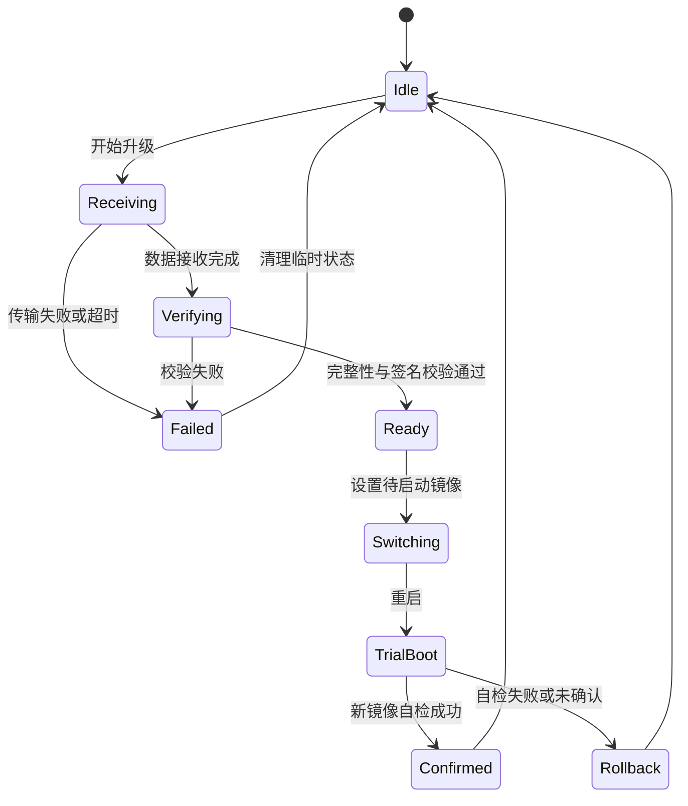

# OTA 固件升级架构

> 本页是 WS63 OTA (Over-The-Air) 公共机制的权威入口，说明镜像、校验、写入、切换和回滚。BLE/SLE 页面只描述传输层适配。

## 文档边界

OTA 包含两个相互独立的部分：

1. **传输层**：通过 Wi-Fi、BLE (Bluetooth Low Energy) 、SLE (SparkLink Low Energy) 或其他通道把升级数据可靠送到设备。
2. **升级层**：校验升级包、写入目标区域、确认完整性并控制启动切换。

更换传输通道不应改变镜像格式和安全校验规则。协议页面不得自行定义另一套升级状态机。

## 通用状态机

## 升级层职责

- 校验产品型号、硬件版本、镜像版本和包长度。
- 校验分片顺序、整体哈希以及产品要求的签名或认证信息。
- 只向链接脚本和分区表允许的升级区域写入。
- 掉电恢复后能够识别未完成升级，不将半包镜像标记为可启动。
- 新镜像启动后必须有确认机制；未确认或启动失败时执行回滚策略。

具体分区和镜像名称必须以目标固件实际配置和构建产物为准，本页不提供固定地址。

## 传输层接口要求

无论使用何种协议，传输适配层都应向升级层提供一致的信息：

| 信息 | 用途 |
| --- | --- |
| 升级会话标识 | 区分新旧任务，防止跨会话混包 |
| 总长度和版本 | 开始前进行空间和版本校验 |
| 分片偏移与长度 | 检测重复、越界和乱序 |
| 分片数据 | 写入升级缓存或目标区域 |
| 结束标志 | 触发整体校验 |
| 取消或超时 | 清理会话并释放资源 |

## 安全要求

- 传输加密不能替代镜像签名或完整性校验。
- 防回滚策略应由产品安全策略决定，并与量产版本管理一致。
- 任何来自远端的偏移、长度和版本字段都必须在写 Flash 前校验。
- 升级日志不得泄露密钥、签名材料或敏感设备标识。

## 协议适配

- [BLE OTA 传输说明](../../connectivity/ble/ota.md)
- [SLE OTA 传输说明](../../connectivity/sle/verticals/ota.md)

当前 SDK 的 `src/application/samples` 和 `vendor` 中没有与这三篇文档一一对应的通用 OTA 案例，因此本页不提供可直接执行的构建、烧录或分区写入代码。

## 验证清单

- 正常升级、重复分片、乱序、丢包和超时。
- 空间不足、版本不兼容、哈希或签名失败。
- 接收、写入、校验和首次启动各阶段掉电。
- 新镜像自检成功确认和失败回滚。
- 取消升级后临时状态和资源得到清理。
