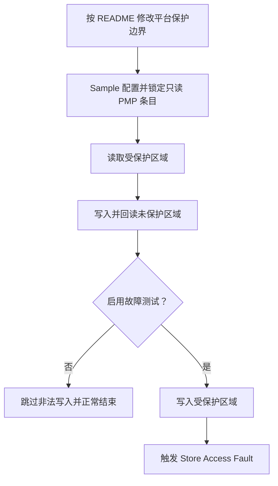

# WS63 PMP 内存保护 Sample

## 1. 一句话说明

本示例演示如何在 WS63 上使用 `uapi_pmp_config()` 将一段内存配置为只读区域，并验证受保护区域可读、相邻未保护区域可写以及非法写入可触发访问异常。

## 2. 适用场景

 - 验证 WS63 RISC-V PMP 内存访问权限是否生效。
 - 学习 TOR 地址匹配和读、写、执行权限的基本配置方法。
 - 作为关键数据只读保护和 PMP 故障验证的参考样例。

## 3. 支持能力

 - 支持使用 TOR 模式配置只读、不可执行的 PMP 区域。
 - 支持读取受保护区域，验证读权限可用。
 - 支持写入并回读相邻未保护区域。
 - 支持可选的非法写入测试，验证 PMP 能够拦截受保护区域写操作。

## 4. 不支持/限制

 - 本示例仅适用于 WS63 LiteOS 应用目标。
 - PMP 条目使用 Lock 位锁定后，处理器复位前不能再次修改。
 - 故障测试会有意触发 Store Access Fault，系统可能停止运行或复位，只应在验证环境中启用。
 - Sample 使用 PMP 条目 8；`ws63-liteos-app` 默认没有为样例缓冲区预留独立的 TOR 边界，验证前需要按本文说明修改本地平台配置。

## 5. 关键词

### 中文关键词

PMP、物理内存保护、TOR、只读内存、访问权限、故障注入、WS63、RISC-V

### English Keywords

PMP, Physical Memory Protection, TOR, read-only memory, access permission, fault injection, WS63, RISC-V

## 6. 目录结构

```text
application/samples/peripheral/pmp/
├── CMakeLists.txt
├── Kconfig
├── README.md
├── pmp_sample.c
└── reference/
    └── pmp_cfg.c
```

## 7. 入口文件

主入口：`application/samples/peripheral/pmp/pmp_sample.c`

初始化及主业务入口：`pmp_sample_entry()`

配置入口：`application/samples/peripheral/pmp/Kconfig`

用户保护配置：`drivers/chips/ws63/porting/arch/riscv/pmp_cfg.c`

## 8. 整体流程



示例将 64 字节对齐缓冲区的前 32 字节配置为只读区域，后 32 字节保持可写；默认只执行安全验证，启用故障测试后才会尝试非法写入。

## 9. 核心文件说明

| 文件 | 作用 | 主要内容 |
|------|------|----------|
| `pmp_sample.c` | 实现 PMP 内存保护 Sample | 定义样例缓冲区、配置只读条目、验证内存访问并可选触发故障 |
| `Kconfig` | 提供故障测试开关 | 控制是否尝试写入受保护区域 |
| `CMakeLists.txt` | 配置 Sample 编译源 | 将 `pmp_sample.c` 加入 peripheral sample |
| `reference/pmp_cfg.c` | 完整平台配置参考文件 | 可临时替换 WS63 平台的 `pmp_cfg.c`，直接建立 Sample 所需的 PMP 边界 |
| `pmp_cfg.c` | 用户侧平台保护配置 | 验证前按本文说明为样例缓冲区拆分 SRAM TOR 边界；本 Sample 不修改该文件 |

## 10. 核心函数/类说明

`pmp_sample_entry()`

功能：配置样例只读区域，验证受保护区域和未保护区域的访问行为，并按 menuconfig 设置决定是否触发非法写入。

参数：无。

返回值：无。

调用关系：由 `app_run()` 注册，在应用初始化阶段调用；内部调用 `uapi_pmp_config()` 配置 PMP 条目。

`uapi_pmp_config(const pmp_conf_t *config, uint32_t length)`

功能：将一个或多个 PMP 条目配置写入处理器。

参数：`config` 指向 PMP 配置数组，`length` 表示配置条目数量。

返回值：成功返回 `ERRCODE_SUCC`，失败返回对应错误码。

调用关系：由 `pmp_sample_entry()` 调用，配置并锁定样例只读区域。

## 11. 配置样例保护区

> 以下修改只用于验证 PMP 配置方法。实际项目应根据自身内存布局、PMP 条目占用情况和安全策略重新选择边界及条目号。

修改前建议先备份平台配置文件。在 SDK 根目录执行：

```powershell
Copy-Item src/drivers/chips/ws63/porting/arch/riscv/pmp_cfg.c `
    src/drivers/chips/ws63/porting/arch/riscv/pmp_cfg.c.pmp_sample.bak
```

本 Sample 提供了基于当前 SDK 平台文件制作的完整参考配置。备份完成后，可以直接复制替换：

```powershell
Copy-Item src/application/samples/peripheral/pmp/reference/pmp_cfg.c `
    src/drivers/chips/ws63/porting/arch/riscv/pmp_cfg.c -Force
```

参考文件不会被 Sample 的 `CMakeLists.txt` 编译，只有复制到平台目录后才会生效。如果当前 SDK 中的平台 `pmp_cfg.c` 已被其他功能修改，不要直接覆盖，应对照下面四处改动手动合入。

### 侵入式新增内容说明

参考文件对平台 PMP 配置做了四处临时扩展：

| 新增内容 | 含义 |
|----------|------|
| 声明条目 8、32 字节保护长度和 Sample 缓冲区 | 让平台启动阶段能够使用链接器最终确定的缓冲区地址 |
| 将原 `REGION_RAM_3` 拆成三个连续条目 | 在原 SRAM 范围中切出一段独立区域，避免范围更大的低编号条目先匹配该地址 |
| 将中间条目设置为可读写但不锁定 | 平台先建立正确的 TOR 边界，随后允许 Sample 再把它改成只读；如果平台提前锁定，Sample 将无法修改 |
| 在 `pmp_region_cfg()` 中填写缓冲区起止地址 | 静态数组初始化时地址尚未由链接器最终确定，因此在运行期配置函数中填写边界 |

TOR 条目 `N` 保护的范围为“条目 `N-1` 的地址”到“条目 `N` 的地址”，即左闭右开区间 `[pmpaddr[N-1], pmpaddr[N])`。本例形成的三个范围是：

```text
REGION_RAM_3_BEFORE_PMP_SAMPLE : 原 SRAM 起点 → g_pmp_sample_buffer
REGION_PMP_SAMPLE              : g_pmp_sample_buffer → g_pmp_sample_buffer + 32
REGION_RAM_3_AFTER_PMP_SAMPLE  : g_pmp_sample_buffer + 32 → RADAR_SENSOR_RX_MEM_START
```

PMP 地址匹配按条目编号从低到高进行，首次匹配的条目决定权限。因此不能只新增条目 8 而保留一个更低编号、覆盖整个 SRAM 的条目；必须先把原 SRAM 范围拆开。启动阶段中间条目使用 `PMPCFG_RW_NEXECUTE` 且 `lock = false`，Sample 随后调用 `uapi_pmp_config()` 将同一条目改为 `PMPCFG_READ_ONLY_NEXECUTE` 且 `lock = true`。锁定后，处理器复位前不能再次修改。

下面列出参考文件中的四处代码，便于用户学习或手动合入。参考文件是专用于 PMP Sample 的侵入式配置，复制后会直接替代平台原有的 `REGION_RAM_3` 布局。

1. 在 `pmp_cfg.c` 的头文件引用后声明 Sample 使用的条目和缓冲区：

```c
#define PMP_SAMPLE_REGION_INDEX 8U
#define PMP_SAMPLE_PROTECTED_SIZE 32U

extern volatile uint8_t g_pmp_sample_buffer[];
```

2. 将原来的 `REGION_RAM_3` 拆分为样例前、样例保护区和样例后三个连续 TOR 条目：

```c
    REGION_RAM_3_BEFORE_PMP_SAMPLE,
    REGION_PMP_SAMPLE = PMP_SAMPLE_REGION_INDEX,
    REGION_RAM_3_AFTER_PMP_SAMPLE,
```

3. 在 `g_region_attr` 中，将原 `REGION_RAM_3` 配置替换为以下三个条目。中间条目必须保持未锁定，供 Sample 调用 `uapi_pmp_config()` 将其改为只读并锁定：

```c
    {
        .idx = REGION_RAM_3_BEFORE_PMP_SAMPLE,
        .addr = 0,
        .conf.rwx_permission = PMPCFG_RW_EXECUTE,
        .conf.addr_match = PMPCFG_ADDR_MATCH_TOR,
        .conf.lock = true,
        .conf.pmp_attr = PMP_ATTR_WRITEBACK_RWALLOCATE,
    },
    {
        .idx = REGION_PMP_SAMPLE,
        .addr = 0,
        .conf.rwx_permission = PMPCFG_RW_NEXECUTE,
        .conf.addr_match = PMPCFG_ADDR_MATCH_TOR,
        .conf.lock = false,
        .conf.pmp_attr = PMP_ATTR_WRITEBACK_RWALLOCATE,
    },
    {
        .idx = REGION_RAM_3_AFTER_PMP_SAMPLE,
        .addr = (uint32_t)RADAR_SENSOR_RX_MEM_START,
        .conf.rwx_permission = PMPCFG_RW_EXECUTE,
        .conf.addr_match = PMPCFG_ADDR_MATCH_TOR,
        .conf.lock = true,
        .conf.pmp_attr = PMP_ATTR_WRITEBACK_RALLOCATE,
    },
```

4. 在 `pmp_region_cfg()` 中设置前两个 TOR 上边界：

```c
    g_region_attr[REGION_RAM_3_BEFORE_PMP_SAMPLE].addr =
        (uint32_t)(uintptr_t)g_pmp_sample_buffer;
    g_region_attr[REGION_PMP_SAMPLE].addr =
        (uint32_t)(uintptr_t)&g_pmp_sample_buffer[PMP_SAMPLE_PROTECTED_SIZE];
```

配置后，样例缓冲区前 32 字节对应条目 8，且不会先被更低编号的宽范围 SRAM 条目命中。Sample 随后调用 `uapi_pmp_config()` 将该条目配置为只读并锁定。

### 验证完成后还原

参考文件不使用 `CONFIG_SAMPLE_SUPPORT_PMP` 条件编译。关闭 menuconfig 中的 `Support PMP Sample.` 只会停止编译 Sample，不能还原已经替换的平台配置。验证完成后，必须使用前面生成的备份恢复 `pmp_cfg.c`。在 SDK 根目录执行：

```powershell
Copy-Item src/drivers/chips/ws63/porting/arch/riscv/pmp_cfg.c.pmp_sample.bak `
    src/drivers/chips/ws63/porting/arch/riscv/pmp_cfg.c -Force
Remove-Item src/drivers/chips/ws63/porting/arch/riscv/pmp_cfg.c.pmp_sample.bak
```

恢复源文件后，再通过 menuconfig 关闭 `Support PMP Sample.`，执行一次 clean 构建并重新烧录。不要直接使用 `git restore` 还原该文件，以免覆盖用户在同一文件中的其他本地修改。

## 12. 配置项说明

完成样例保护区配置后，在 SDK 根目录执行：

```powershell
fbb menuconfig ws63-liteos-app
```

进入以下菜单并启用 PMP Sample：

```text
Application
  → Enable Sample.
    → Enable the Sample of peripheral.
      → Support PMP Sample.
```

启用后进入 `PMP Sample Configuration`。首次运行建议关闭 `Trigger a protected write for exception verification.`，先完成不会触发异常的安全验证。

需要验证写保护时，再启用该选项并重新编译、烧录。此模式会故意触发 Store Access Fault，验证完成后应关闭该选项并恢复正常固件。

## 13. 使用方法

### 环境准备

 - 准备 WS63 开发板、USB 数据线和可用串口。
 - 完成 HiSpark FBB 构建环境和 WS63 SDK 配置。
 - 按“配置样例保护区”替换或修改本地 `pmp_cfg.c`，再按“配置项说明”使用 menuconfig 启用 PMP Sample。

### 编译

修改 PMP Sample 配置后执行 clean 构建，确保平台 PMP 条目和 Sample 使用同一份配置：

```powershell
fbb build --clean ws63-liteos-app
```

### 运行

将固件烧录到 WS63 开发板，然后打开串口监视器：

```powershell
fbb flash ws63-liteos-app --port <device_port> --baud 2000000 --json-summary
fbb monitor --port <device_port>
```

## 14. 输入输出示例

### 输入

本示例无运行时输入。是否执行非法写入由 menuconfig 中的故障测试选项决定。

### 正常输出

默认模式下，受保护区域读取成功，相邻未保护区域写入成功，随后跳过故障测试：

```text
[pmp] protected region: <start_address> - <end_address>
[pmp] unprotected region: <start_address> - <end_address>
[pmp] initial values: protected=0x11, unprotected=0x33
[pmp] first 32 bytes configured as read-only
[pmp] protected read succeeded: 0x11
[pmp] unprotected write succeeded: 0x22
[pmp] fault test disabled; protected write skipped
```

### 故障验证输出

启用故障测试后，示例在完成正常读写验证后尝试写入只读区域。出现 Store Access Fault 表示 PMP 成功拦截非法写入：

```text
[pmp] triggering protected write; a store access fault is expected
<Store Access Fault 日志>
```

如果继续输出以下日志，说明受保护写入未被 PMP 拦截，应检查 PMP 条目边界和权限配置：

```text
[pmp] ERROR: protected write was not blocked
```

### 配置失败输出

`uapi_pmp_config()` 失败时输出：

```text
[pmp] configuration failed: <error_code>
```
