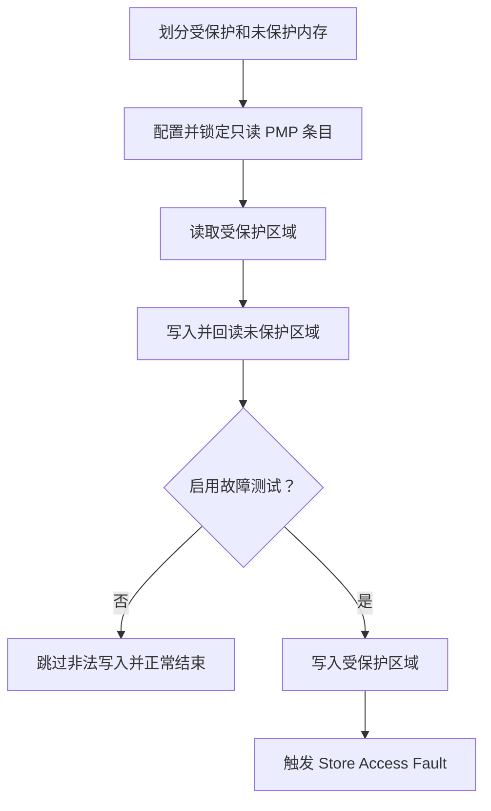

# WS63 PMP 内存保护 Sample

## 1. 一句话说明

本示例演示如何在 WS63 上使用 `uapi_pmp_config()` 将一段内存配置为只读区域，并验证受保护区域可读、相邻未保护区域可写以及非法写入可触发访问异常。

## 2. 适用场景

 - 验证 WS63 RISC-V PMP 内存访问权限是否生效。
 - 学习 TOR 地址匹配和读、写、执行权限的基本配置方法。
 - 作为关键数据只读保护和 PMP 故障验证的参考样例。

## 3. 支持能力

 - 支持使用 TOR 模式配置只读、不可执行的 PMP 区域。
 - 支持读取受保护区域，验证读权限可用。
 - 支持写入并回读相邻未保护区域。
 - 支持可选的非法写入测试，验证 PMP 能够拦截受保护区域写操作。

## 4. 不支持/限制

 - 本示例仅适用于 WS63 LiteOS 应用目标。
 - PMP 条目使用 Lock 位锁定后，处理器复位前不能再次修改。
 - 故障测试会有意触发 Store Access Fault，系统可能停止运行或复位，只应在验证环境中启用。
 - Sample 使用 PMP 条目 8，并依赖 WS63 平台 PMP 配置为样例缓冲区预留对应的 TOR 边界。

## 5. 关键词

### 中文关键词

PMP、物理内存保护、TOR、只读内存、访问权限、故障注入、WS63、RISC-V

### English Keywords

PMP, Physical Memory Protection, TOR, read-only memory, access permission, fault injection, WS63, RISC-V

## 6. 目录结构

```text
application/samples/peripheral/pmp/
├── README.md
├── CMakeLists.txt
├── Kconfig
└── pmp_sample.c
```

## 7. 入口文件

主入口：`application/samples/peripheral/pmp/pmp_sample.c`

初始化及主业务入口：`pmp_sample_entry()`

配置入口：`application/samples/peripheral/pmp/Kconfig`

平台 PMP 配置：`drivers/chips/ws63/porting/arch/riscv/pmp_cfg.c`

## 8. 整体流程



示例将 64 字节对齐缓冲区的前 32 字节配置为只读区域，后 32 字节保持可写；默认只执行安全验证，启用故障测试后才会尝试非法写入。

## 9. 核心文件说明

| 文件 | 作用 | 主要内容 |
|------|------|----------|
| `pmp_sample.c` | 实现 PMP 内存保护 Sample | 定义样例缓冲区、配置只读条目、验证内存访问并可选触发故障 |
| `Kconfig` | 提供故障测试开关 | 控制是否尝试写入受保护区域 |
| `CMakeLists.txt` | 配置 Sample 编译源 | 将 `pmp_sample.c` 加入 peripheral sample |
| `pmp_cfg.h` | 定义样例 PMP 参数 | 定义条目号、保护区大小和缓冲区大小 |
| `pmp_cfg.c` | 配置 WS63 平台 PMP 边界 | 为样例缓冲区拆分 SRAM TOR 条目并预留条目 8 |

## 10. 核心函数/类说明

`pmp_sample_entry()`

功能：配置样例只读区域，验证受保护区域和未保护区域的访问行为，并按 menuconfig 设置决定是否触发非法写入。

参数：无。

返回值：无。

调用关系：由 `app_run()` 注册，在应用初始化阶段调用；内部调用 `uapi_pmp_config()` 配置 PMP 条目。

`uapi_pmp_config(const pmp_conf_t *config, uint32_t length)`

功能：将一个或多个 PMP 条目配置写入处理器。

参数：`config` 指向 PMP 配置数组，`length` 表示配置条目数量。

返回值：成功返回 `ERRCODE_SUCC`，失败返回对应错误码。

调用关系：由 `pmp_sample_entry()` 调用，配置并锁定样例只读区域。

## 11. 配置项说明

在 SDK 根目录执行：

```powershell
fbb menuconfig ws63-liteos-app
```

进入以下菜单并启用 PMP Sample：

```text
Application
  → Enable Sample.
    → Enable the Sample of peripheral.
      → Support PMP Sample.
```

启用后进入 `PMP Sample Configuration`。首次运行建议关闭 `Trigger a protected write for exception verification.`，先完成不会触发异常的安全验证。

需要验证写保护时，再启用该选项并重新编译、烧录。此模式会故意触发 Store Access Fault，验证完成后应关闭该选项并恢复正常固件。

PMP 驱动组件和 WS63 平台 PMP 配置已包含在 `ws63-liteos-app` 中，不需要额外修改 app 的组件列表。

## 12. 使用方法

### 环境准备

 - 准备 WS63 开发板、USB 数据线和可用串口。
 - 完成 HiSpark FBB 构建环境和 WS63 SDK 配置。
 - 按“配置项说明”使用 menuconfig 启用 PMP Sample，并选择安全验证或故障验证模式。

### 编译

修改 PMP Sample 配置后执行 clean 构建，确保平台 PMP 条目和 Sample 使用同一份配置：

```powershell
fbb build --clean ws63-liteos-app
```

### 运行

将固件烧录到 WS63 开发板，然后打开串口监视器：

```powershell
fbb flash ws63-liteos-app --port <device_port> --baud 2000000 --json-summary
fbb monitor --port <device_port>
```

## 13. 输入输出示例

### 输入

本示例无运行时输入。是否执行非法写入由 menuconfig 中的故障测试选项决定。

### 正常输出

默认模式下，受保护区域读取成功，相邻未保护区域写入成功，随后跳过故障测试：

```text
[pmp] protected region: <start_address> - <end_address>
[pmp] unprotected region: <start_address> - <end_address>
[pmp] initial values: protected=0x11, unprotected=0x33
[pmp] first 32 bytes configured as read-only
[pmp] protected read succeeded: 0x11
[pmp] unprotected write succeeded: 0x22
[pmp] fault test disabled; protected write skipped
```

### 故障验证输出

启用故障测试后，示例在完成正常读写验证后尝试写入只读区域。出现 Store Access Fault 表示 PMP 成功拦截非法写入：

```text
[pmp] triggering protected write; a store access fault is expected
<Store Access Fault 日志>
```

如果继续输出以下日志，说明受保护写入未被 PMP 拦截，应检查 PMP 条目边界和权限配置：

```text
[pmp] ERROR: protected write was not blocked
```

### 配置失败输出

`uapi_pmp_config()` 失败时输出：

```text
[pmp] configuration failed: <error_code>
```
