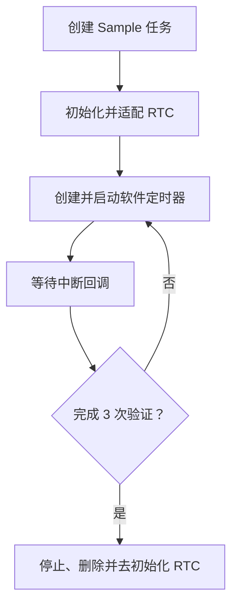

# WS63 RTC 软件定时器 Sample

## 1. 一句话说明

本示例演示如何在 WS63 上使用 `uapi_rtc_*` 接口创建 RTC 软件定时器，并通过中断回调验证定时触发和参数透传功能。

## 2. 适用场景

 - 验证 WS63 RTC 软件定时器驱动及中断回调是否正常。
 - 学习 `uapi_rtc_init()`、`uapi_rtc_create()` 和 `uapi_rtc_start()` 等接口的基本用法。
 - 作为需要一次性定时回调功能的最小参考样例。

## 3. 支持能力

 - 支持初始化和去初始化 RTC 驱动。
 - 支持创建、启动、停止和删除 RTC 软件定时器。
 - 支持在 RTC 中断回调中接收用户透传参数。
 - 支持统计回调次数和 RTC 中断次数，并连续验证 3 次定时触发。

## 4. 不支持/限制

 - 本示例仅适用于 WS63 LiteOS 应用目标。
 - 依赖 `rtc_unified`、`hal_rtc_unified` 和 `rtc_unified_port` 组件；当前 `ws63-liteos-app` 配置默认未包含这些组件，使用时需要手动引入。
 - 回调运行在中断上下文中，不应在回调内阻塞、打印大量日志或执行复杂业务。
 - 本示例演示 RTC 软件定时器，不提供日历时间、日期维护或低功耗唤醒示例。

## 5. 关键词

### 中文关键词

RTC、软件定时器、中断回调、定时触发、参数透传、WS63、LiteOS

### English Keywords

RTC, software timer, interrupt callback, timeout, user data, WS63, LiteOS

## 6. 目录结构

```text
application/samples/peripheral/rtc/
├── README.md
├── CMakeLists.txt
├── Kconfig
└── rtc_sample.c
```

## 7. 入口文件

主入口：`application/samples/peripheral/rtc/rtc_sample.c`

初始化入口：`rtc_sample_entry()`

主业务逻辑：`rtc_sample_task()`

配置入口：`application/samples/peripheral/rtc/Kconfig`

## 8. 整体流程



示例创建一次性 RTC 定时器，通过中断回调校验触发次数和透传参数；完成 3 次验证后释放 RTC 资源，异常时输出对应错误日志。

## 9. 核心文件说明

| 文件 | 作用 | 主要内容 |
|------|------|----------|
| `rtc_sample.c` | 实现 RTC 软件定时器 Sample | RTC 初始化、定时器控制、回调处理、结果校验和资源释放 |
| `Kconfig` | 提供 Sample 配置 | 定义 `CONFIG_RTC_SAMPLE_PERIOD_MS` 的默认值和有效范围 |
| `CMakeLists.txt` | 配置 Sample 编译源 | 将 `rtc_sample.c` 加入 peripheral sample |

## 10. 核心函数/类说明

`rtc_sample_entry()`

功能：创建 RTC Sample 任务并设置任务优先级。

参数：无。

返回值：无。

调用关系：由 `app_run()` 注册，在应用初始化阶段调用；内部调用 OSAL 任务接口创建 `rtc_sample_task()`。

`rtc_sample_task(void *data)`

功能：完成 RTC 初始化、定时触发验证和资源释放的完整流程。

参数：`data` 为任务透传参数，本示例未使用。

返回值：成功返回 `0`；初始化或创建阶段失败时返回相应错误码。

调用关系：由 OSAL 任务调度执行；内部调用 `uapi_rtc_init()`、`uapi_rtc_adapter()`、`uapi_rtc_create()`、`uapi_rtc_start()`、`uapi_rtc_stop()`、`uapi_rtc_delete()` 和 `uapi_rtc_deinit()`。

`rtc_sample_timeout_callback(uintptr_t data)`

功能：在 RTC 超时时记录回调次数和用户透传参数。

参数：`data` 为调用 `uapi_rtc_start()` 时设置的用户参数。

返回值：无。

调用关系：由 RTC 中断处理流程调用；只更新 `volatile` 状态变量。

`rtc_sample_wait_callback(uint32_t expected_count)`

功能：轮询等待指定次数的 RTC 回调，超时后返回失败。

参数：`expected_count` 为期望收到的累计回调次数。

返回值：收到预期回调返回 `true`，等待超时返回 `false`。

## 11. 配置项说明

在 SDK 根目录执行：

```powershell
fbb menuconfig ws63-liteos-app
```

进入以下菜单并启用 RTC Sample：

```text
Application
  → Enable Sample
    → Enable the Sample of peripheral
      → Support RTC Sample
```

启用后进入 `RTC Sample Configuration`，设置 `RTC sampling period in milliseconds`。取值范围为 100～60000 ms，默认值为 1000 ms。

配置完成后保存并退出 menuconfig，再执行编译命令。menuconfig 会自动启用 RTC Sample 所需的驱动配置。

### RTC 构建组件配置

当前 `ws63-liteos-app` 配置默认未包含 RTC 组件，使用本示例时需要手动引入。编译前，打开 `build/config/target_config/ws63/config.py`，在 `ws63-liteos-app` 的 `ram_component` 中加入以下三个实际组件：

```python
'ram_component': [
    # 其他组件省略
    'rtc_unified', 'hal_rtc_unified', 'rtc_unified_port',
],
```

也可以在 `ws63-liteos-app` 中新增或补充 `ram_component_set`，使用公共组件集合一次性展开上述三个组件：

```python
'ram_component_set': [
    'rtc_unified',
],
```

不要将 RTC 组件加入 `target_config.py` 的公共 app 模板，否则所有继承该模板的目标都会默认链接 RTC 组件。

## 12. 使用方法

### 环境准备

 - 准备 WS63 开发板、USB 数据线和可用串口。
 - 完成 HiSpark FBB 构建环境和 WS63 SDK 配置。
 - 按“RTC 构建组件配置”修改 `ws63-liteos-app` 的组件列表。
 - 按“配置项说明”使用 menuconfig 启用 RTC Sample 并设置定时周期。

### 编译

```powershell
fbb build ws63-liteos-app
```

首次修改组件配置后，如果增量构建未刷新组件列表，可执行：

```powershell
fbb build --clean ws63-liteos-app
```

### 运行

将生成的 `ws63-liteos-app` 固件烧录到 WS63 开发板，然后打开串口监视器：

```powershell
fbb flash ws63-liteos-app --port <device_port> --baud 2000000 --json-summary
fbb monitor --port <device_port>
```

## 13. 输入输出示例

### 输入

本示例无运行时输入。定时周期通过 menuconfig 配置，默认值为 1000 ms。

### 正常输出

连续收到 3 次 RTC 回调后，输出验证通过日志：

```text
[rtc] ready: period=1000ms max=<max_ms>ms samples=3
[rtc] sample #1 callback received, irq_count=1
[rtc] sample #2 callback received, irq_count=2
[rtc] sample #3 callback received, irq_count=3
[rtc] verification passed: callbacks=3
```

### 异常输出

RTC 初始化、适配、创建或启动失败时，会输出对应的 `uapi_rtc_* failed` 日志；等待回调超时时，会输出：

```text
[rtc] sample #<n> timeout
[rtc] verification failed: passed=<count> expected=3
```
